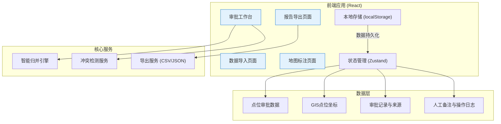
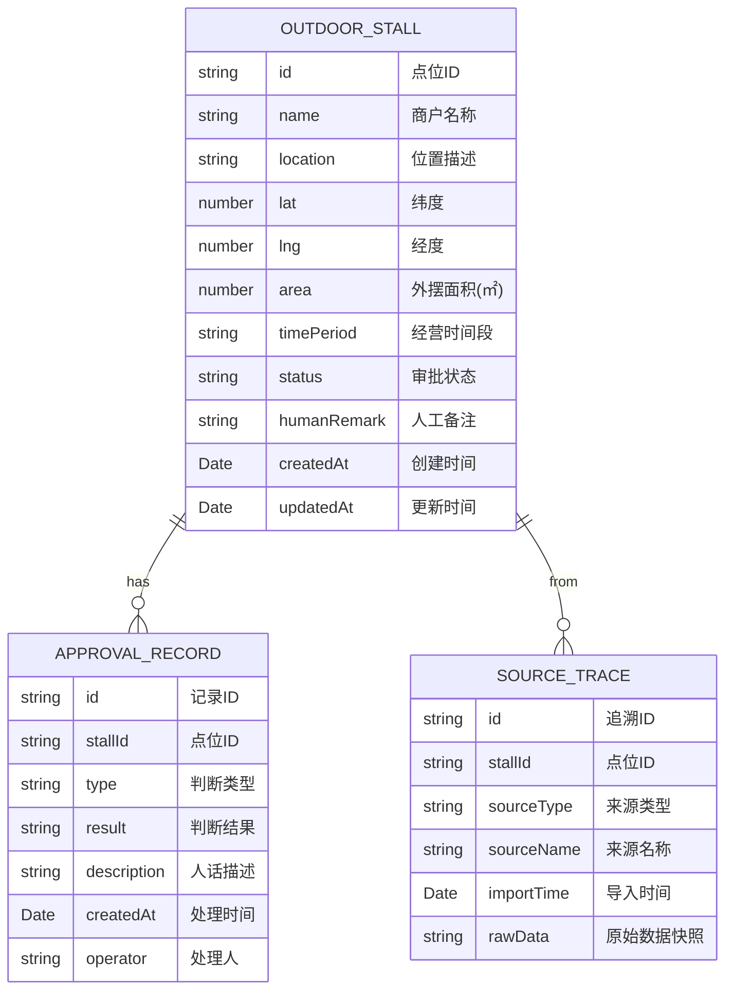

## 1. 架构设计



## 2. 技术描述

- **前端框架**: React@18 + TypeScript + Vite
- **状态管理**: Zustand（轻量级，适合本地数据持久化）
- **样式方案**: Tailwind CSS 3
- **路由管理**: React Router DOM
- **地图可视化**: 基于SVG的简化地图（避免依赖外部地图服务）
- **数据持久化**: localStorage（本地运行，无需后端）
- **导出功能**: 原生JS实现CSV/JSON导出
- **图标库**: Lucide React

## 3. 路由定义

| 路由 | 页面 | 功能 |
|------|------|------|
| `/` | 审批工作台 | 点位列表、智能判断、人工复核 |
| `/import` | 数据导入 | 多源数据上传、预览、校验 |
| `/map` | 地图标注 | GIS点位可视化、冲突展示 |
| `/export` | 报告导出 | 公示清单、审批报告导出 |

## 4. 数据模型

### 4.1 数据模型定义



### 4.2 TypeScript 类型定义

```typescript
// 审批状态枚举
type ApprovalStatus = 'pending' | 'approved' | 'rejected' | 'need_confirm' | 'legacy';

// 来源类型
type SourceType = 'street_form' | 'site_photo' | 'approval_record' | 'gis_legacy';

// 外摆点位
interface OutdoorStall {
  id: string;
  name: string;
  location: string;
  lat: number;
  lng: number;
  area: number;
  maxArea?: number;
  timePeriod: string;
  status: ApprovalStatus;
  humanRemark?: string;
  createdAt: string;
  updatedAt: string;
  sources: SourceTrace[];
  approvalRecords: ApprovalRecord[];
}

// 来源追溯
interface SourceTrace {
  id: string;
  sourceType: SourceType;
  sourceName: string;
  importTime: string;
  rawData: string;
}

// 审批记录
interface ApprovalRecord {
  id: string;
  type: 'capacity_check' | 'time_conflict' | 'manual_review';
  result: 'pass' | 'fail' | 'warning';
  description: string;
  createdAt: string;
  operator: string;
}

// 冲突检测结果
interface ConflictResult {
  hasConflict: boolean;
  type: 'capacity' | 'time' | 'location';
  description: string;
  suggestion: string;
}
```

## 5. 核心算法

### 5.1 容量超限检测
- 输入：外摆面积、最大允许面积
- 输出：是否超限、超限比例、人话描述
- 规则：超过10%预警，超过20%明确否决

### 5.2 时间段冲突检测
- 输入：两个时间段字符串（如"09:00-22:00"）
- 输出：是否冲突、冲突时长、人话描述
- 规则：边缘重叠（<30分钟）需人工确认

### 5.3 数据归并逻辑
- 按商户名称+位置模糊匹配
- 合并多源数据，保留原始来源信息
- 冲突数据标记需人工确认

## 6. 样例数据配置

系统预置3条样例数据：
1. **顺利通过**：星巴克咖啡（万达店），面积8㎡，时间段10:00-22:00，无冲突
2. **需人工确认**：喜茶（步行街店），面积12㎡，时间段09:30-23:00，与相邻点位边缘冲突
3. **GIS旧口径**：报刊亭（人民广场），面积5㎡，时间段07:00-21:00，2023年GIS补录
