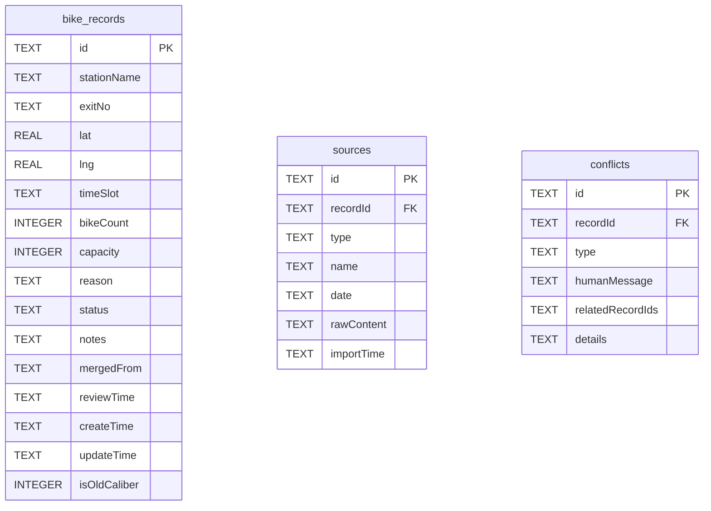

## 1. 架构设计

```mermaid
graph TD
    "Frontend (React + Vite + TypeScript)" --> "Browser Router"
    "Browser Router" --> "Pages: Import / Merge / Review / Export"
    "Pages" --> "Components: Table / StatusBadge / SourceTimeline / ConflictCard"
    "Pages" --> "State Management (Zustand)"
    "Frontend" --> "HTTP Client (fetch)"
    "HTTP Client" --> "Backend API (Express + TypeScript)"
    "Backend API" --> "Controllers"
    "Controllers" --> "Services"
    "Services" --> "Repository (better-sqlite3)"
    "Repository" --> "SQLite Database"
    "Services" --> "Business Logic: Merge / Conflict Detection / Export"
```

## 2. 技术描述

- **Frontend**: React@18 + TypeScript + Vite@5 + tailwindcss@3 + zustand@4 + react-router-dom@6 + lucide-react
- **Backend**: Express@4 + TypeScript + better-sqlite3
- **Database**: SQLite（文件型，本地部署无需额外服务）
- **初始化工具**: vite-init（react-express-ts 模板）
- **特点**: 全栈 TypeScript，前后端类型通过 shared 目录共享

## 3. 路由定义

| 路由 | 页面 | 用途 |
|------|------|------|
| / | 导入页 | 导入原始疏导记录材料 |
| /merge | 归并页 | 自动归并与冲突处理 |
| /review | 复核页 | 人工复核与状态标记 |
| /export | 导出页 | 分类导出公示清单 |

### 后端 API 路由

| 方法 | 路由 | 用途 |
|------|------|------|
| POST | /api/records/import | 批量导入疏导记录 |
| GET | /api/records | 获取所有疏导记录 |
| GET | /api/records/:id | 获取单条记录详情（含来源） |
| PUT | /api/records/:id | 更新记录状态和备注 |
| POST | /api/records/merge | 执行自动归并 |
| POST | /api/records/manual-merge | 手动合并指定记录 |
| GET | /api/export/csv | 导出CSV（按状态分类） |
| GET | /api/export/json | 导出JSON（按状态分类） |
| POST | /api/sample/load | 加载样例数据 |

## 4. API 类型定义

```typescript
// shared/types.ts
export type RecordStatus = 'pending' | 'processed' | 'verify' | 'onsite';
// pending=待处理, processed=已处理, verify=待核实, onsite=需要现场复看

export type SourceType = 'inspection' | 'complaint' | 'meeting' | 'old_caliber';

export interface SourceInfo {
  id: string;
  type: SourceType;
  name: string;
  date: string;
  rawContent: string;
  importTime: string;
}

export interface CoordOffsetIssue {
  expectedLat: number;
  expectedLng: number;
  actualLat: number;
  actualLng: number;
  distanceMeters: number;
}

export interface ConflictInfo {
  type: 'same_name' | 'duplicate' | 'coord_offset' | 'cross_time' | 'capacity' | 'time_conflict';
  humanMessage: string;
  relatedRecordIds: string[];
  details?: CoordOffsetIssue;
}

export interface BikeRecord {
  id: string;
  stationName: string;
  exitNo: string;
  lat: number;
  lng: number;
  timeSlot: string;
  bikeCount: number;
  capacity: number;
  reason: string;
  status: RecordStatus;
  notes: string;
  sources: SourceInfo[];
  conflicts: ConflictInfo[];
  mergedFrom: string[];
  reviewTime?: string;
  createTime: string;
  updateTime: string;
  isOldCaliber: boolean;
}

export interface ImportResult {
  total: number;
  success: number;
  withIssues: number;
  issues: ConflictInfo[];
}

export interface ExportRecord extends BikeRecord {
  statusText: string;
  sourceSummary: string;
}
```

## 5. 服务层架构

```mermaid
graph TD
    "Express Routes" --> "ImportController"
    "Express Routes" --> "RecordController"
    "Express Routes" --> "MergeController"
    "Express Routes" --> "ExportController"
    "ImportController" --> "ImportService"
    "RecordController" --> "RecordService"
    "MergeController" --> "MergeService"
    "ExportController" --> "ExportService"
    "ImportService" --> "ConflictDetector"
    "MergeService" --> "ConflictDetector"
    "All Services" --> "RecordRepository"
    "RecordRepository" --> "SQLite DB"
```

## 6. 数据模型

### 6.1 数据模型定义（ER 图）



### 6.2 数据定义语言（DDL）

```sql
CREATE TABLE IF NOT EXISTS bike_records (
  id TEXT PRIMARY KEY,
  stationName TEXT NOT NULL,
  exitNo TEXT NOT NULL,
  lat REAL NOT NULL,
  lng REAL NOT NULL,
  timeSlot TEXT NOT NULL,
  bikeCount INTEGER NOT NULL,
  capacity INTEGER NOT NULL,
  reason TEXT NOT NULL,
  status TEXT NOT NULL DEFAULT 'pending',
  notes TEXT,
  mergedFrom TEXT,
  reviewTime TEXT,
  createTime TEXT NOT NULL,
  updateTime TEXT NOT NULL,
  isOldCaliber INTEGER NOT NULL DEFAULT 0
);

CREATE TABLE IF NOT EXISTS sources (
  id TEXT PRIMARY KEY,
  recordId TEXT NOT NULL,
  type TEXT NOT NULL,
  name TEXT NOT NULL,
  date TEXT NOT NULL,
  rawContent TEXT NOT NULL,
  importTime TEXT NOT NULL,
  FOREIGN KEY (recordId) REFERENCES bike_records(id) ON DELETE CASCADE
);

CREATE TABLE IF NOT EXISTS conflicts (
  id TEXT PRIMARY KEY,
  recordId TEXT NOT NULL,
  type TEXT NOT NULL,
  humanMessage TEXT NOT NULL,
  relatedRecordIds TEXT NOT NULL,
  details TEXT,
  FOREIGN KEY (recordId) REFERENCES bike_records(id) ON DELETE CASCADE
);

CREATE INDEX IF NOT EXISTS idx_sources_recordId ON sources(recordId);
CREATE INDEX IF NOT EXISTS idx_conflicts_recordId ON conflicts(recordId);
CREATE INDEX IF NOT EXISTS idx_records_status ON bike_records(status);
CREATE INDEX IF NOT EXISTS idx_records_station ON bike_records(stationName, exitNo);
```

### 6.3 样例数据（SQL 初始化）

```sql
-- 样例数据将通过 API /api/sample/load 动态生成
-- 包含：1条顺利记录、1条需要人工确认、1条旧口径
-- 脏数据场景：同名路口、重复投诉、坐标偏移、跨时段统计各1条
```
