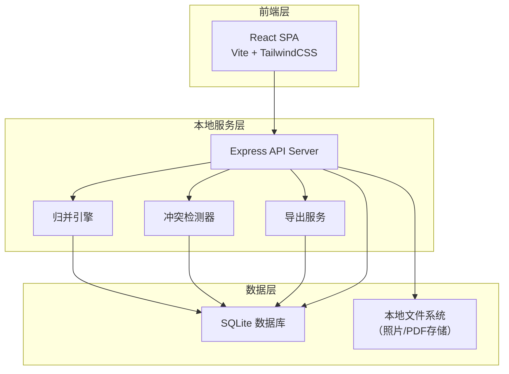
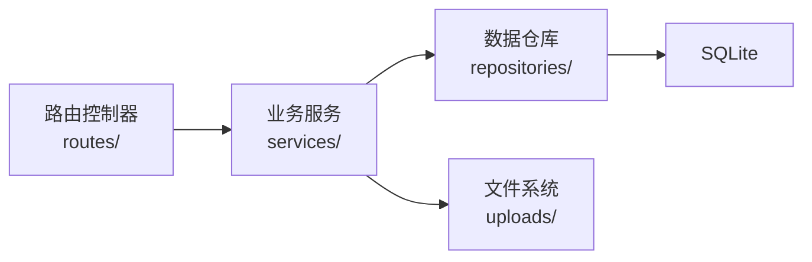
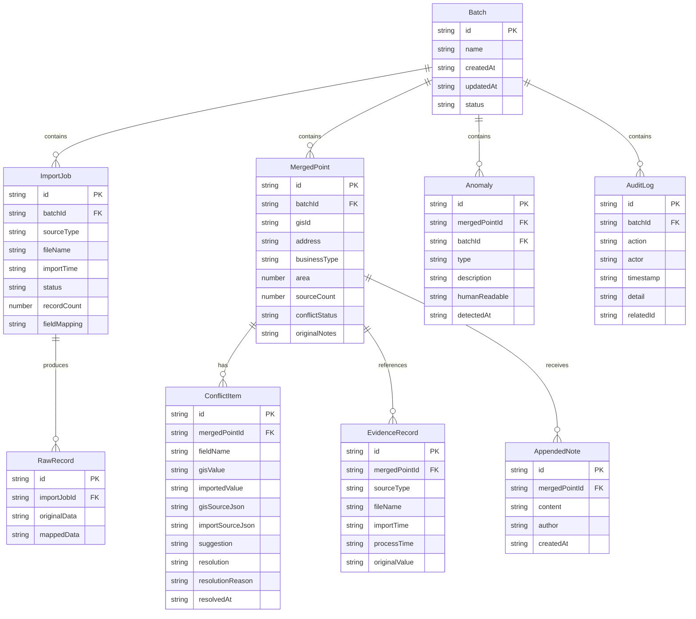

## 1. 架构设计



## 2. 技术说明

- **前端**：React@18 + TailwindCSS@3 + Vite
- **初始化工具**：Vite (React + TypeScript 模板)
- **后端**：Express@4，本地运行，无需部署
- **数据库**：SQLite（通过 better-sqlite3），单文件存储，随项目移动
- **文件存储**：本地文件系统目录，照片和 PDF 原件保留在 `./uploads/` 目录
- **数据格式**：导入支持 CSV / Excel（xlsx） / JSON；导出支持 Excel / PDF

## 3. 路由定义

| 路由 | 用途 |
|------|------|
| `/` | 项目总览页：批次状态、待处理事项、操作时间线、异常摘要 |
| `/import` | 数据导入页：GIS 点位、街道表格、现场照片、审批记录导入 |
| `/review` | 归并与复核页：归并结果浏览、冲突双栏对比、人工裁决 |
| `/review/:id` | 单条冲突复核详情：完整证据链、裁决操作 |
| `/export` | 公示清单页：筛选、预览、导出 |

## 4. API 定义

### 4.1 批次管理

```typescript
interface Batch {
  id: string;
  name: string;
  createdAt: string;
  updatedAt: string;
  status: "active" | "archived";
}

// GET    /api/batches          — 获取批次列表
// POST   /api/batches          — 创建新批次
// GET    /api/batches/:id      — 获取批次详情（含统计摘要）
```

### 4.2 数据导入

```typescript
interface ImportJob {
  id: string;
  batchId: string;
  sourceType: "gis" | "street_table" | "photo" | "approval";
  fileName: string;
  importTime: string;
  status: "pending" | "previewing" | "confirmed" | "failed";
  recordCount: number;
  fieldMapping: Record<string, string>;
  rawPreview: Record<string, unknown>[];
}

// POST   /api/batches/:id/import          — 上传文件并创建导入任务
// GET    /api/batches/:id/imports          — 获取导入任务列表
// GET    /api/imports/:id/preview          — 获取导入预览数据
// PUT    /api/imports/:id/mapping          — 更新字段映射
// POST   /api/imports/:id/confirm          — 确认导入，写入数据库
```

### 4.3 归并与冲突

```typescript
interface MergedPoint {
  id: string;
  batchId: string;
  gisId: string;
  address: string;
  businessType: string;
  area: number;
  sourceCount: number;
  conflictStatus: "none" | "conflict" | "resolved";
  originalNotes: string;
  appendedNotes: string[];
  sources: EvidenceSource[];
}

interface ConflictItem {
  id: string;
  mergedPointId: string;
  fieldName: string;
  gisValue: string;
  importedValue: string;
  gisSource: EvidenceSource;
  importSource: EvidenceSource;
  suggestion: "use_gis" | "use_import" | "manual";
  resolution: "use_gis" | "use_import" | "manual" | "pending_verification" | null;
  resolutionReason: string | null;
  resolvedAt: string | null;
  resolvedBy: string | null;
}

interface EvidenceSource {
  type: "gis" | "street_table" | "photo" | "approval";
  fileName: string;
  importTime: string;
  processTime: string;
  originalValue: string;
}

// POST   /api/batches/:id/merge             — 触发归并
// GET    /api/batches/:id/merged-points      — 获取归并结果列表
// GET    /api/conflicts                      — 获取冲突列表（支持筛选）
// GET    /api/conflicts/:id                  — 获取冲突详情
// PUT    /api/conflicts/:id/resolve          — 提交裁决结果（含理由）
```

### 4.4 异常报告

```typescript
interface Anomaly {
  id: string;
  mergedPointId: string;
  type: "capacity_overlimit" | "time_period_conflict";
  description: string;
  humanReadable: string;
  detectedAt: string;
}

// GET    /api/batches/:id/anomalies          — 获取异常列表
```

### 4.5 导出

```typescript
interface ExportRequest {
  batchId: string;
  filters: {
    district?: string;
    businessType?: string;
    updateStatus?: string;
    conflictStatus?: string;
  };
  format: "excel" | "pdf";
}

// POST   /api/batches/:id/export             — 请求导出，返回文件下载链接
```

### 4.6 操作日志

```typescript
interface AuditLog {
  id: string;
  batchId: string;
  action: "import" | "merge" | "resolve" | "export" | "note_append";
  actor: string;
  timestamp: string;
  detail: string;
  relatedId: string;
}

// GET    /api/batches/:id/audit-logs         — 获取操作日志
```

## 5. 服务端架构图



## 6. 数据模型

### 6.1 数据模型定义



### 6.2 数据定义语言

```sql
CREATE TABLE batch (
    id TEXT PRIMARY KEY,
    name TEXT NOT NULL,
    createdAt TEXT NOT NULL DEFAULT (datetime('now')),
    updatedAt TEXT NOT NULL DEFAULT (datetime('now')),
    status TEXT NOT NULL DEFAULT 'active'
);

CREATE TABLE import_job (
    id TEXT PRIMARY KEY,
    batchId TEXT NOT NULL REFERENCES batch(id),
    sourceType TEXT NOT NULL CHECK (sourceType IN ('gis', 'street_table', 'photo', 'approval')),
    fileName TEXT NOT NULL,
    importTime TEXT NOT NULL DEFAULT (datetime('now')),
    status TEXT NOT NULL DEFAULT 'pending' CHECK (status IN ('pending', 'previewing', 'confirmed', 'failed')),
    recordCount INTEGER NOT NULL DEFAULT 0,
    fieldMapping TEXT,
    rawPreview TEXT
);

CREATE TABLE raw_record (
    id TEXT PRIMARY KEY,
    importJobId TEXT NOT NULL REFERENCES import_job(id),
    originalData TEXT NOT NULL,
    mappedData TEXT
);

CREATE TABLE merged_point (
    id TEXT PRIMARY KEY,
    batchId TEXT NOT NULL REFERENCES batch(id),
    gisId TEXT,
    address TEXT,
    businessType TEXT,
    area REAL,
    sourceCount INTEGER NOT NULL DEFAULT 0,
    conflictStatus TEXT NOT NULL DEFAULT 'none' CHECK (conflictStatus IN ('none', 'conflict', 'resolved')),
    originalNotes TEXT NOT NULL DEFAULT '',
    createdAt TEXT NOT NULL DEFAULT (datetime('now')),
    updatedAt TEXT NOT NULL DEFAULT (datetime('now'))
);

CREATE TABLE conflict_item (
    id TEXT PRIMARY KEY,
    mergedPointId TEXT NOT NULL REFERENCES merged_point(id),
    fieldName TEXT NOT NULL,
    gisValue TEXT,
    importedValue TEXT,
    gisSourceJson TEXT,
    importSourceJson TEXT,
    suggestion TEXT NOT NULL DEFAULT 'manual' CHECK (suggestion IN ('use_gis', 'use_import', 'manual')),
    resolution TEXT CHECK (resolution IN ('use_gis', 'use_import', 'manual', 'pending_verification')),
    resolutionReason TEXT,
    resolvedAt TEXT,
    resolvedBy TEXT
);

CREATE TABLE anomaly (
    id TEXT PRIMARY KEY,
    mergedPointId TEXT NOT NULL REFERENCES merged_point(id),
    batchId TEXT NOT NULL REFERENCES batch(id),
    type TEXT NOT NULL CHECK (type IN ('capacity_overlimit', 'time_period_conflict')),
    description TEXT NOT NULL,
    humanReadable TEXT NOT NULL,
    detectedAt TEXT NOT NULL DEFAULT (datetime('now'))
);

CREATE TABLE evidence_record (
    id TEXT PRIMARY KEY,
    mergedPointId TEXT NOT NULL REFERENCES merged_point(id),
    sourceType TEXT NOT NULL CHECK (sourceType IN ('gis', 'street_table', 'photo', 'approval')),
    fileName TEXT NOT NULL,
    importTime TEXT NOT NULL,
    processTime TEXT NOT NULL DEFAULT (datetime('now')),
    originalValue TEXT NOT NULL
);

CREATE TABLE appended_note (
    id TEXT PRIMARY KEY,
    mergedPointId TEXT NOT NULL REFERENCES merged_point(id),
    content TEXT NOT NULL,
    author TEXT NOT NULL DEFAULT '当前用户',
    createdAt TEXT NOT NULL DEFAULT (datetime('now'))
);

CREATE TABLE audit_log (
    id TEXT PRIMARY KEY,
    batchId TEXT NOT NULL REFERENCES batch(id),
    action TEXT NOT NULL CHECK (action IN ('import', 'merge', 'resolve', 'export', 'note_append')),
    actor TEXT NOT NULL DEFAULT '当前用户',
    timestamp TEXT NOT NULL DEFAULT (datetime('now')),
    detail TEXT NOT NULL,
    relatedId TEXT
);

CREATE INDEX idx_import_job_batch ON import_job(batchId);
CREATE INDEX idx_merged_point_batch ON merged_point(batchId);
CREATE INDEX idx_conflict_item_point ON conflict_item(mergedPointId);
CREATE INDEX idx_conflict_item_resolution ON conflict_item(resolution);
CREATE INDEX idx_anomaly_batch ON anomaly(batchId);
CREATE INDEX idx_anomaly_type ON anomaly(type);
CREATE INDEX idx_evidence_point ON evidence_record(mergedPointId);
CREATE INDEX idx_appended_note_point ON appended_note(mergedPointId);
CREATE INDEX idx_audit_log_batch ON audit_log(batchId);
CREATE INDEX idx_audit_log_timestamp ON audit_log(timestamp);
```
