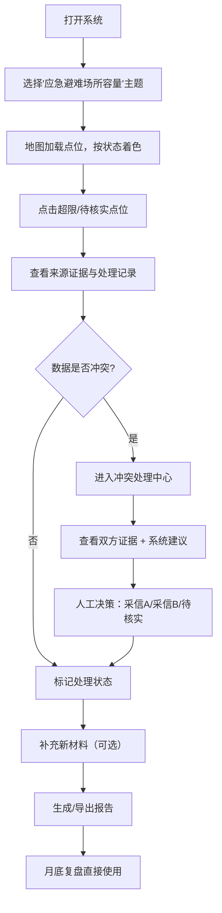

## 1. 产品概述

社区应急避难场所容量管理系统，解决居民反馈表中地点描述不统一、容量判断依赖人工翻查、冲突数据难以比对的痛点。面向社区运营人员（如阿宁），实现"应急避难场所容量"相关投诉的智能归集、冲突检测、可视化展示与报告导出，减少重复翻查旧记录的工作量，提升月底复盘效率。

核心价值：将零散的居民反馈结构化，自动识别同名点位、重复投诉、坐标偏移等问题，容量超限和时间段冲突以自然语言呈现，冲突数据不替用户拍板，而是展示双方证据供人工决策。

## 2. 核心功能

### 2.1 用户角色

| 角色 | 登录方式 | 核心权限 |
|------|----------|----------|
| 社区运营人员 | 本地模拟登录 | 查看地图点位、处理投诉记录、标记状态、导出报告、补充材料 |

### 2.2 功能模块

1. **地图总览页**：2D/3D切换展示避难场所点位，按状态（已处理/待核实/需现场复看）分色标记，支持点位搜索与筛选
2. **点位详情面板**：点击地图点位弹出，展示来源数据、处理状态、历史处理记录、容量变化趋势
3. **冲突处理中心**：自动检测居民反馈与导入数据的冲突，并列展示双方证据，提供建议动作
4. **智能判断引擎**：容量超限判断、时间段冲突检测、同名点位聚合、重复投诉识别
5. **报告生成导出**：按状态分类的月度/复盘报告，自然语言描述问题，支持PDF/Excel导出
6. **材料补充模块**：支持为历史记录补充新证据，保留处理痕迹可追溯

### 2.3 页面详情

| 页面名称 | 模块名称 | 功能描述 |
|----------|----------|----------|
| 地图总览页 | 顶部导航栏 | 业务主题切换（当前锁定"应急避难场所容量"）、状态筛选、搜索框、报告导出按钮、2D/3D切换 |
| 地图总览页 | 地图主区域 | Leaflet地图展示点位，不同状态不同颜色图标，悬浮预览，点击进入详情 |
| 地图总览页 | 左侧统计面板 | 容量超限数、待核实数、需现场复看数、本月处理进度、跨时段统计 |
| 地图总览页 | 右侧时间线 | 按时间倒序展示处理记录，点击跳转对应点位 |
| 点位详情页 | 基本信息卡片 | 点位名称、标准坐标、设计容量、当前状态 |
| 点位详情页 | 来源证据区 | 居民反馈表原文（多条聚合）、官方导入数据、坐标偏移对比 |
| 点位详情页 | 容量判断区 | 时段分布柱状图、超限高亮、自然语言解读 |
| 点位详情页 | 处理记录时间线 | 每次处理的时间、操作人、处理内容、状态变更 |
| 点位详情页 | 材料补充区 | 上传/录入新证据，关联到历史记录 |
| 冲突处理中心 | 冲突列表 | 列出所有数据冲突项，标记冲突类型（容量/坐标/时段） |
| 冲突处理中心 | 冲突详情 | 左右对比展示居民反馈与导入数据，中间列建议动作 |
| 报告预览页 | 报告正文 | 按已处理/待核实/需现场复看分类，自然语言描述每个问题点位 |
| 报告预览页 | 导出选项 | 支持PDF下载、Excel导出、打印 |

## 3. 核心流程

用户（阿宁）打开系统 → 地图自动展示"应急避难场所容量"相关点位 → 看到红色超限点位闪烁 → 点击查看详情：来源居民反馈哪几条、官方容量多少、超限多少 → 如果有冲突，看到左右对比和建议动作 → 标记为"已处理"/"待核实"/"需现场复看" → 补充新发现的材料 → 月底一键导出报告，直接用于复盘。

## 4. 用户界面设计

### 4.1 设计风格
- **主色**：应急蓝 (#1E40AF) 作为主色调，代表专业可靠
- **辅色**：警告橙 (#F97316) 标记待核实，危险红 (#DC2626) 标记超限/冲突，成功绿 (#16A34A) 标记已处理
- **中性色**：深灰 (#1F2937) 背景，浅灰 (#F3F4F6) 卡片底色，纯白数据面板
- **按钮风格**：圆角 6px，轻微阴影，hover时有微妙上浮效果，点击有按压反馈
- **字体**：标题用"思源黑体 Heavy"，正文用"思源宋体 Light"，数据数字用"JetBrains Mono"
- **布局**：三栏式卡片布局，地图居中撑满，左侧统计面板半透明悬浮，右侧时间线可折叠
- **图标**：统一使用 Phosphor Icons 线性风格，状态用 emoji 辅助标记（🟢🟡🔴）

### 4.2 页面设计概览

| 页面名称 | 模块名称 | UI元素 |
|----------|----------|--------|
| 地图总览页 | 顶部导航 | 深色渐变背景，左侧logo+主题名称，右侧筛选器组+导出按钮 |
| 地图总览页 | 统计面板 | 毛玻璃效果（backdrop-blur），四张数字卡片，底部容量超限趋势迷你图 |
| 地图总览页 | 地图区域 | 自定义地图样式（午夜蓝调），脉冲动画标记超限点位，点击圆形展开波纹 |
| 地图总览页 | 时间线 | 可折叠抽屉，每条记录带状态色条，hover时高亮对应地图点位 |
| 点位详情页 | 详情抽屉 | 从右侧滑入，分为信息区、证据区、处理区三大块，分区标题用竖线装饰 |
| 点位详情页 | 证据对比 | 左右两列卡片，冲突区域红色虚线框标注，中间箭头指向建议采信方 |
| 点位详情页 | 容量图表 | 横向条形图，超限时溢出部分用红色渐变填充，旁边配自然语言说明 |
| 冲突处理中心 | 冲突列表 | 表格行hover高亮，冲突类型标签彩色圆角，严重度星级标记 |
| 报告预览页 | 报告正文 | 仿Word文档风格，页边距充足，分级标题清晰，关键数据加粗高亮 |

### 4.3 响应式
- **桌面端**（默认）：三栏布局，地图占 60%，左右面板各占 20%
- **平板端**：左右面板改为可折叠抽屉，默认收起
- **移动端**：地图全屏，统计和时间线改为底部Tab切换
- **触摸优化**：按钮最小高度 44px，滑动手势支持关闭抽屉、切换点位

### 4.4 3D场景指引
- **环境**：使用 Three.js + @react-three/fiber 构建简化社区3D模型，应急避难场所用半透明蓝色立方体表示
- **光照**：半球光 + 方向光，模拟黄昏时分暖色调，营造紧迫感但不压抑
- **相机**：默认45度俯视角，支持轨道控制器缩放旋转，点击点位时相机平滑飞行至目标上方
- **动效**：容量超限时建筑顶部发出红色脉冲光柱，避难所根据容量使用率呈现不同透明度
- **后处理**：轻微Bloom效果突出发光元素，室外雾化营造空间深度
- **性能**：控制三角形数量在 5万 以内，LOD优化，移动端自动降级为2D模式
