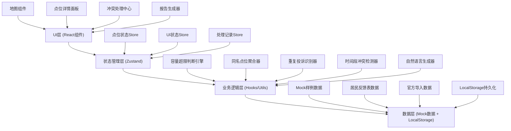
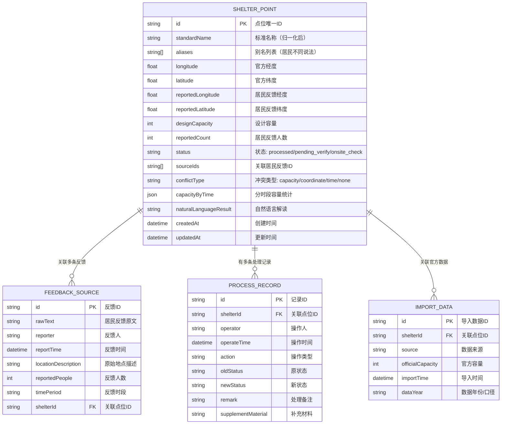

## 1. 架构设计

本项目为纯前端单页应用，数据与逻辑全部在浏览器端处理，无需后端服务。采用分层架构，将UI展示、业务逻辑、数据管理分离，便于维护和扩展。



## 2. 技术选型说明

| 技术栈 | 版本 | 用途 | 选型理由 |
|--------|------|------|----------|
| React | ^18.2.0 | UI框架 | 组件化开发，生态丰富，配合hooks便于逻辑复用 |
| TypeScript | ^5.4.0 | 类型系统 | 编译时类型检查，减少运行时bug，提升代码可维护性 |
| Vite | ^5.2.0 | 构建工具 | 开发体验好，热更新快，打包优化优秀 |
| Tailwind CSS | ^3.4.0 | CSS框架 | 快速构建UI，原子化class，统一设计规范 |
| Zustand | ^4.5.0 | 状态管理 | 轻量无样板代码，API简洁，支持DevTools |
| Leaflet | ^1.9.0 | 2D地图 | 开源轻量，移动端友好，社区插件丰富 |
| Three.js | ^0.162.0 | 3D渲染 | WebGL封装，功能强大，配合R3F更易用 |
| @react-three/fiber | ^8.15.0 | React-Three桥接 | 声明式Three.js，与React生态无缝融合 |
| @react-three/drei | ^9.99.0 | 3D工具库 | 常用组件封装，减少重复代码 |
| Recharts | ^2.12.0 | 图表库 | React原生，配置灵活，支持响应式 |
| Lucide React | ^0.363.0 | 图标库 | 一致风格，按需加载，体积小 |
| html2canvas + jspdf | ^2.16.0 | PDF导出 | 纯前端方案，无需后端，支持自定义样式 |
| xlsx | ^0.18.5 | Excel导出 | 成熟稳定，支持多种格式 |

## 3. 路由定义

使用 React Router v6 管理前端路由：

| 路由路径 | 页面/组件 | 用途 |
|----------|-----------|------|
| `/` | 地图总览页 | 应用首页，默认展示"应急避难场所容量"主题 |
| `/conflicts` | 冲突处理中心 | 列表展示所有数据冲突，支持人工决策 |
| `/report` | 报告预览页 | 生成并预览月度/复盘报告，支持导出 |

## 4. 核心数据模型

### 4.1 点位数据模型



### 4.2 TypeScript 类型定义

```typescript
// 点位状态枚举
export enum ShelterStatus {
  PROCESSED = 'processed',
  PENDING_VERIFY = 'pending_verify',
  ONSITE_CHECK = 'onsite_check'
}

// 冲突类型枚举
export enum ConflictType {
  NONE = 'none',
  CAPACITY = 'capacity',
  COORDINATE = 'coordinate',
  TIME = 'time',
  MIXED = 'mixed'
}

// 点位接口
export interface ShelterPoint {
  id: string;
  standardName: string;
  aliases: string[];
  longitude: number;
  latitude: number;
  reportedLongitude?: number;
  reportedLatitude?: number;
  designCapacity: number;
  reportedCount: number;
  status: ShelterStatus;
  sourceIds: string[];
  conflictType: ConflictType;
  capacityByTime: Record<string, number>;
  naturalLanguageResult: string;
  createdAt: string;
  updatedAt: string;
}

// 处理记录接口
export interface ProcessRecord {
  id: string;
  shelterId: string;
  operator: string;
  operateTime: string;
  action: string;
  oldStatus?: ShelterStatus;
  newStatus: ShelterStatus;
  remark: string;
  supplementMaterial?: string;
}
```

## 5. 核心算法逻辑

### 5.1 同名点位聚合算法
- 对居民反馈表中的地点描述进行归一化处理（去除空格、特殊字符、同义词替换）
- 使用Levenshtein距离计算相似度，阈值设为0.85
- 维护别名映射表，如"社区广场"="中心广场"="小区广场"
- 聚合后统一使用标准名称，保留所有原始说法在别名列表

### 5.2 容量超限判断
- 分时段统计：将一天分为早(6-10)、中(10-14)、晚(14-18)、夜(18-次日6)四个时段
- 超限条件：单时段人数 > 设计容量 × 0.9 或 全日累计 > 设计容量 × 1.5
- 自然语言生成：根据超限程度和时段生成易懂描述，如"晚高峰时段18-22点，该避难场所实际容纳420人，超出设计容量300人的40%，建议分流至200米外的第二小学"

### 5.3 重复投诉识别
- 基于反馈人、反馈时间、地点描述三重匹配
- 7天内同一人同一地点的反馈视为重复，合并展示但保留原始记录
- 跨时段统计：同一地点不同时段的反馈累加计算

### 5.4 坐标偏移检测
- 计算官方坐标与居民反馈坐标的球面距离
- 偏移 > 50米 标记为坐标冲突，展示两点位连线和距离
- 提供建议：优先采信官方坐标，居民反馈坐标作为补充参考

### 5.5 冲突建议动作
- 容量冲突：建议"核实现场实际容量"或"启动分流预案"
- 坐标冲突：建议"现场复核准确位置"或"更新官方数据"
- 时段冲突：建议"调整不同时段疏散引导"或"增加临时安置点"
- 系统不自动决策，仅提供建议，最终由人工确认

## 6. 目录结构

```
src/
├── assets/              # 静态资源
│   ├── fonts/           # 字体文件
│   └── images/          # 图片资源
├── components/          # React组件
│   ├── layout/          # 布局组件（Header、Sidebar等）
│   ├── map/             # 地图相关组件（2D/3D切换、点位标记）
│   ├── shelter/         # 避难场所相关组件（详情、处理记录）
│   ├── conflict/        # 冲突处理组件
│   ├── report/          # 报告相关组件
│   └── common/          # 通用组件（按钮、卡片、图表）
├── hooks/               # 自定义Hooks
│   ├── useShelter.ts    # 点位业务逻辑
│   ├── useConflict.ts   # 冲突处理逻辑
│   └── useReport.ts     # 报告生成逻辑
├── store/               # Zustand状态管理
│   ├── shelterStore.ts  # 点位状态
│   └── uiStore.ts       # UI状态
├── data/                # Mock数据
│   ├── shelters.ts      # 点位样例数据
│   ├── feedbacks.ts     # 居民反馈样例
│   └── records.ts       # 处理记录样例
├── utils/               # 工具函数
│   ├── geo.ts           # 地理计算
│   ├── nlGenerator.ts   # 自然语言生成
│   ├── deduplicate.ts   # 去重聚合
│   └── export.ts        # 导出工具
├── types/               # TypeScript类型定义
│   └── index.ts
├── pages/               # 页面组件
│   ├── MapPage.tsx
│   ├── ConflictPage.tsx
│   └── ReportPage.tsx
├── App.tsx
├── main.tsx
└── index.css
```

## 7. 样例数据设计

根据需求准备"应急避难场所容量"小样例数据，包含以下场景：

1. **顺利记录（已处理）**：
   - 点位：阳光社区活动中心
   - 设计容量：200人
   - 居民反馈：150人（早高峰）
   - 结果：容量正常，无需处理

2. **需要人工确认（待核实）**：
   - 点位：东门路口/东门口交叉口（同名不同说法）
   - 设计容量：300人
   - 居民反馈A：420人（晚高峰）
   - 居民反馈B：380人（同一时段，重复投诉）
   - 坐标偏移：官方坐标与居民反馈坐标相差80米
   - 冲突：容量超限 + 坐标偏移
   - 建议：现场复看核实准确人数和位置

3. **居民反馈表补来的旧口径**：
   - 点位：星光小学操场
   - 设计容量（旧口径）：500人（2020年数据）
   - 设计容量（新导入）：350人（2024年翻新后数据）
   - 居民反馈：400人
   - 冲突：新旧口径容量标准不一致
   - 建议：确认以哪版容量标准为准
