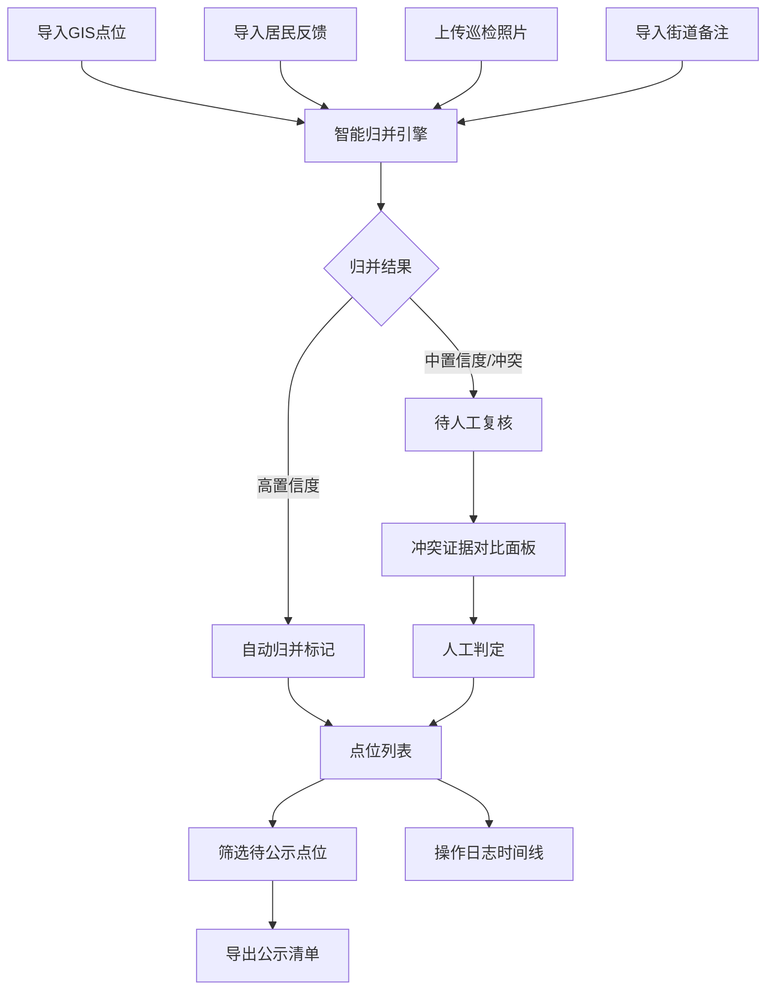

## 1. 产品概述

垃圾分类投放热力数据校对与公示管理工具，解决城市规划师在数据交接时面临的多源数据对齐难题。面向城市规划师、街道巡检人员，实现多源数据导入、智能归并、人工复核、冲突证据展示及公示清单导出全流程。

- 解决问题：同一投放点位多源异构数据（GIS点位、居民反馈、巡检照片、街道备注）的对齐与校对，避免人工逐条比对的低效与失误
- 核心价值：保留数据来源与处理时间线，冲突数据透明展示而非自动决策，确保交接可追溯、可解释

## 2. 核心功能

### 2.1 用户角色

| 角色 | 登录方式 | 核心权限 |
|------|---------|---------|
| 城市规划师 | 本地登录 | 数据导入、归并规则调整、人工复核、导出公示清单、查看操作日志 |
| 巡检人员 | 本地登录 | 上传巡检照片、补充点位备注、查看个人上传记录 |

### 2.2 功能模块

1. **数据导入模块**：GIS点位导入、居民反馈导入、巡检照片上传、街道备注导入
2. **点位归并模块**：智能同名/近名归并、地理距离校验、归并历史追溯
3. **人工复核模块**：待复核列表、冲突证据对比、人工判定、备注留痕
4. **公示导出模块**：筛选条件、公示清单导出、导出记录
5. **操作日志模块**：处理时间线、来源追溯、操作人记录

### 2.3 页面详情

| 页面名称 | 模块名称 | 功能描述 |
|---------|---------|----------|
| 数据导入页 | 文件上传区 | 支持CSV/GeoJSON导入GIS点位，Excel导入居民反馈，批量上传巡检照片 |
| 数据导入页 | 数据预览区 | 导入后预览数据样例、字段映射、脏数据提示 |
| 点位管理页 | 点位列表 | 展示已归并点位，支持按状态/街道/时间筛选 |
| 点位管理页 | 归并详情 | 展示点位多源数据对比、归并依据、处理时间线 |
| 人工复核页 | 待复核列表 | 展示疑似冲突点位、归并存疑点、新导入未处理数据 |
| 人工复核页 | 冲突证据面板 | 左右对比展示GIS数据与巡检照片证据，提供建议动作但不自动决策 |
| 公示导出页 | 筛选配置 | 按街道、状态、时间范围筛选待公示点位 |
| 公示导出页 | 导出预览 | 预览公示清单内容，支持导出Excel/PDF |
| 操作日志页 | 时间线视图 | 展示所有点位的处理历史、操作人、处理时间、来源 |

## 3. 核心流程

用户导入多源数据后，系统按名称相似度+地理距离进行智能归并，标记疑似冲突与存疑点。规划师进入复核页面，系统展示双方证据与建议动作，由人工最终判定。判定完成后可按筛选条件导出公示清单。所有操作保留完整时间线与来源记录。

## 4. 用户界面设计

### 4.1 设计风格

- **主色调**：政务蓝 `#1E5AA8`，代表专业可信；辅以环保绿 `#2E7D32` 标记合规点位，警示橙 `#F57C00` 标记待复核，警示红 `#C62828` 标记冲突
- **按钮风格**：直角微圆角（2px），实心按钮配白色文字，次要按钮为描边样式
- **字体**：标题使用 Noto Serif SC（政务严谨感），正文使用 Noto Sans SC（清晰易读）
- **布局风格**：三栏式主布局，左侧导航+中间内容区+右侧详情面板，卡片式数据展示
- **图标风格**：线性图标，统一2px描边，颜色与状态对应

### 4.2 页面设计概述

| 页面名称 | 模块名称 | UI元素 |
|---------|---------|--------|
| 数据导入页 | 文件上传区 | 拖拽上传区域、文件类型图标、进度条、脏数据数量警示徽章 |
| 点位管理页 | 点位列表 | 数据表格、状态色标签、街道筛选器、时间范围选择器、热力地图小窗 |
| 人工复核页 | 冲突证据面板 | 左右分栏对比布局、GIS坐标卡片、照片预览卡片、证据原文引用、建议动作按钮组 |
| 公示导出页 | 导出预览 | 表格预览、分页、列配置、导出格式选择器 |
| 操作日志页 | 时间线视图 | 垂直时间线、来源标签、操作人头像、时间戳、变更内容对比 |

### 4.3 响应式

- 桌面端优先（1280px+），三栏式布局
- 平板端（768px-1279px）：左右栏可折叠，中间内容区自适应
- 移动端（<768px）：单栏堆叠，导航折叠为汉堡菜单，重点保留复核与导出功能

### 4.4 地图组件说明

- 使用 Leaflet 轻量地图组件展示点位分布
- 底图：OpenStreetMap 中文底图
- 点位标记：按状态使用不同颜色图标，冲突点位使用 pulsating 动画
- 交互：点击点位高亮对应列表项，支持框选批量归并
- 性能：点位较多时采用聚类展示，缩放到14级以上展开单个点位
