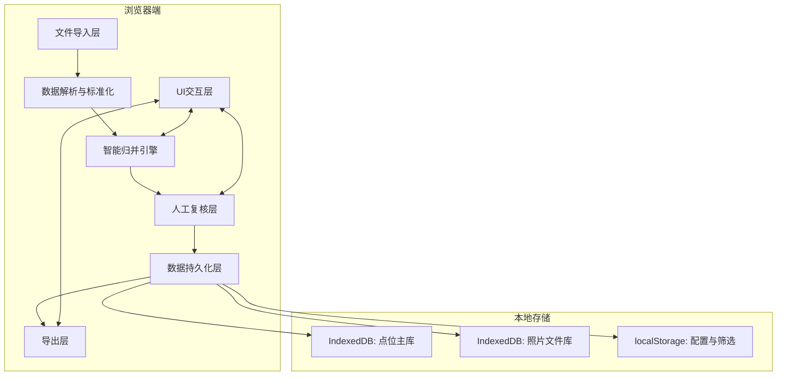
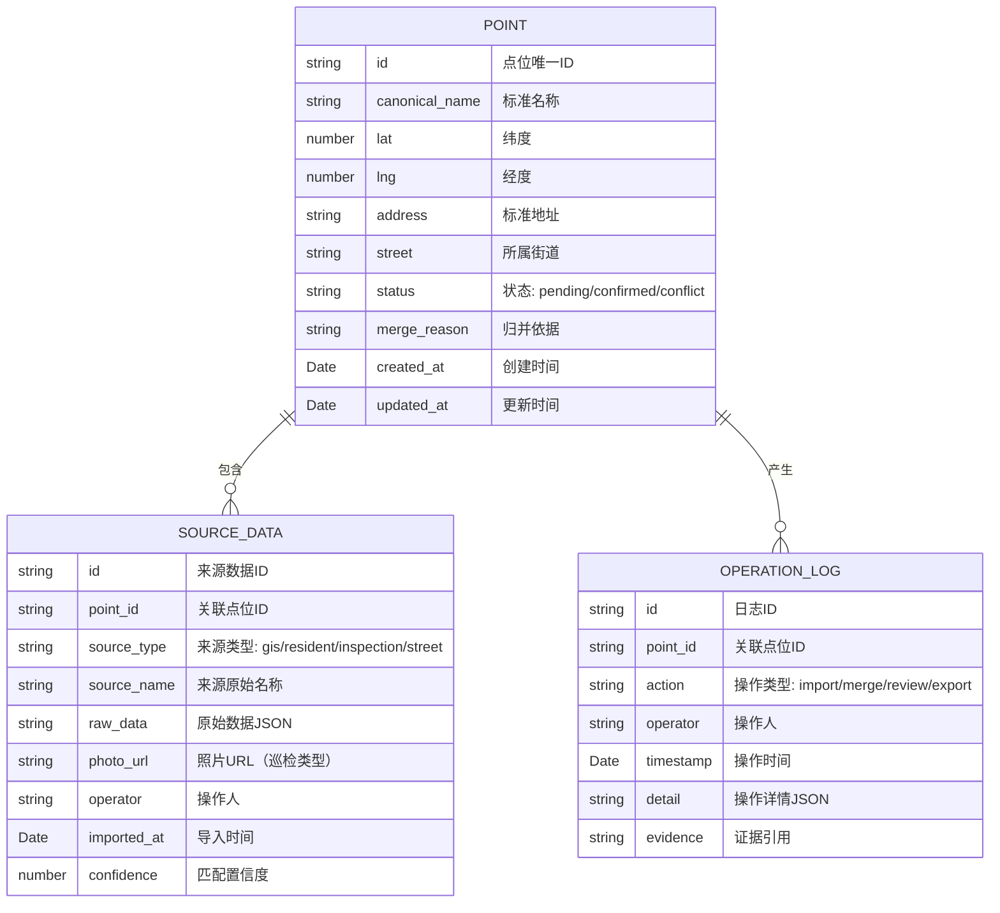

## 1. 架构设计

本地单页应用架构，数据全部存储于浏览器端（IndexedDB + localStorage），无需后端服务即可独立运行。核心数据流向：文件导入 → 解析标准化 → 智能归并引擎 → 人工复核 → 数据持久化 → 导出。



## 2. 技术描述

- **前端框架**: React@18 + TypeScript
- **构建工具**: Vite@5
- **样式方案**: TailwindCSS@3
- **状态管理**: Zustand（轻量级状态管理，避免Redux复杂度）
- **地图组件**: Leaflet@1.9 + react-leaflet@4
- **数据解析**: PapaParse（CSV）, SheetJS/xlsx（Excel）, @turf/turf（地理计算）
- **本地存储**: Dexie.js（IndexedDB封装）
- **文件导出**: SheetJS/xlsx（Excel）, jspdf + jspdf-autotable（PDF）
- **字符串相似度**: fast-levenshtein（编辑距离计算）
- **Mock数据**: 内置小样例数据，首次加载自动初始化

## 3. 路由定义

| 路由 | 页面用途 |
|------|---------|
| / | 点位管理主页（列表+地图） |
| /import | 数据导入页 |
| /review | 人工复核页 |
| /export | 公示导出页 |
| /logs | 操作日志页 |
| /help | 使用说明文档 |

## 4. 数据模型

### 4.1 数据模型定义



### 4.2 核心数据结构定义（TypeScript）

```typescript
// 点位状态枚举
enum PointStatus {
  PENDING = 'pending',      // 待处理
  CONFIRMED = 'confirmed',  // 已确认
  CONFLICT = 'conflict',    // 有冲突
  MERGED = 'merged'         // 已归并
}

// 来源类型枚举
enum SourceType {
  GIS = 'gis',              // GIS点位
  RESIDENT = 'resident',    // 居民反馈
  INSPECTION = 'inspection',// 巡检照片
  STREET = 'street'         // 街道备注
}

// 点位主数据
interface GarbagePoint {
  id: string;
  canonicalName: string;
  lat: number;
  lng: number;
  address: string;
  street: string;
  status: PointStatus;
  mergeReason: string;
  sources: SourceData[];
  createdAt: Date;
  updatedAt: Date;
}

// 来源数据
interface SourceData {
  id: string;
  pointId: string;
  sourceType: SourceType;
  sourceName: string;
  rawData: Record<string, any>;
  photoUrl?: string;
  operator: string;
  importedAt: Date;
  confidence: number; // 0-1，与标准名称的匹配度
}

// 操作日志
interface OperationLog {
  id: string;
  pointId: string;
  action: 'import' | 'merge' | 'split' | 'confirm' | 'reject' | 'export';
  operator: string;
  timestamp: Date;
  detail: string;
  evidence?: string;
}

// 归并规则配置
interface MergeConfig {
  nameSimilarityThreshold: number;  // 名称相似度阈值，默认0.7
  distanceThreshold: number;        // 地理距离阈值（米），默认50
  autoMergeConfidence: number;      // 自动归并置信度，默认0.9
}
```

### 4.3 智能归并算法说明

1. **名称相似度计算**：
   - 使用 Levenshtein 编辑距离计算字符串相似度
   - 去除常见后缀词（"投放点"、"垃圾桶"、"点"等）后比对
   - 同义词替换（如"小区北门"="小区北入口"）

2. **地理距离计算**：
   - 使用 Haversine 公式计算两点球面距离
   - 距离 < 50米 视为可能同一点位
   - 距离 > 200米 禁止归并（避免合错相邻点位）

3. **归并决策逻辑**：
   - 置信度 >= 0.9：自动归并，标记为已确认
   - 0.7 <= 置信度 < 0.9：待人工复核
   - 置信度 < 0.7：作为独立点位

4. **冲突检测**：
   - 同一来源的多个数据指向不同标准点位
   - GIS坐标与照片EXIF坐标相差超过阈值
   - 居民反馈地址与GIS地址不一致

## 5. 核心模块设计

### 5.1 数据导入模块
- 支持文件类型：.csv, .geojson, .xlsx, .xls, .jpg, .jpeg, .png
- 字段映射配置：用户可自定义导入字段与系统字段的对应关系
- 脏数据检测：缺失必填字段、坐标格式错误、名称为空等情况标记并提示
- 导入进度：批量导入时显示进度条和预计剩余时间

### 5.2 智能归并模块
- 增量归并：新导入数据与已有数据比对，不重复处理
- 归并预览：展示拟归并的点位对，包含相似度分数和距离
- 可撤销：归并操作可撤销，恢复为独立点位

### 5.3 人工复核模块
- 冲突对比：左右分栏展示GIS数据与巡检照片
- 证据高亮：自动提取冲突关键词高亮显示
- 建议动作：提供"确认归并"、"作为新点位"、"标记待补充"三个建议按钮
- 复核留痕：所有人工判定必须填写理由，记入操作日志

### 5.4 导出模块
- 导出格式：Excel（.xlsx）、PDF
- 自定义列：可选择导出字段
- 导出水印：可选添加"内部资料"水印
- 导出记录：记录每次导出的筛选条件、时间、操作人

## 6. 初始化与持久化策略

### 6.1 首次启动
- 自动创建 IndexedDB 数据库和表结构
- 加载内置小样例数据（3个街道、8-10个点位、包含故意制造的名称不一致和冲突案例）
- 初始化默认归并规则配置

### 6.2 数据持久化
- 所有点位数据实时写入 IndexedDB
- 照片文件以 Base64 存入 IndexedDB（限制单张 < 5MB）
- 用户筛选条件、视图偏好存入 localStorage
- 支持导出完整数据包（JSON格式）用于备份或迁移

### 6.3 性能优化
- 虚拟滚动：点位列表超过100条时启用虚拟滚动
- 地图聚合：点位较多时使用 Leaflet.markercluster 进行聚合
- 防抖处理：搜索、筛选输入添加 300ms 防抖
- 懒加载：操作日志分页加载，每页50条
