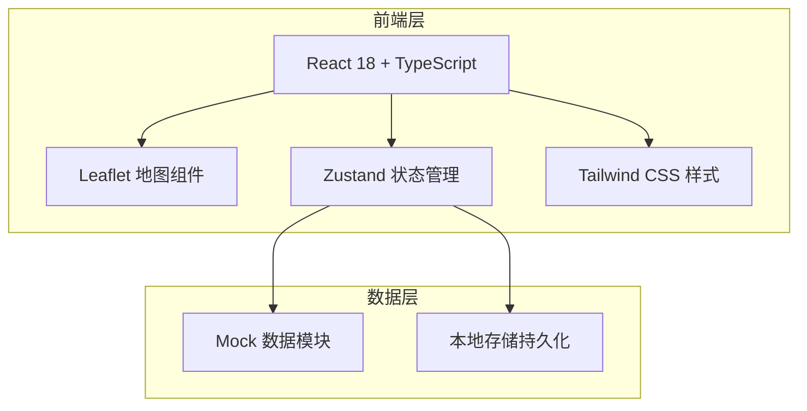
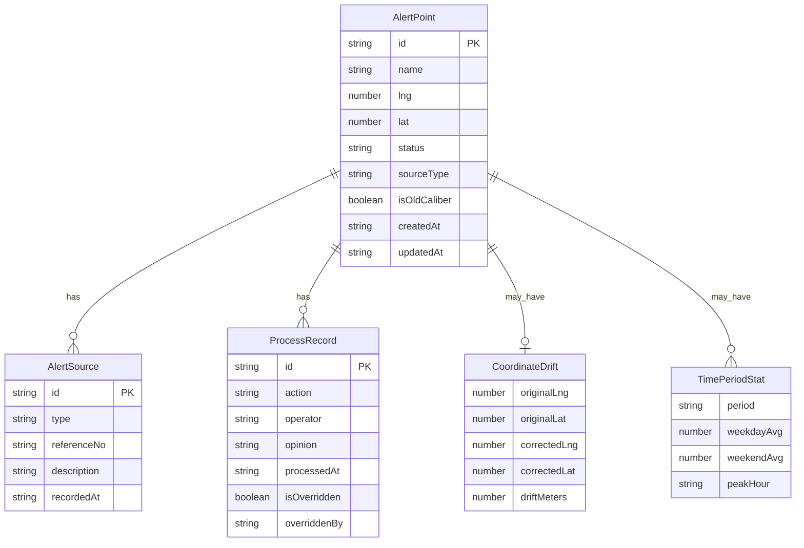

## 1. 架构设计



本项目为纯前端应用，不涉及后端服务。数据使用 Mock 数据模块提供，状态通过 Zustand 管理，关键操作持久化到 localStorage。

## 2. 技术说明

- **前端**：React@18 + TypeScript + Tailwind CSS@3 + Vite
- **初始化工具**：vite-init（react-ts 模板）
- **后端**：无（纯前端，Mock 数据）
- **地图库**：Leaflet + react-leaflet
- **数据库**：无，使用 Mock 数据 + localStorage 持久化
- **图标**：lucide-react
- **状态管理**：Zustand
- **路由**：react-router-dom

## 3. 路由定义

| 路由 | 用途 |
|------|------|
| `/` | 地图总览页，展示所有预警点 |
| `/alert/:id` | 预警点详情页，展示完整溯源链与处理操作 |
| `/export` | 导出页，分类导出预警数据 |

## 4. API 定义

无后端 API。前端通过 Zustand store 直接操作 Mock 数据。

### 4.1 数据类型定义

```typescript
type AlertStatus = "processed" | "pending" | "recheck"

type SourceType = "inspection_report" | "inspection_photo" | "complaint" | "statistics"

interface AlertSource {
  id: string
  type: SourceType
  referenceNo: string
  description: string
  recordedAt: string
}

interface ProcessRecord {
  id: string
  action: "confirmed" | "marked_pending" | "marked_recheck" | "opinion_added"
  operator: string
  opinion: string
  processedAt: string
  isOverridden: boolean
  overriddenBy?: string
}

interface CoordinateDrift {
  originalLng: number
  originalLat: number
  correctedLng: number
  correctedLat: number
  driftMeters: number
}

interface TimePeriodStat {
  period: string
  weekdayAvg: number
  weekendAvg: number
  peakHour: string
}

interface AlertPoint {
  id: string
  name: string
  lng: number
  lat: number
  status: AlertStatus
  sourceType: SourceType
  sources: AlertSource[]
  processRecords: ProcessRecord[]
  coordinateDrift?: CoordinateDrift
  duplicateComplaintIds: string[]
  timePeriodStats?: TimePeriodStat[]
  isOldCaliber: boolean
  inspectionPhotoUrls: string[]
  createdAt: string
  updatedAt: string
}
```

## 5. 服务器架构图

不适用。本项目无后端服务。

## 6. 数据模型

### 6.1 数据模型定义



### 6.2 样例数据初始化

系统启动时加载以下 Mock 数据：

1. **顺利记录**（id: alert-001）
   - 名称：中山路与解放路交叉口
   - 状态：processed
   - 来源：巡检报告 INS-2025-0042
   - 处理记录：确认 → 添加意见 → 标记已处理，完整时间线

2. **人工确认记录**（id: alert-002）
   - 名称：人民广场东入口（同名路口 alert-002-A）
   - 状态：pending
   - 来源：市民投诉 CMP-2025-0118（重复投诉3次）
   - 坐标偏移：原始坐标偏移约47米
   - 跨时段统计：周末日均人流8200 vs 工作日4600

3. **旧口径补录记录**（id: alert-003）
   - 名称：文化街夜市南段
   - 状态：recheck
   - 来源：巡检照片（旧口径）
   - 历史意见：旧方案"增设临时围栏"已被新方案"分时段限流"覆盖，保留历史记录
   - 标记为 isOldCaliber: true
