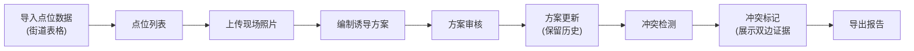

## 1. 产品概述

专为市政设计师老曹打造的"医院周边停车诱导"巡检管理工具，解决巡检数据（点位、照片、反馈、方案）的全链路追踪问题，让杂乱的巡检资料能互相对得上，不用手工核对第二遍。

- 核心价值：保留原始数据痕迹、方案版本可回溯、冲突证据不丢失、交接无障碍

## 2. 核心功能

### 2.1 用户角色

| 角色 | 注册方式 | 核心权限 |
|------|----------|---------|
| 市政设计师 | 本地登录 | 点位导入、照片上传、方案编制、冲突处理、报告导出 |

### 2.2 功能模块

1. **点位总览页：点位列表、筛选搜索、快速统计
2. **点位详情页：点位信息、照片管理、方案历史、冲突标记
3. **方案管理页：版本对比、历史意见、审批记录
4. **报告导出页：筛选导出、使用说明

### 2.3 页面详情

| 页面名称 | 模块名称 | 功能描述 |
|---------|---------|----------|
| 点位总览页 | 顶部导航 | 模块切换、全局搜索、快速筛选 |
| 点位总览页 | 统计卡片 | 点位总数、待处理、有冲突、已完成 |
| 点位总览页 | 点位列表 | 表格展示、状态标签、快速操作 |
| 点位详情页 | 点位信息 | 基础信息展示、原始来源标注、处理时间记录 |
| 点位详情页 | 照片管理 | 照片上传、原始备注保留、多图管理 |
| 点位详情页 | 方案历史 | 版本时间线、新旧方案对比、历史意见 |
| 点位详情页 | 冲突处理 | 数据冲突标记、双边证据展示、建议动作 |
| 报告导出页 | 筛选导出 | 当前筛选条件导出、Excel/JSON报告 |
| 报告导出页 | 使用说明 | 导入点位、补照片、导出筛选操作指南 |

## 3. 核心流程

## 4. 用户界面设计

### 4.1 设计风格

**设计基调：市政专业、稳重、实用主义**
- 主色调：深蓝 #1e3a5f（专业可信）
- 辅助色：橙黄 #f59e0b（警告标记）、绿 #10b981（正常）、红 #ef4444（冲突）
- 字体：系统无衬线字体，清晰易读
- 按钮风格：矩形微圆角，hover轻微阴影
- 布局：卡片式布局，信息分区明确
- 图标：线性图标，专业简洁

### 4.2 页面设计概览

| 页面名称 | 模块名称 | UI元素 |
|---------|---------|--------|
| 点位总览页 | 统计卡片 | 大数字+小标签、hover微动画、色彩区分状态 |
| 点位总览页 | 列表行 | 悬停高亮、状态色标、快速操作按钮 |
| 点位详情页 | 照片网格 | 照片缩略图、原图预览、原始备注气泡 |
| 点位详情页 | 时间线 | 垂直时间线、版本节点、对比按钮 |
| 点位详情页 | 冲突卡片 | 左右分栏对比、证据来源标记、建议动作 |
| 报告导出页 | 操作指南 | 步骤卡片、代码示例、注意事项 |

### 4.3 响应式

桌面端优先，平板自适应，触摸优化列表滚动体验

