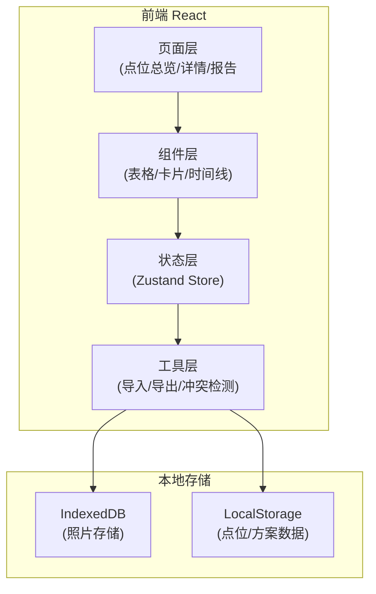
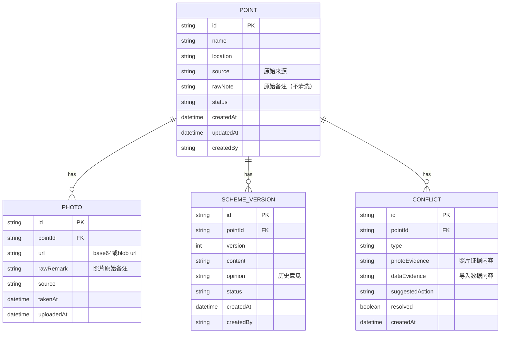

## 1. 架构设计



## 2. 技术说明

- **前端框架**: React@18 + TypeScript
- **构建工具**: Vite
- **样式方案**: TailwindCSS@3
- **状态管理**: Zustand
- **路由管理**: React Router v6
- **本地存储**: LocalStorage + IndexedDB (照片)
- **文件处理**: SheetJS (xlsx) / PapaParse (csv)
- **图标**: Lucide React
- **后端**: 无（纯前端本地应用，数据保存在浏览器）

## 3. 路由定义

| 路由 | 页面名称 | 功能 |
|------|---------|------|
| / | 点位总览页 | 点位列表、筛选搜索、统计卡片 |
| /point/:id | 点位详情页 | 点位信息、照片、方案历史、冲突 |
| /report | 报告导出页 | 导出报告、使用说明 |

## 4. 数据模型

### 4.1 数据模型定义



### 4.2 TypeScript 类型定义

```typescript
// 点位状态枚举
type PointStatus = 'pending' | 'processing' | 'conflict' | 'completed';

// 点位
interface Point {
  id: string;
  name: string;
  location: string;
  hospital: string;
  source: 'street' | 'onsite' | 'approval' | 'other';
  sourceDesc?: string;
  rawNote: string;
  status: PointStatus;
  createdAt: string;
  updatedAt: string;
  createdBy: string;
}

// 照片
interface Photo {
  id: string;
  pointId: string;
  dataUrl: string;
  fileName: string;
  rawRemark: string;
  source: string;
  takenAt?: string;
  uploadedAt: string;
}

// 方案版本
interface SchemeVersion {
  id: string;
  pointId: string;
  version: number;
  content: string;
  opinion: string;
  status: 'draft' | 'submitted' | 'approved' | 'rejected';
  createdAt: string;
  createdBy: string;
  approvalRecord?: string;
}

// 冲突记录
interface Conflict {
  id: string;
  pointId: string;
  type: 'data_mismatch' | 'scheme_override' | 'note_conflict';
  photoEvidence: string;
  dataEvidence: string;
  suggestedAction: string;
  resolved: boolean;
  resolution?: string;
  createdAt: string;
}
```

## 5. 核心功能模块

### 5.1 数据导入模块
- 支持 CSV/XLSX 导入点位数据
- **关键：保留原始备注不清洗
- 记录导入时间和来源

### 5.2 照片管理模块
- 支持多图上传
- 原始备注单独字段存储
- 支持查看大图和原图

### 5.3 方案版本模块
- 新建方案自动版本号递增
- 旧方案永不删除，仅标记历史
- 支持版本对比视图

### 5.4 冲突处理模块
- 自动检测数据冲突（关键字匹配
- 冲突卡片左右对比展示
- 记录解决状态和处理意见

### 5.5 导出模块
- 按当前筛选条件导出
- 导出格式：Excel/JSON
- 包含完整历史和原始数据

