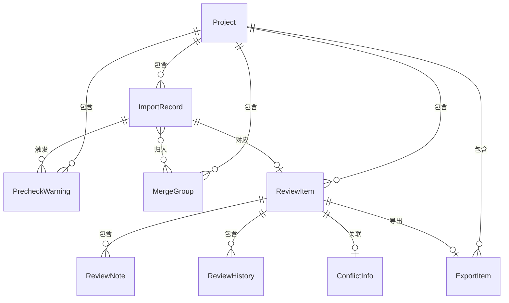

## 1. 架构设计

```mermaid
graph TB
    "前端 React+Vite" --> "API层 Express"
    "API层 Express" --> "数据层 SQLite"
    "数据层 SQLite" --> "文件存储 本地"
    "前端 React+Vite" --> "状态管理 Zustand"
```

采用前后端分离架构，前端React负责界面交互与状态管理，后端Express负责业务逻辑与数据持久化，SQLite作为轻量级本地数据库，无需外部服务依赖即可本地运行。

## 2. 技术说明

- 前端：React@18 + TailwindCSS@3 + Vite + Zustand
- 初始化工具：vite-init
- 后端：Express@4 + TypeScript（ESM格式）
- 数据库：SQLite（better-sqlite3），本地文件存储，零配置
- 样例数据：内置种子数据，包含同名路口、重复投诉、坐标偏移、跨时段统计等场景

## 3. 路由定义

| 路由 | 用途 |
|------|------|
| / | 工作台首页，项目概览与快速入口 |
| /import | 数据导入页面，上传日照数据与审批台账 |
| /merge | 归并去重页面，处理同名路口、重复投诉、坐标偏移等 |
| /review | 人工复核页面，逐项复核与冲突裁决 |
| /export | 公示清单页面，分级导出与交接备注 |

## 4. API定义

### 4.1 数据导入

```
POST   /api/projects                    创建项目
GET    /api/projects/:id                获取项目详情
POST   /api/projects/:id/import         导入数据（日照测量/审批台账）
GET    /api/projects/:id/precheck       获取预检结果
```

### 4.2 归并去重

```
GET    /api/projects/:id/merge-groups   获取归并分组列表
PUT    /api/projects/:id/merge-groups/:groupId  更新归并策略（合并/分开/待定）
GET    /api/projects/:id/conflicts      获取冲突列表
```

### 4.3 人工复核

```
GET    /api/projects/:id/reviews        获取复核列表
PUT    /api/projects/:id/reviews/:reviewId  更新复核判定
POST   /api/projects/:id/reviews/:reviewId/notes  补录备注
GET    /api/projects/:id/reviews/:reviewId/diff    获取补录差异
POST   /api/projects/:id/reviews/:reviewId/resolve  冲突裁决
GET    /api/projects/:id/reviews/:reviewId/history  获取历史意见
```

### 4.4 公示清单

```
GET    /api/projects/:id/export         获取公示清单数据
GET    /api/projects/:id/export/csv     导出CSV
GET    /api/projects/:id/export/history 导出历史版本
```

### 4.5 数据类型定义

```typescript
interface Project {
  id: string
  name: string
  status: 'importing' | 'prechecking' | 'merging' | 'reviewing' | 'exported'
  createdAt: string
  updatedAt: string
}

interface ImportRecord {
  id: string
  projectId: string
  source: 'sunlight' | 'ledger'
  rawRow: Record<string, string>
  locationName: string
  address: string
  longitude: number | null
  latitude: number | null
  period: string
  sunlightHours: number | null
  complaint: string | null
  remark: string | null
  rawRemark: string
  importedAt: string
}

interface PrecheckWarning {
  id: string
  projectId: string
  type: 'same_name' | 'duplicate_complaint' | 'coordinate_drift' | 'cross_period' | 'field_missing'
  severity: 'info' | 'warning' | 'error'
  recordIds: string[]
  description: string
  originalValues: Record<string, string>
  resolved: boolean
}

interface MergeGroup {
  id: string
  projectId: string
  type: 'same_name' | 'duplicate_complaint'
  recordIds: string[]
  strategy: 'merge' | 'separate' | 'pending'
  note: string | null
}

interface ReviewItem {
  id: string
  projectId: string
  recordId: string
  status: 'pending' | 'passed' | 'failed' | 'needs_field_visit' | 'conflict'
  verdict: string | null
  notes: ReviewNote[]
  history: ReviewHistory[]
  conflict: ConflictInfo | null
}

interface ReviewNote {
  id: string
  content: string
  author: string
  createdAt: string
  diffFromPrevious: string | null
}

interface ReviewHistory {
  id: string
  oldStatus: string
  newStatus: string
  oldVerdict: string | null
  newVerdict: string | null
  reason: string
  author: string
  createdAt: string
}

interface ConflictInfo {
  ledgerEvidence: string
  importEvidence: string
  suggestion: string
  resolvedBy: string | null
  resolvedAt: string | null
  resolution: 'accept_ledger' | 'accept_import' | 'needs_field_visit' | null
}

interface ExportItem {
  id: string
  projectId: string
  category: 'processed' | 'pending_verification' | 'needs_field_visit'
  recordId: string
  locationName: string
  address: string
  sunlightHours: number | null
  verdict: string | null
  judgmentBasis: string
  operator: string
  reviewedAt: string
  handoverNote: string | null
}
```

## 5. 服务端架构图

```mermaid
graph LR
    "Controller 路由层" --> "Service 业务层"
    "Service 业务层" --> "Repository 数据层"
    "Repository 数据层" --> "SQLite 数据库"
```

## 6. 数据模型

### 6.1 数据模型定义



### 6.2 数据定义语言

```sql
CREATE TABLE projects (
  id TEXT PRIMARY KEY,
  name TEXT NOT NULL,
  status TEXT NOT NULL DEFAULT 'importing',
  created_at TEXT NOT NULL DEFAULT (datetime('now')),
  updated_at TEXT NOT NULL DEFAULT (datetime('now'))
);

CREATE TABLE import_records (
  id TEXT PRIMARY KEY,
  project_id TEXT NOT NULL REFERENCES projects(id),
  source TEXT NOT NULL CHECK(source IN ('sunlight', 'ledger')),
  raw_row TEXT NOT NULL,
  location_name TEXT NOT NULL,
  address TEXT NOT NULL,
  longitude REAL,
  latitude REAL,
  period TEXT NOT NULL,
  sunlight_hours REAL,
  complaint TEXT,
  remark TEXT,
  raw_remark TEXT NOT NULL,
  imported_at TEXT NOT NULL DEFAULT (datetime('now'))
);

CREATE TABLE precheck_warnings (
  id TEXT PRIMARY KEY,
  project_id TEXT NOT NULL REFERENCES projects(id),
  type TEXT NOT NULL CHECK(type IN ('same_name', 'duplicate_complaint', 'coordinate_drift', 'cross_period', 'field_missing')),
  severity TEXT NOT NULL CHECK(severity IN ('info', 'warning', 'error')),
  record_ids TEXT NOT NULL,
  description TEXT NOT NULL,
  original_values TEXT NOT NULL,
  resolved INTEGER NOT NULL DEFAULT 0
);

CREATE TABLE merge_groups (
  id TEXT PRIMARY KEY,
  project_id TEXT NOT NULL REFERENCES projects(id),
  type TEXT NOT NULL CHECK(type IN ('same_name', 'duplicate_complaint')),
  record_ids TEXT NOT NULL,
  strategy TEXT NOT NULL DEFAULT 'pending' CHECK(strategy IN ('merge', 'separate', 'pending')),
  note TEXT
);

CREATE TABLE review_items (
  id TEXT PRIMARY KEY,
  project_id TEXT NOT NULL REFERENCES projects(id),
  record_id TEXT NOT NULL REFERENCES import_records(id),
  status TEXT NOT NULL DEFAULT 'pending' CHECK(status IN ('pending', 'passed', 'failed', 'needs_field_visit', 'conflict')),
  verdict TEXT,
  conflict_ledger_evidence TEXT,
  conflict_import_evidence TEXT,
  conflict_suggestion TEXT,
  conflict_resolved_by TEXT,
  conflict_resolved_at TEXT,
  conflict_resolution TEXT CHECK(conflict_resolution IS NULL OR conflict_resolution IN ('accept_ledger', 'accept_import', 'needs_field_visit'))
);

CREATE TABLE review_notes (
  id TEXT PRIMARY KEY,
  review_item_id TEXT NOT NULL REFERENCES review_items(id),
  content TEXT NOT NULL,
  author TEXT NOT NULL,
  diff_from_previous TEXT,
  created_at TEXT NOT NULL DEFAULT (datetime('now'))
);

CREATE TABLE review_history (
  id TEXT PRIMARY KEY,
  review_item_id TEXT NOT NULL REFERENCES review_items(id),
  old_status TEXT NOT NULL,
  new_status TEXT NOT NULL,
  old_verdict TEXT,
  new_verdict TEXT,
  reason TEXT NOT NULL,
  author TEXT NOT NULL,
  created_at TEXT NOT NULL DEFAULT (datetime('now'))
);

CREATE TABLE export_items (
  id TEXT PRIMARY KEY,
  project_id TEXT NOT NULL REFERENCES projects(id),
  category TEXT NOT NULL CHECK(category IN ('processed', 'pending_verification', 'needs_field_visit')),
  record_id TEXT NOT NULL REFERENCES import_records(id),
  location_name TEXT NOT NULL,
  address TEXT NOT NULL,
  sunlight_hours REAL,
  verdict TEXT,
  judgment_basis TEXT NOT NULL,
  operator TEXT NOT NULL,
  reviewed_at TEXT NOT NULL,
  handover_note TEXT
);

CREATE INDEX idx_import_records_project ON import_records(project_id);
CREATE INDEX idx_precheck_warnings_project ON precheck_warnings(project_id);
CREATE INDEX idx_merge_groups_project ON merge_groups(project_id);
CREATE INDEX idx_review_items_project ON review_items(project_id);
CREATE INDEX idx_review_notes_review ON review_notes(review_item_id);
CREATE INDEX idx_review_history_review ON review_history(review_item_id);
CREATE INDEX idx_export_items_project ON export_items(project_id);
CREATE INDEX idx_export_items_category ON export_items(category);
```
