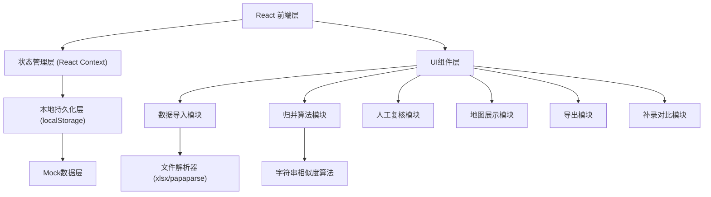
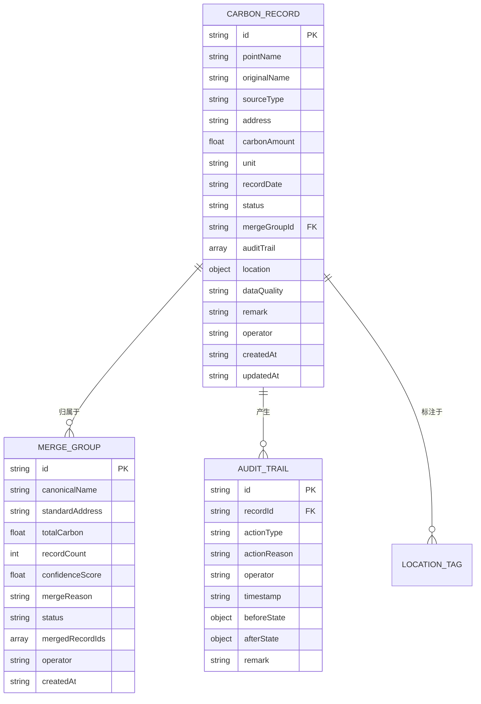

## 1. 架构设计



## 2. 技术描述

- **前端框架**: React@18 + TypeScript + Vite@5
- **样式方案**: TailwindCSS@3 + CSS变量
- **状态管理**: React Context + useReducer
- **本地持久化**: localStorage + 自动定时保存
- **文件解析**: xlsx (Excel) + papaparse (CSV)
- **导出功能**: xlsx (生成Excel)
- **图标库**: lucide-react (线性图标)
- **后端**: 无后端，纯前端实现，所有数据本地存储
- **数据库**: localStorage作为持久化存储，内存中维护完整状态

## 3. 路由定义

| Route | 页面名称 | 主要功能 |
|-------|----------|----------|
| / | 概览仪表盘 | 数据统计卡片、快捷操作入口、近期活动 |
| /import | 数据导入 | 文件上传、数据预览、格式校验 |
| /merge | 点位归并 | 自动归并列表、匹配详情、手动调整 |
| /review | 人工复核 | 三栏看板、审核操作、备注添加 |
| /map | 地图标注 | SVG街区地图、点位展示、状态筛选 |
| /export | 导出公示 | 公示清单、判断原因展示、Excel导出 |
| /supplement | 补录备注 | 数据补录表单、新旧差异对比 |

## 4. 数据模型

### 4.1 核心数据结构



### 4.2 数据字典

#### 数据源类型 (sourceType)
- `street_form`: 街道表格
- `inspection_photo`: 现场照片
- `approval_record`: 审批记录
- `manual_supplement`: 人工补录

#### 记录状态 (status)
- `pending_review`: 待审核
- `auto_merged`: 自动归并待确认
- `review_confirmed`: 审核通过
- `needs_confirmation`: 需要人工确认
- `rejected`: 已驳回
- `split`: 已拆分

#### 匹配算法说明

字符串相似度计算采用多维度加权：
1. **编辑距离** (40%权重): Levenshtein距离计算字符差异
2. **拼音相似度** (30%权重): 中文转拼音后比较
3. **关键词匹配** (20%权重): 提取地址关键词（路/街/号/小区等）
4. **地理位置** (10%权重): 经纬度距离判断

阈值设置：
- 得分 ≥ 85: 自动归并
- 60 ≤ 得分 < 85: 标记为待确认，需人工审核
- 得分 < 60: 视为不同点位

## 5. 样例数据

### 5.1 三条典型记录

**记录1 - 顺利通过（同点异名自动归并）**
```
原始名称A: "东城区和平里街道7号院碳排放点"
原始名称B: "和平里七区节能监测点"
归并后标准名: "东城区和平里街道7号院碳排放监测点"
匹配得分: 92分
来源: 街道表格 + 审批记录
状态: 自动归并通过
判断原因: 编辑距离相似度88% + 关键词"和平里""7号院/七区"匹配 + 经纬度距离50米内
```

**记录2 - 需要人工确认（相似度临界）**
```
原始名称A: "地坛公园南门绿化碳汇点"
原始名称B: "地坛南门停车场旁绿化点"
归并后标准名: "地坛公园南门绿化碳汇点（待确认）"
匹配得分: 72分
来源: 现场照片 + 街道表格
状态: 需要人工确认
判断原因: 编辑距离相似度65% + 关键词"地坛南门"匹配，但具体位置描述有差异，需现场核实
```

**记录3 - 巡检照片旧口径补录**
```
原始名称（旧口径）: "安定门内大街256号门前三包"
原始名称（新口径）: "安定门内大街256号低碳示范点"
归并后标准名: "安定门内大街256号低碳示范点"
匹配得分: 78分
来源: 巡检照片（旧） + 街道表格（新）
状态: 补录待审核
判断原因: 门牌号完全匹配，但名称表述从"门前三包"改为"低碳示范点"，属于口径更新
```

## 6. 项目目录结构

```
src/
├── components/
│   ├── layout/          # 布局组件（导航、侧边栏、页脚）
│   ├── common/          # 通用组件（按钮、卡片、表格、模态框）
│   ├── import/          # 导入模块组件
│   ├── merge/           # 归并模块组件
│   ├── review/          # 复核模块组件
│   ├── map/             # 地图模块组件
│   ├── export/          # 导出模块组件
│   └── supplement/      # 补录模块组件
├── context/
│   ├── CarbonContext.tsx    # 全局状态管理
│   └── types.ts             # TypeScript类型定义
├── utils/
│   ├── mergeAlgorithm.ts    # 归并算法
│   ├── stringSimilarity.ts  # 字符串相似度
│   ├── excelParser.ts       # Excel解析
│   ├── exporter.ts          # 导出工具
│   ├── pinyin.ts            # 拼音转换
│   └── storage.ts           # 本地存储
├── data/
│   └── mockData.ts          # 样例数据
├── pages/
│   ├── Dashboard.tsx
│   ├── Import.tsx
│   ├── Merge.tsx
│   ├── Review.tsx
│   ├── MapView.tsx
│   ├── Export.tsx
│   └── Supplement.tsx
├── App.tsx
├── main.tsx
└── index.css
```

## 7. 核心功能实现要点

### 7.1 判断痕迹留存
- 每条记录维护完整的`auditTrail`数组
- 每次状态变更记录：操作类型、操作原因、操作人、时间戳、变更前后状态
- 导出时自动将判断链格式化为可读文本

### 7.2 本地持久化
- 使用localStorage存储完整应用状态
- 每次状态变更后自动保存（防抖1秒）
- 页面加载时自动恢复状态
- 提供"重置数据"功能恢复初始样例

### 7.3 地图实现
- 使用SVG绘制简化的街区地图，无需第三方地图API
- 点位坐标基于样例数据预设
- 标注点状态通过颜色区分，支持点击查看详情
