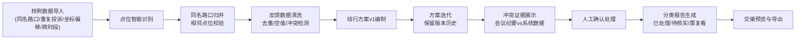

## 1. 产品概述

道路施工绕行评估系统是面向街道工作人员的业务协同平台，解决周姐在交接前需要人工比对现场会议纪要与绕行评估数据的痛点，实现点位、反馈、方案版本和报告的全链路可追溯。

- 核心价值：将"道路施工绕行评估"从分散的会议纪要和Excel表格中解放出来，形成标准化、可追溯、可复用的业务流程
- 目标用户：街道办事处工作人员（周姐及业务同事）、社区交接人员
- 核心场景：施工点位管理、居民投诉处理、绕行方案迭代、评估报告交接

## 2. 核心功能

### 2.1 用户角色

| 角色 | 注册方式 | 核心权限 |
|------|----------|----------|
| 街道工作人员 | 系统内置账号 | 点位管理、反馈处理、方案编制、报告生成、数据导出 |
| 社区交接人员 | 临时授权 | 查看报告、筛选点位、确认交接状态 |

### 2.2 功能模块

1. **数据看板**：总览统计、待办提醒、流程进度、跨时段趋势
2. **点位管理**：点位列表、同名归并、坐标校准、相邻点位区分
3. **反馈记录**：投诉登记、重复检测、空值处理、证据留存
4. **方案版本**：版本追溯、变更对比、冲突证据展示、处理建议
5. **评估报告**：分类导出（已处理/待核实/需复看）、交接清单、历史回溯

### 2.3 页面详情

| 页面名称 | 模块名称 | 功能描述 |
|----------|----------|----------|
| 数据看板 | 总览仪表盘 | 点位总数、待处理反馈、方案版本数、报告统计、跨时段趋势图 |
| 数据看板 | 主流程演示 | 从样例数据到最终报告的完整流程引导，一步一步展示"道路施工绕行评估"全过程 |
| 点位管理 | 点位列表 | 展示所有施工点位，支持搜索、筛选、批量操作 |
| 点位管理 | 点位详情 | 点位基础信息、坐标地图、关联反馈、历史方案、归属关系 |
| 点位管理 | 归并工具 | 同名路口智能识别、人工确认归并、相邻点位防误合校验 |
| 反馈记录 | 反馈列表 | 居民投诉、现场记录、会议纪要导入、重复项标记 |
| 反馈记录 | 冲突处理 | 会议纪要与导入数据冲突时，双边证据展示、建议动作列表 |
| 方案版本 | 版本列表 | 所有绕行方案版本、变更时间、变更人、版本对比 |
| 方案版本 | 版本详情 | 方案内容、关联点位、处理建议、追溯链路 |
| 评估报告 | 报告生成 | 按状态分类（已处理/待核实/需复看）、自动汇总、一键导出 |
| 评估报告 | 交接预览 | 面向社区的报告视图、交接清单、确认记录 |

## 3. 核心流程

### 主流程：从样例到报告的完整评估链路

1. 导入样例数据（包含同名路口、重复投诉、坐标偏移、跨时段统计）
2. 点位智能识别：自动标记同名路口、检测坐标偏移、区分相邻点位
3. 反馈数据清洗：去重处理、空值标记、冲突检测
4. 绕行方案编制：基于点位和反馈生成初版方案，保留版本历史
5. 方案迭代：根据新反馈更新方案，记录每次变更原因
6. 冲突处理：当会议纪要与系统数据不一致时，展示双边证据供人工判断
7. 报告生成：按状态分类导出，形成可交接的评估报告
8. 交接确认：社区人员查看报告，确认接收

### 异常处理流程

1. 空值处理：标记并高亮，提供补全建议
2. 重复项：自动识别并关联，支持合并或保留独立
3. 边界记录：特殊标记，提醒需要现场复看
4. 数据冲突：不自动决策，展示双边证据+建议动作

## 4. 用户界面设计

### 4.1 设计风格

**设计方向：专业政务风 + 清晰业务导向**

- **主色调**：政务蓝 `#1e40af`（权威、可信），辅助色：警示橙 `#f97316`（待处理）、成功绿 `#10b981`（已处理）、警告黄 `#eab308`（待核实）
- **按钮风格**：直角微圆角（4px），扁平化设计，强调功能导向
- **字体**：标题使用"思源黑体 Bold"，正文使用"思源宋体 Regular"，数字使用等宽字体，强化政务专业感
- **布局风格**：左侧导航 + 顶部操作栏 + 主体内容区卡片式布局，信息密度适中
- **图标风格**：线性图标，统一2px描边，避免过于卡通化

### 4.2 页面设计概述

| 页面名称 | 模块名称 | UI元素 |
|----------|----------|--------|
| 数据看板 | 总览仪表盘 | 4个统计大卡片（点位/反馈/方案/报告）、跨时段趋势折线图、待办事项列表、主流程引导卡片 |
| 数据看板 | 主流程演示 | 时间轴式步骤导航，每步可展开查看样例数据处理过程，进度条可视化 |
| 点位管理 | 点位列表 | 表格视图，归并状态标签（已归并/待归并/相邻点位），坐标偏移标记，操作列 |
| 点位管理 | 归并工具 | 左右对比布局，左侧候选点位，右侧预览归并结果，相邻点位红色警示 |
| 反馈记录 | 反馈列表 | 卡片式列表，重复项标记（关联图标），空值红色高亮，冲突项橙色边框 |
| 反馈记录 | 冲突处理 | 左右分栏对比，左侧会议纪要内容，右侧系统导入数据，中间建议动作文字说明 |
| 方案版本 | 版本列表 | 时间轴布局，每个版本卡片显示变更摘要，支持点击展开diff对比 |
| 方案版本 | 版本详情 | 方案正文，处理建议以"业务提醒"卡片形式展示（黄色背景，灯泡图标） |
| 评估报告 | 报告生成 | 三栏布局（已处理/待核实/需复看），每栏独立统计和列表，顶部导出按钮组 |
| 评估报告 | 交接预览 | 打印友好布局，大标题、水印、交接确认区 |

### 4.3 响应式设计

- **桌面优先**：主内容区最小宽度1200px，适配1920px及以上政务显示器
- **平板适配**：左侧导航可折叠，卡片自适应宽度
- **移动端**：简化为列表视图，核心操作按钮固定底部
- **打印优化**：报告页面提供专门的打印样式，去除导航和交互元素

### 4.4 交互细节

- 点位归并时，相邻点位会弹出"⚠️ 这是相邻点位，确定要合并吗？"的确认对话框
- 处理建议卡片采用手写风格字体模拟"业务同事提醒"的亲切感
- 版本切换时有平滑的淡入淡出动画，高亮变更内容
- 空值字段鼠标悬停显示补全建议tooltip
- 主流程演示有"下一步"引导，完成每步后自动解锁后续步骤
