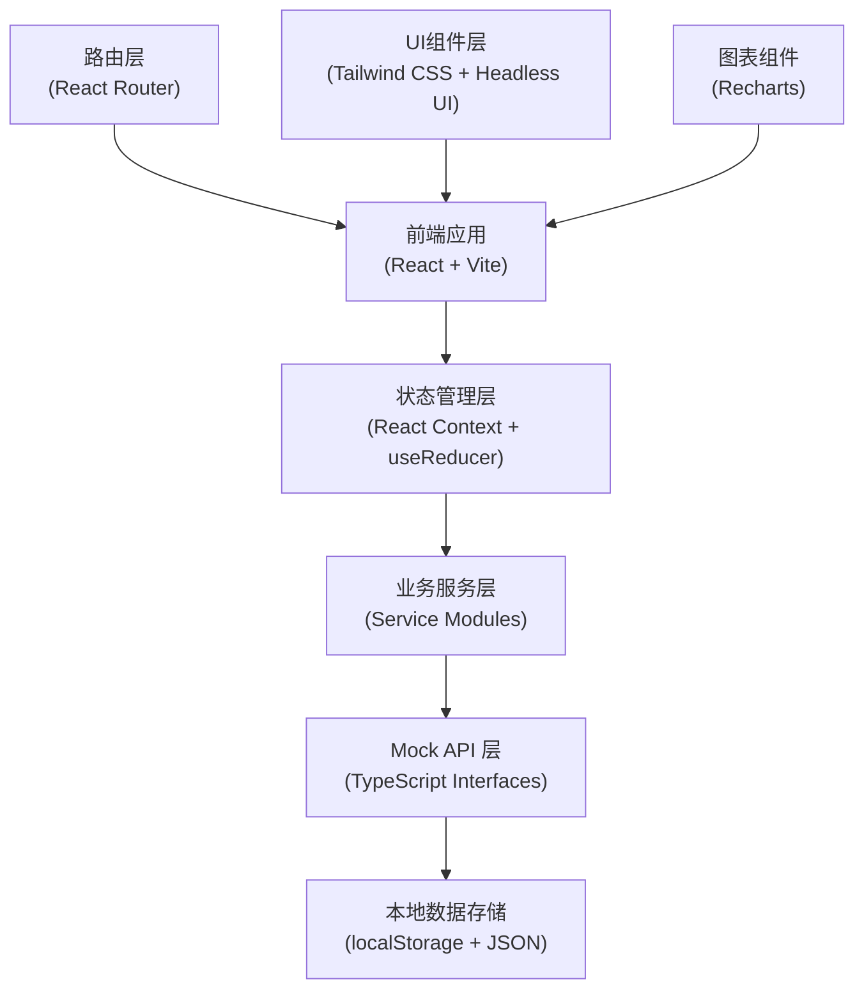
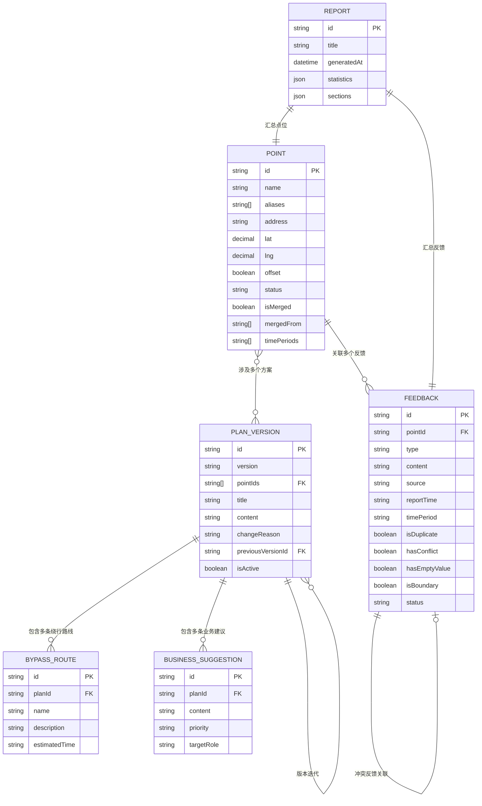

## 1. 架构设计

本系统采用前后端分离架构，前端使用 React + Vite 构建单页应用，后端暂以 Mock 数据模拟，预留完整 API 接口便于后续接入真实后端。



## 2. 技术描述

### 2.1 技术栈选型

- **前端框架**：React@18.2.0 - 组件化开发，生态成熟
- **构建工具**：Vite@5.0.0 - 快速开发体验，热更新
- **样式方案**：Tailwind CSS@3.4.0 - 原子化CSS，快速构建UI
- **UI组件**：Headless UI@1.7.0 - 无样式组件库，高度可定制
- **图标库**：Lucide React@0.294.0 - 线性图标，符合政务风格
- **图表库**：Recharts@2.10.0 - React生态图表库
- **路由管理**：React Router DOM@6.20.0 - 单页路由
- **状态管理**：React Context + useReducer - 轻量级状态管理
- **日期处理**：date-fns@2.30.0 - 轻量日期库
- **类型系统**：TypeScript@5.3.0 - 类型安全

### 2.2 项目初始化

- 使用 `npm create vite@latest` 初始化 React + TypeScript 项目
- 安装 Tailwind CSS 及相关依赖
- 配置 ESLint + Prettier 代码规范
- 配置路径别名 `@/` 指向 `src/` 目录

## 3. 路由定义

| 路由路径 | 页面名称 | 功能说明 |
|----------|----------|----------|
| `/` | 数据看板 | 总览仪表盘、主流程演示入口 |
| `/dashboard` | 数据看板 | 同根路径，仪表盘首页 |
| `/points` | 点位管理 | 点位列表、搜索筛选 |
| `/points/:id` | 点位详情 | 点位信息、关联反馈、历史方案 |
| `/points/merge` | 点位归并 | 同名路口归并工具 |
| `/feedbacks` | 反馈记录 | 反馈列表、重复检测、冲突处理 |
| `/feedbacks/conflict/:id` | 冲突处理详情 | 会议纪要与系统数据对比 |
| `/plans` | 方案版本 | 版本列表、版本对比 |
| `/plans/:id` | 方案详情 | 方案内容、处理建议、追溯链路 |
| `/reports` | 评估报告 | 分类报告、导出功能 |
| `/reports/preview` | 交接预览 | 打印友好的报告预览 |

## 4. API 定义（Mock）

### 4.1 点位相关接口

```typescript
// 点位数据模型
interface Point {
  id: string;
  name: string;
  aliases: string[]; // 同地点不同写法
  address: string;
  coordinates: {
    lat: number;
    lng: number;
    offset?: boolean; // 是否坐标偏移
    originalLat?: number;
    originalLng?: number;
  };
  status: 'pending' | 'processing' | 'verified' | 'completed' | 'review';
  isMerged: boolean;
  mergedFrom?: string[];
  isAdjacent?: boolean; // 是否相邻点位标记
  adjacentPointIds?: string[];
  timePeriods: string[]; // 涉及时段
  createdAt: string;
  updatedAt: string;
}

// 接口定义
interface PointAPI {
  getPoints: (params?: { status?: string; keyword?: string }) => Promise<Point[]>;
  getPointById: (id: string) => Promise<Point | null>;
  getMergeCandidates: () => Promise<Point[][]>; // 同名路口候选组
  mergePoints: (pointIds: string[], targetName: string) => Promise<Point>;
  updatePoint: (id: string, data: Partial<Point>) => Promise<Point>;
  getAdjacentPoints: (pointId: string) => Promise<Point[]>;
}
```

### 4.2 反馈记录相关接口

```typescript
// 反馈数据模型
interface Feedback {
  id: string;
  pointId: string;
  type: 'complaint' | 'meeting' | 'onsite' | 'import';
  title: string;
  content: string;
  source: string; // 来源：会议纪要/居民投诉/现场记录/导入数据
  reporter: string;
  reportTime: string;
  timePeriod: string;
  isDuplicate: boolean;
  duplicateOf?: string; // 关联的重复反馈ID
  hasConflict: boolean;
  conflictWith?: string; // 冲突的反馈ID
  conflictEvidence?: {
    meetingContent?: string;
    systemContent?: string;
    suggestedActions: string[];
  };
  hasEmptyValue: boolean;
  emptyFields?: string[];
  isBoundary: boolean; // 边界记录标记
  status: 'pending' | 'processing' | 'resolved' | 'verify';
  createdAt: string;
}

interface FeedbackAPI {
  getFeedbacks: (params?: { pointId?: string; status?: string; type?: string }) => Promise<Feedback[]>;
  getFeedbackById: (id: string) => Promise<Feedback | null>;
  getDuplicateGroups: () => Promise<Feedback[][]>;
  resolveConflict: (id: string, decision: 'accept_meeting' | 'accept_system' | 'custom', note: string) => Promise<Feedback>;
  createFeedback: (data: Omit<Feedback, 'id' | 'createdAt'>) => Promise<Feedback>;
}
```

### 4.3 方案版本相关接口

```typescript
// 方案版本模型
interface PlanVersion {
  id: string;
  version: string; // v1, v2, ...
  pointIds: string[];
  title: string;
  content: string;
  bypassRoutes: BypassRoute[];
  suggestions: BusinessSuggestion[];
  changeReason: string;
  createdBy: string;
  createdAt: string;
  previousVersionId?: string;
  nextVersionId?: string;
  isActive: boolean;
}

interface BypassRoute {
  id: string;
  name: string;
  description: string;
  startPoint: string;
  endPoint: string;
  estimatedTime: string;
  applicableTime: string;
}

interface BusinessSuggestion {
  id: string;
  content: string;
  priority: 'high' | 'medium' | 'low';
  targetRole: string; // 面向的业务角色
}

interface PlanAPI {
  getPlans: (params?: { pointId?: string }) => Promise<PlanVersion[]>;
  getPlanById: (id: string) => Promise<PlanVersion | null>;
  getPlanVersions: (planId: string) => Promise<PlanVersion[]>;
  compareVersions: (versionId1: string, versionId2: string) => Promise<DiffResult>;
  createPlan: (data: Omit<PlanVersion, 'id' | 'createdAt'>) => Promise<PlanVersion>;
  getTraceChain: (planId: string) => Promise<TraceNode[]>; // 追溯链路
}

interface TraceNode {
  id: string;
  type: 'point' | 'feedback' | 'plan';
  title: string;
  time: string;
  relation: string;
}
```

### 4.4 报告相关接口

```typescript
interface Report {
  id: string;
  title: string;
  generatedAt: string;
  generatedBy: string;
  timeRange: { start: string; end: string };
  statistics: {
    totalPoints: number;
    completedPoints: number;
    pendingPoints: number;
    reviewPoints: number;
    totalFeedbacks: number;
    resolvedFeedbacks: number;
    conflictFeedbacks: number;
  };
  sections: {
    completed: ReportSection;
    pending: ReportSection;
    review: ReportSection;
  };
}

interface ReportSection {
  title: string;
  count: number;
  items: ReportItem[];
}

interface ReportItem {
  id: string;
  pointName: string;
  address: string;
  status: string;
  latestFeedback: string;
  latestPlan: string;
}

interface ReportAPI {
  generateReport: (timeRange?: { start: string; end: string }) => Promise<Report>;
  getReportById: (id: string) => Promise<Report | null>;
  exportReport: (id: string, format: 'pdf' | 'excel' | 'print') => Promise<Blob>;
  getCrossPeriodStats: () => Promise<CrossPeriodData[]>; // 跨时段统计
}

interface CrossPeriodData {
  period: string;
  pointCount: number;
  feedbackCount: number;
  completedRate: number;
}
```

## 5. 数据模型 ER 图



## 6. 目录结构

```
src/
├── assets/              # 静态资源
├── components/          # 通用组件
│   ├── layout/         # 布局组件
│   ├── ui/             # 基础UI组件
│   └── business/       # 业务组件
├── contexts/           # React Context 状态管理
├── hooks/              # 自定义 Hooks
├── mocks/              # Mock 数据
│   ├── points.ts       # 点位数据（含同名路口、坐标偏移样例）
│   ├── feedbacks.ts    # 反馈数据（含重复投诉、空值、边界记录样例）
│   ├── plans.ts        # 方案版本数据
│   └── reports.ts      # 报告数据（含跨时段统计样例）
├── pages/              # 页面组件
│   ├── Dashboard/
│   ├── Points/
│   ├── Feedbacks/
│   ├── Plans/
│   └── Reports/
├── services/           # API 服务层
│   ├── pointService.ts
│   ├── feedbackService.ts
│   ├── planService.ts
│   └── reportService.ts
├── types/              # TypeScript 类型定义
│   ├── index.ts
│   ├── point.ts
│   ├── feedback.ts
│   ├── plan.ts
│   └── report.ts
├── utils/              # 工具函数
│   ├── merge.ts        # 点位归并逻辑
│   ├── duplicate.ts    # 重复检测逻辑
│   ├── conflict.ts     # 冲突处理逻辑
│   └── export.ts       # 导出功能
├── App.tsx
├── main.tsx
└── index.css
```

## 7. 核心业务逻辑说明

### 7.1 同名路口归并算法

1. 标准化地点名称（去除空格、特殊字符、同义词替换：如"路口"="交叉口"="拐角"）
2. 计算名称相似度（Jaccard 相似度 + 编辑距离）
3. 相似度 > 0.85 标记为候选归并组
4. 检查坐标距离：距离 < 50米 确认归并；50-200米 标记为相邻点位，不自动归并
5. 人工确认后执行归并，保留所有别名，坐标取平均值

### 7.2 重复投诉检测

1. 同一点位 + 同一投诉类型 + 7天内 = 疑似重复
2. 内容相似度 > 0.9 = 确认重复
3. 保留最早一条为主记录，其余标记为重复并关联

### 7.3 冲突处理机制

1. 检测同一点位同一时段，会议纪要与导入数据描述不一致
2. 触发冲突标记，不自动决策
3. 展示双边证据：左侧会议纪要原文，右侧系统导入数据
4. 提供建议动作列表供人工选择

### 7.4 跨时段统计

1. 按早高峰(7-9)、日间(9-17)、晚高峰(17-19)、夜间(19-7)划分时段
2. 统计各时段点位数量、反馈数量、完成率
3. 生成趋势图表
