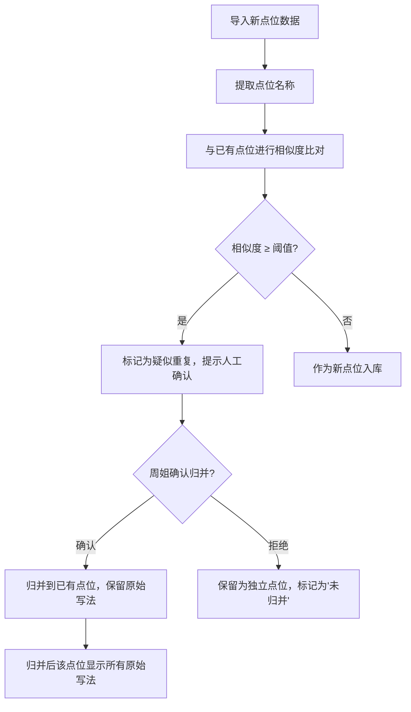
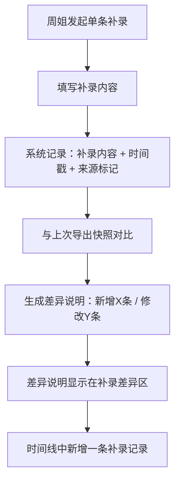

## 1. 产品概述

社区充电桩布局管理工具——面向街道工作人员（周姐）的轻量数据看板，用于把现场会议纪要、街道表格、现场照片和审批记录中关于"社区充电桩布局"的零散材料归拢、归并、追查和导出，确保点位、反馈、方案版本和报告之间可互相追溯，脏数据进来时有交代，例外不在汇总中消失。

- 目标用户：街道办工作人员（以周姐为典型），非技术人员，日常用 Excel 和微信群办公
- 核心价值：让现场会议纪要里的充电桩布局材料与导出结果不脱节；补录差异可追溯；交接时不用再口头解释

## 2. 核心功能

### 2.1 用户角色

| 角色 | 使用方式 | 核心权限 |
|------|----------|----------|
| 街道工作人员 | 本地打开网页即可使用 | 导入、补录、查看、导出全部数据 |
| 交接接收人 | 同上 | 只读查看全部数据及来源追溯 |

### 2.2 功能模块

1. **数据看板页**：全局概览——点位总数、待处理反馈数、当前方案版本号、最近操作时间线
2. **点位管理页**：点位列表 + 搜索/筛选 + 同名归并标记 + 详情面板（含原始来源、照片、备注历史）
3. **反馈与方案页**：反馈记录列表、方案版本对比、每条反馈关联的点位和方案
4. **导入导出页**：批量导入（CSV/Excel）、单条补录、导出当前筛选结果、补录差异说明

### 2.3 页面详情

| 页面名称 | 模块名称 | 功能说明 |
|----------|----------|----------|
| 数据看板页 | 统计卡片 | 点位总数（含归并后/归并前分别显示）、待处理反馈数、当前方案版本号、例外标记数 |
| 数据看板页 | 最近操作时间线 | 按时间倒序展示导入、补录、修改操作，含操作人、时间、原始来源 |
| 数据看板页 | 数据健康度提示 | 脏数据占比、未归并疑似重复点位数、缺失字段统计 |
| 点位管理页 | 点位列表表格 | 列含：点位名称（原始写法）、归并状态、所属方案版本、反馈数量、最近更新时间 |
| 点位管理页 | 搜索筛选栏 | 按名称模糊搜索、按归并状态筛选、按方案版本筛选、按有无反馈筛选 |
| 点位管理页 | 归并提示面板 | 高亮疑似同一地点的不同写法，人工确认归并，相邻点位不自动合并 |
| 点位管理页 | 点位详情侧栏 | 原始来源（表格/照片/审批记录）、原始写法、现场照片缩略图、备注历史（含脏备注原文）、处理时间戳 |
| 反馈与方案页 | 反馈记录列表 | 每条反馈含：内容原文、关联点位、来源、时间、处理状态 |
| 反馈与方案页 | 方案版本卡片 | 各版本摘要，点击可展开查看变更点位清单 |
| 反馈与方案页 | 版本差异视图 | 两个版本之间的点位增减、状态变化、备注变化 |
| 导入导出页 | 批量导入区 | 拖拽上传 CSV/Excel，预览解析结果，标记异常行（缺失字段、格式不符），不丢弃异常行 |
| 导入导出页 | 单条补录表单 | 逐条添加点位/反馈/备注，补录后自动生成差异记录 |
| 导入导出页 | 补录差异说明 | 显示本次补录新增了什么、修改了什么，含时间戳和原始来源标记 |
| 导入导出页 | 导出功能区 | 按当前筛选条件导出 CSV，导出内容含原始来源列和处理时间列 |

## 3. 核心流程

### 3.1 日常使用流程

1. 周姐打开工具，在"导入导出页"上传街道表格（CSV/Excel），系统解析并标记异常行
2. 预览确认后导入，工具自动识别疑似同一地点的不同写法（如"阳光花园东门"与"阳光花园东区门"），在"点位管理页"提示归并
3. 周姐逐条确认归并，拒绝的归并建议保留为"未归并"状态，不会被合并
4. 遇到现场照片，在对应点位详情中补传照片文件
5. 会议后有新反馈或备注，在"导入导出页"单条补录，补录完成后系统显示差异说明
6. 需要汇报时，在"导入导出页"按筛选条件导出当前结果

### 3.2 归并判断流程

### 3.3 补录差异追踪流程

## 4. 用户界面设计

### 4.1 设计风格

- **主色调**：深灰底（#1a1a2e）+ 电光蓝强调色（#0f766e）+ 琥珀色警告（#d97706），传达"数据工具"的实用感而非花哨感
- **次色调**：卡片背景用微灰白（#f8fafc），边框用冷灰（#e2e8f0）
- **按钮风格**：圆角矩形（radius 8px），主操作用实色填充，次要操作用描边
- **字体**：标题用 Noto Sans SC Bold，正文用 Noto Sans SC Regular，数字用 JetBrains Mono
- **布局风格**：左侧固定导航栏 + 右侧内容区，卡片式布局
- **图标风格**：线性图标（Lucide Icons），简洁不抢视觉

### 4.2 页面设计概览

| 页面名称 | 模块名称 | UI 要素 |
|----------|----------|---------|
| 数据看板页 | 统计卡片 | 4列网格，每卡片含大数字 + 标签 + 小趋势指示器，深色底+亮色数字 |
| 数据看板页 | 操作时间线 | 左侧竖线 + 圆点 + 右侧内容卡片，按日期分组 |
| 数据看板页 | 数据健康度 | 三色指示条（绿/黄/红），hover 显示详细数字 |
| 点位管理页 | 点位列表表格 | 斑马纹表格，归并状态用标签色块，hover 行高亮 |
| 点位管理页 | 搜索筛选栏 | 顶部固定，含搜索框+下拉筛选器+重置按钮 |
| 点位管理页 | 归并提示面板 | 浮动面板，左右对比两个点位信息，底部确认/拒绝按钮 |
| 点位管理页 | 点位详情侧栏 | 右侧抽屉式滑出，分区显示基本信息、来源、照片、备注历史 |
| 反馈与方案页 | 反馈记录列表 | 卡片列表，每卡片含状态标签 + 内容摘要 + 关联点位链接 |
| 反馈与方案页 | 方案版本卡片 | 横向时间轴，每个节点可展开 |
| 反馈与方案页 | 版本差异视图 | 左右双栏对比，新增绿色高亮、删除红色高亮、修改黄色高亮 |
| 导入导出页 | 批量导入区 | 虚线拖拽区 + 文件选择按钮，下方预览表格含异常行红标 |
| 导入导出页 | 单条补录表单 | 分组表单，必填项星号标记，提交后下方显示差异卡片 |
| 导入导出页 | 补录差异说明 | 差异卡片：绿色新增条目 + 黄色修改条目，每条含时间戳 |
| 导入导出页 | 导出功能区 | 筛选条件摘要 + 导出按钮，导出后显示文件下载链接 |

### 4.3 响应式设计

- 桌面优先设计，主要在办公电脑上使用
- 1280px 以上完整布局，1024-1280px 导航栏折叠为图标，1024px 以下暂不优化（街道办公场景以桌面为主）

### 4.4 无障碍

- 表格数据支持键盘导航
- 颜色不作为唯一信息传达方式（同时使用图标和文字标签）
- 交互元素有清晰的焦点状态
