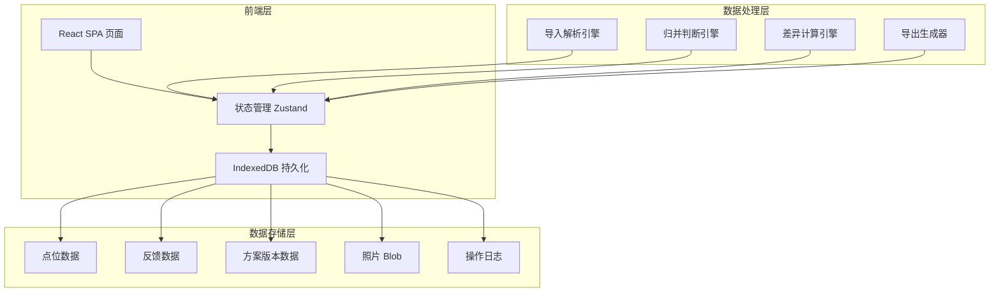
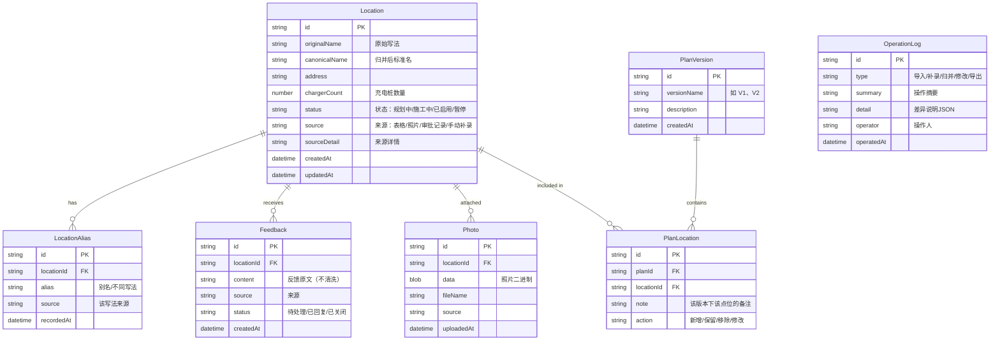

## 1. 架构设计



## 2. 技术说明

- **前端框架**：React@18 + TypeScript
- **样式方案**：TailwindCSS@3
- **构建工具**：Vite
- **初始化工具**：vite-init
- **状态管理**：Zustand（轻量、无 boilerplate）
- **持久化**：IndexedDB（通过 idb 库封装，支持照片 Blob 存储）
- **表格解析**：SheetJS（xlsx）解析 CSV/Excel
- **相似度计算**：自定义字符串相似度（编辑距离 + 拼音首字母匹配）
- **后端**：无（纯前端 SPA，数据存浏览器本地，导出文件即可交接）
- **数据库**：IndexedDB（浏览器内置，无需安装）

## 3. 路由定义

| 路由 | 用途 |
|------|------|
| `/` | 重定向到数据看板页 |
| `/dashboard` | 数据看板页，全局概览和操作时间线 |
| `/locations` | 点位管理页，列表、搜索、归并、详情 |
| `/feedback` | 反馈与方案页，反馈记录和方案版本管理 |
| `/data` | 导入导出页，批量导入、单条补录、导出 |

## 4. 数据模型

### 4.1 数据模型定义



### 4.2 数据定义语言（IndexedDB Object Stores）

```
Object Store: locations
  keyPath: id
  indexes: [canonicalName, status, source, createdAt]

Object Store: locationAliases
  keyPath: id
  indexes: [locationId, alias]

Object Store: feedbacks
  keyPath: id
  indexes: [locationId, status, createdAt]

Object Store: planVersions
  keyPath: id
  indexes: [versionName, createdAt]

Object Store: planLocations
  keyPath: id
  indexes: [planId, locationId]

Object Store: photos
  keyPath: id
  indexes: [locationId, uploadedAt]

Object Store: operationLogs
  keyPath: id
  indexes: [type, operatedAt]
```

## 5. 核心算法说明

### 5.1 点位归并算法

采用两阶段判断：
1. **精确匹配**：去除空格、标点后完全一致 → 自动标记疑似重复
2. **模糊匹配**：计算编辑距离相似度 + 拼音首字母相似度，加权得分 ≥ 0.8 → 标记疑似重复
3. **相邻点位保护**：地址包含"东/西/南/北门"等方向词的，不自动判定为重复，必须人工确认
4. 所有归并操作需人工确认，系统只提示不自动执行

### 5.2 差异计算算法

每次补录或修改后：
1. 记录操作前后的数据快照关键字段
2. 对比新增、修改、删除的条目
3. 生成结构化差异说明（JSON），存入 OperationLog
4. 在 UI 上以绿/黄/红标识展示差异

### 5.3 脏数据处理策略

- 异常行不丢弃，标记为"解析异常"并保留原始行内容
- 脏备注原文完整保留，不清洗、不截断
- 缺失字段用"未填写"占位，不在汇总中隐藏
- 例外情况（如数量为0、状态矛盾）用琥珀色标签明确标出
- 汇总数字单独列出"例外/异常"计数，不混入正常统计

## 6. 项目目录结构

```
src/
├── components/          # 通用UI组件
│   ├── Layout/          # 布局框架（侧栏+顶栏）
│   ├── DataTable/       # 表格组件
│   ├── DiffView/        # 差异对比视图
│   └── MergePanel/      # 归并确认面板
├── pages/               # 页面组件
│   ├── Dashboard/       # 数据看板页
│   ├── Locations/       # 点位管理页
│   ├── Feedback/        # 反馈与方案页
│   └── DataIO/          # 导入导出页
├── stores/              # Zustand 状态仓库
│   ├── locationStore.ts
│   ├── feedbackStore.ts
│   ├── planStore.ts
│   └── operationLogStore.ts
├── services/            # 业务逻辑
│   ├── db.ts            # IndexedDB 封装
│   ├── importService.ts # 导入解析
│   ├── mergeService.ts  # 归并判断
│   ├── diffService.ts   # 差异计算
│   └── exportService.ts # 导出生成
├── types/               # TypeScript 类型定义
│   └── index.ts
├── utils/               # 工具函数
│   ├── similarity.ts    # 相似度算法
│   └── pinyin.ts        # 拼音首字母提取
├── App.tsx
└── main.tsx
```
