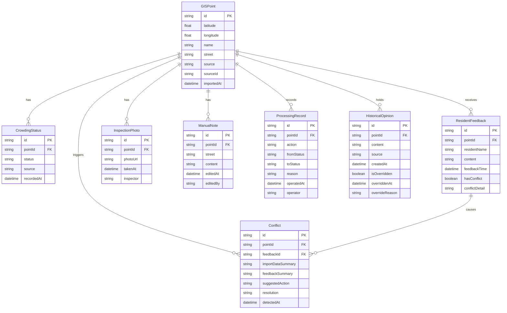

## 1. 架构设计

```mermaid
flowchart TB
    subgraph "前端层"
        "React App" --> "Zustand Store"
        "Zustand Store" --> "localStorage 持久化"
        "React App" --> "Leaflet 地图组件"
        "React App" --> "侧边栏组件"
        "React App" --> "详情面板组件"
        "React App" --> "冲突面板组件"
    end
    subgraph "数据层"
        "localStorage" --> "GIS点位数据"
        "localStorage" --> "居民反馈数据"
        "localStorage" --> "巡检照片数据(base64)"
        "localStorage" --> "人工备注数据"
        "localStorage" --> "处理记录数据"
        "localStorage" --> "历史版本数据"
    end
    subgraph "外部服务"
        "OpenStreetMap 瓦片服务"
    end
    "React App" --> "OpenStreetMap 瓦片服务"
```

## 2. 技术说明

- 前端：React@18 + TypeScript + Tailwind CSS@3 + Vite
- 初始化工具：vite-init
- 后端：无（纯前端，数据持久化到 localStorage）
- 数据库：localStorage（模拟持久化，满足"刷新不丢数据"需求）
- 地图：Leaflet + react-leaflet（免费开源，无需 API Key）
- 状态管理：Zustand + zustand/middleware persist
- 图标：lucide-react
- 照片存储：样例照片使用占位图片URL，巡检照片元数据存入 localStorage

## 3. 路由定义

| 路由 | 用途 |
|------|------|
| / | 监测总览页（地图+侧边栏+详情面板） |

## 4. 数据模型

### 4.1 数据模型定义



### 4.2 数据定义语言（TypeScript 接口）

```typescript
interface GISPoint {
  id: string;
  latitude: number;
  longitude: number;
  name: string;
  street: string;
  source: 'gis_import' | 'resident_feedback' | 'inspection';
  sourceId: string;
  importedAt: string;
}

type CrowdingLevel = 'crowded' | 'normal' | 'pending_review';

interface CrowdingStatus {
  id: string;
  pointId: string;
  status: CrowdingLevel;
  source: string;
  recordedAt: string;
}

interface ResidentFeedback {
  id: string;
  pointId: string;
  residentName: string;
  content: string;
  feedbackTime: string;
  hasConflict: boolean;
  conflictDetail?: string;
}

interface InspectionPhoto {
  id: string;
  pointId: string;
  photoUrl: string;
  takenAt: string;
  inspector: string;
}

interface ManualNote {
  id: string;
  pointId: string;
  street: string;
  content: string;
  editedAt: string;
  editedBy: string;
}

interface ProcessingRecord {
  id: string;
  pointId: string;
  action: string;
  fromStatus: string;
  toStatus: string;
  reason: string;
  operatedAt: string;
  operator: string;
}

interface HistoricalOpinion {
  id: string;
  pointId: string;
  content: string;
  source: string;
  createdAt: string;
  isOverridden: boolean;
  overriddenAt?: string;
  overrideReason?: string;
}

interface Conflict {
  id: string;
  pointId: string;
  feedbackId: string;
  importDataSummary: string;
  feedbackSummary: string;
  suggestedAction: 'use_feedback' | 'use_import' | 'mark_for_review';
  resolution?: 'use_feedback' | 'use_import' | 'mark_for_review';
  detectedAt: string;
}
```
