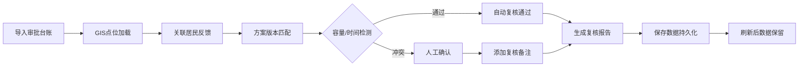

## 1. 产品概述

公交优先信号复核系统，用于解决市政交通审批中"公交优先信号灯"方案复核流程混乱问题，实现点位、居民反馈、方案版本和复核报告的全链路追踪，确保例外情况不被汇总数字掩盖。

- **核心问题**: 审批台账临时拼凑导致版本覆盖、例外情况丢失、追溯困难
- **目标用户**: 市政设计师、交通审批人员、运维巡检人员
- **产品价值**: 实现全流程可追溯、例外透明化、报告可复用

## 2. 核心功能

### 2.1 用户角色
| 角色 | 登录方式 | 核心权限 |
|------|---------|---------|
| 复核人员 | 本地存储（无需登录） | 点位查看、反馈记录、方案比对、报告生成 |

### 2.2 功能模块
1. **GIS点位地图**: 信号点位标注、状态可视化、点位详情
2. **居民反馈管理**: 反馈记录、照片附件、处理状态追踪
3. **方案版本管理**: 版本对比、变更记录、历史回溯
4. **复核报告生成**: 例外说明、冲突检测、数据汇总、报告导出

### 2.3 页面详情
| 页面名称 | 模块名称 | 功能描述 |
|---------|---------|---------|
| 主面板 | 地图视图 | GIS点位可视化展示，支持点击查看详情 |
| 主面板 | 点位列表 | 点位筛选、状态标签、快速搜索 |
| 点位详情 | 反馈记录 | 居民反馈列表、巡检照片、处理备注 |
| 点位详情 | 方案版本 | 版本切换、对比视图、变更时间线 |
| 报告中心 | 报告生成 | 异常检测、例外说明、报告预览导出 |
| 报告中心 | 数据看板 | 状态统计、冲突分布、处理时效 |

## 3. 核心流程

### 3.1 复核处理流程

### 3.2 测试场景覆盖
1. **顺利流程**: 无冲突点位 → 自动通过 → 生成报告
2. **返工流程**: 容量超限/时间段冲突 → 人工确认 → 添加备注 → 生成报告
3. **旧口径导入**: 审批台账历史数据 → 版本标记 → 差异说明

## 4. 用户界面设计

### 4.1 设计风格
- **主色调**: 市政蓝 (#1e40af)，代表专业和可靠
- **辅助色**: 警示橙 (#f59e0b) 标记待确认，成功绿 (#10b981) 标记通过，错误红 (#ef4444) 标记冲突
- **按钮风格**: 简约直角按钮，轻微阴影，点击反馈
- **字体**: 系统无衬线字体，清晰易读
- **布局**: 左侧地图 + 右侧面板的经典双栏布局
- **图标**: 使用简单的SVG图标，避免过度装饰

### 4.2 页面设计概览
| 页面名称 | 模块名称 | UI 元素 |
|---------|---------|---------|
| 主面板 | 地图视图 | 带标记的简易地图、状态色点、点击交互 |
| 主面板 | 点位列表 | 卡片式列表、状态标签、搜索框 |
| 点位详情 | 反馈区 | 时间线布局、照片缩略图、备注输入框 |
| 点位详情 | 版本区 | 标签切换、差异高亮、版本对比 |
| 报告中心 | 报告页 | 例外卡片、人文化说明、导出按钮 |
| 报告中心 | 数据看板 | 统计卡片、条形图、状态分布 |

### 4.3 响应式
- 桌面端优先（市政办公场景）
- 支持平板适配，地图和面板垂直堆叠
- 最小支持宽度: 1024px

### 4.4 朴素界面原则
- 无过度动画，仅必要的状态切换过渡
- 色彩克制，仅用颜色标记状态差异
- 文字说明清晰，避免专业术语堆砌
- 例外情况用大号卡片突出显示，不藏在统计数字里
