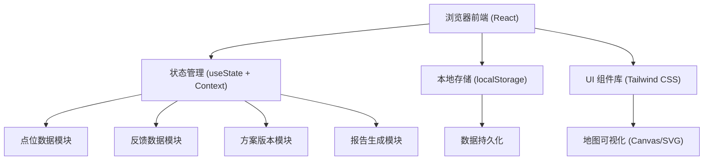
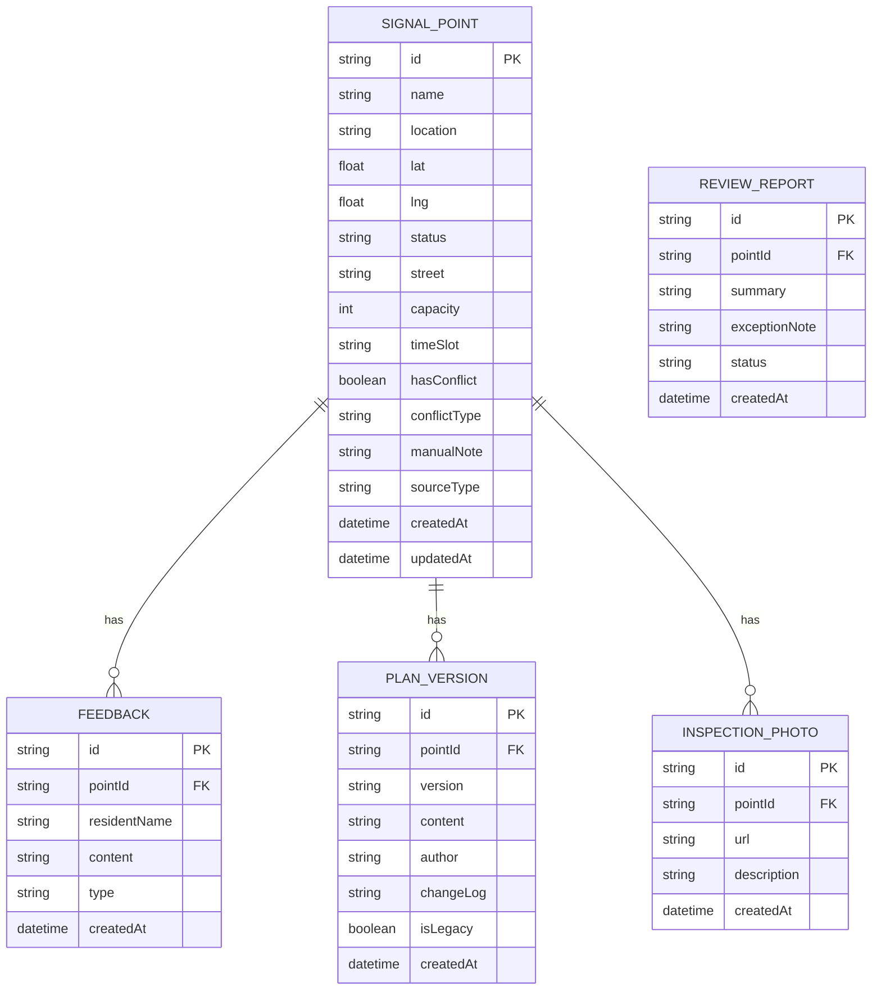

## 1. 架构设计



## 2. 技术说明

- **前端**: React@18 + TypeScript + Tailwind CSS@3 + Vite
- **初始化工具**: npm create vite@latest
- **后端**: 无（纯前端应用，使用 localStorage 持久化）
- **数据库**: 浏览器 localStorage（JSON 格式存储）
- **地图**: 自定义 SVG/Canvas 简易地图（无需 GIS 服务）
- **数据导入**: 内置 Mock 数据 + 支持 JSON 导入

## 3. 路由定义

| 路由 | 用途 |
|------|------|
| / | 主面板 - 地图视图 + 点位列表 |
| /point/:id | 点位详情 - 反馈记录 + 方案版本 |
| /report | 报告中心 - 报告生成 + 数据看板 |

## 4. 数据模型

### 4.1 数据模型定义



### 4.2 Mock 数据规范

**点位数据样例（覆盖测试场景）:**
1. **顺利记录**: 中山路与人民路交叉口 - 无冲突，自动通过
2. **人工确认**: 解放路与建设路交叉口 - 容量超限 15%，需人工备注
3. **旧口径记录**: 和平大道 - 从审批台账导入，标记为历史版本

**异常场景覆盖:**
- 空值: 某个点位缺少 capacity 字段
- 重复项: 同名点位两条记录（需合并提示）
- 边界记录: 容量刚好达到阈值 99%

## 5. 核心模块设计

### 5.1 冲突检测逻辑
```typescript
interface ConflictResult {
  hasConflict: boolean;
  type: 'capacity' | 'timeSlot' | 'empty' | 'duplicate';
  humanReadable: string;
  severity: 'warning' | 'error';
}
```

### 5.2 数据持久化
- 存储键名: `busSignalReviewData`
- 自动保存: 数据变更后 500ms 防抖保存
- 初始化: 首次加载时导入内置 Mock 数据
- 数据导入: 支持 JSON 文件上传导入

### 5.3 人文化说明模板
- 容量超限: "该点位高峰小时预计通过公交车 120 辆，超出设计容量 15%，建议协调相邻路口分流"
- 时间冲突: "早高峰 7:30-9:00 与相邻路口信号配时存在重叠，需人工确认相位差方案"
- 空值提醒: "该点位缺少关键参数，请补充审批台账信息"

## 6. 文件结构

```
src/
├── components/
│   ├── MapView.tsx        # 地图视图
│   ├── PointList.tsx      # 点位列表
│   ├── PointDetail.tsx    # 点位详情
│   ├── FeedbackList.tsx   # 反馈列表
│   ├── VersionPanel.tsx   # 版本面板
│   ├── ReportView.tsx     # 报告视图
│   └── Dashboard.tsx      # 数据看板
├── data/
│   └── mockData.ts        # Mock 数据
├── types/
│   └── index.ts           # 类型定义
├── utils/
│   ├── conflictCheck.ts   # 冲突检测
│   ├── reportGen.ts       # 报告生成
│   └── storage.ts         # 本地存储
├── App.tsx
└── main.tsx
```
