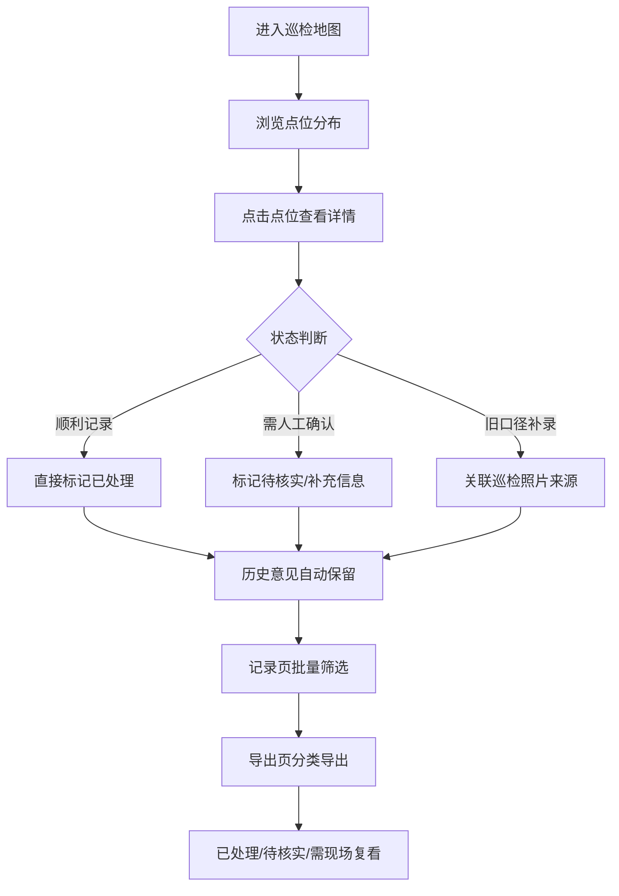

## 1. 产品概述

地下空间导视巡检工具——面向交通工程师何工的日常巡检闭环工具。解决巡检照片与记录对不上、历史意见丢失、处理建议无法直接落地的问题，让巡检结果可追溯、可导出、可复盘。

- 目标用户：交通工程师、社区巡查人员
- 核心价值：一次巡检录入，照片与记录自动匹配，历史意见完整保留，月底复盘直接导出

## 2. 核心功能

### 2.1 用户角色

| 角色 | 使用方式 | 核心权限 |
|------|----------|----------|
| 交通工程师 | 巡检录入、审核确认、导出 | 全部功能 |
| 社区巡查人员 | 查看导出结果 | 只读 |

### 2.2 功能模块

1. **巡检地图页**：地下空间平面图/3D视图，点击点位查看来源、状态、处理记录
2. **巡检记录页**：记录列表、筛选、详情查看、历史意见时间线
3. **导出页**：按状态分离导出（已处理/待核实/需现场复看）

### 2.3 页面详情

| 页面名称 | 模块名称 | 功能描述 |
|----------|----------|----------|
| 巡检地图页 | 平面图/3D视图 | 展示地下空间布局，标注巡检点位，点击弹出详情面板 |
| 巡检地图页 | 点位详情面板 | 显示来源（巡检照片/投诉/旧口径）、当前状态、处理记录时间线 |
| 巡检地图页 | 坐标偏移提示 | 对已知坐标偏移的点位做视觉标注和文字提醒 |
| 巡检记录页 | 记录列表 | 按状态筛选，支持同名路口区分、重复投诉合并提示 |
| 巡检记录页 | 记录详情 | 展示处理建议（业务同事可照做）、历史方案覆盖记录 |
| 巡检记录页 | 状态流转 | 顺利→已处理，待确认→需人工确认，旧口径补录 |
| 导出页 | 分类导出 | 按已处理/待核实/需现场复看三组分别导出CSV |
| 导出页 | 跨时段统计 | 月度统计摘要，可直接用于复盘解释 |

## 3. 核心流程

用户进入地图页查看地下空间全貌 → 点击某点位弹出详情面板 → 查看来源、状态、历史处理记录 → 如需更新状态，在详情面板中操作 → 历史意见自动保留，新方案覆盖时旧记录不丢 → 切换到记录页做批量筛选和确认 → 月底在导出页按状态分类导出，提交社区或复盘使用

## 4. 用户界面设计

### 4.1 设计风格

- 主色调：深灰蓝（#1E293B）+ 琥珀色强调（#F59E0B），地下空间工业感
- 辅助色：状态色——已处理绿（#10B981）、待核实橙（#F97316）、需现场红（#EF4444）
- 按钮风格：圆角微凸，略带3D感
- 字体：Noto Sans SC（中文主字体），JetBrains Mono（编号/坐标等数据）
- 布局：左侧地图占主区域，右侧详情面板抽屉式滑出
- 图标：Lucide图标，线条风格

### 4.2 页面设计概述

| 页面名称 | 模块名称 | UI元素 |
|----------|----------|--------|
| 巡检地图页 | 平面图视图 | SVG地下空间平面图，点位用圆点标注，颜色按状态区分，hover高亮，点击弹出详情 |
| 巡检地图页 | 详情面板 | 右侧抽屉面板，顶部状态徽章，中部来源信息+巡检照片缩略图，底部处理记录时间线 |
| 巡检记录页 | 记录列表 | 卡片列表，每张卡片含路口名、状态标签、最近处理时间，同名路口用编号区分 |
| 巡检记录页 | 详情弹窗 | 模态弹窗，处理建议用醒目提示框，历史方案覆盖用折叠时间线 |
| 导出页 | 分类卡片 | 三列卡片（已处理/待核实/需现场复看），每张卡片显示数量和导出按钮 |

### 4.3 响应式

桌面优先设计，地图区域自适应宽度，详情面板固定宽度400px抽屉。移动端详情面板改为底部抽屉。

### 4.4 样例数据设计

样例包含以下边界情况：
- **同名路口**：两个"人民路-中山路"路口，编号A01和A02，坐标不同
- **重复投诉**：同一问题3次投诉，需合并展示
- **坐标偏移**：一个点位坐标偏移约50米，需标注提醒
- **跨时段统计**：一条2025年3月和2025年5月两次巡检的记录
- **顺利记录**：标识牌完好，直接标记已处理
- **需人工确认记录**：标识牌位置存疑，需现场核实
- **旧口径补录**：早期巡检照片发现的旧问题，补入系统
- **空值**：一条记录缺少处理人字段
- **重复项**：两条完全相同的录入记录
- **边界记录**：状态处于"待核实"与"需现场复看"边界
