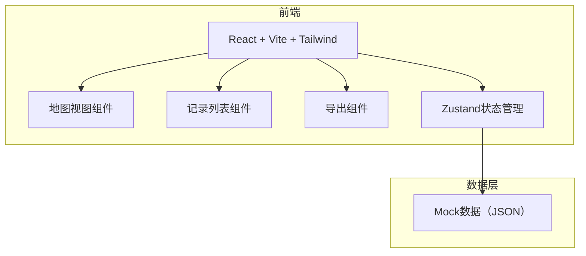
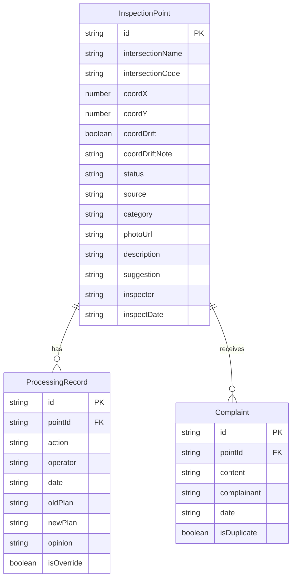

## 1. 架构设计

纯前端方案，数据存储在客户端 Zustand store + localStorage，无需后端服务。

## 2. 技术说明

- 前端：React@18 + Tailwind CSS@3 + Vite + TypeScript
- 初始化工具：vite-init
- 后端：无（纯前端，数据持久化使用 localStorage）
- 数据库：无（Mock JSON 数据，运行时 Zustand + localStorage）

## 3. 路由定义

| 路由 | 用途 |
|------|------|
| / | 巡检地图页，展示地下空间平面图与点位 |
| /records | 巡检记录页，列表筛选与详情查看 |
| /export | 导出页，分类导出与跨时段统计 |

## 4. 数据模型

### 4.1 数据模型定义

### 4.2 状态枚举

| 状态值 | 含义 | 颜色 |
|--------|------|------|
| completed | 已处理 | 绿 #10B981 |
| pending_verify | 待核实 | 橙 #F97316 |
| need_onsite | 需现场复看 | 红 #EF4444 |

### 4.3 来源枚举

| 来源值 | 含义 |
|--------|------|
| inspection_photo | 巡检照片 |
| complaint | 投诉 |
| old_standard | 旧口径补录 |

## 5. 核心交互逻辑

1. **地图点击**：点击点位 → 从 store 查询 InspectionPoint → 右侧抽屉展示详情 + ProcessingRecord 时间线 + 关联 Complaint
2. **同名路口**：通过 intersectionCode 区分，地图上显示编号
3. **重复投诉合并**：同一 pointId 下多条 Complaint，isDuplicate=true 的折叠展示
4. **坐标偏移**：coordDrift=true 时，地图上该点位用虚线圆环标注，详情面板显示偏移说明
5. **方案覆盖**：ProcessingRecord 中 isOverride=true 时，oldPlan 字段保留旧方案文本，时间线上用"已覆盖"标签标注
6. **导出**：按 status 分组生成 CSV，包含跨时段统计摘要
