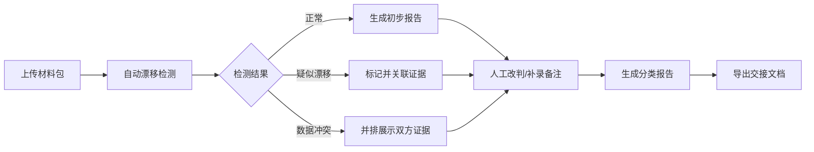

## 1. 产品概述

客服意图漂移监控系统是一个面向标注负责人、产品经理和算法工程师的质量监控工具，解决客服意图识别模型在生产环境中出现的意图漂移问题。系统提供样本对比、人工改判、版本回溯和冲突证据展示功能，确保模型输出与人工标注结果可追溯、可验证。

- **核心问题**：避免同一条样本被重复评测，确保模型输出、人工修正和导出结果不脱节
- **目标用户**：标注负责人（周姐）、产品经理、算法工程师、评审同事
- **核心价值**：提供真实可信的漂移检测结果，支持证据溯源和清晰的处理建议

## 2. 核心功能

### 2.1 用户角色
| 角色 | 登录方式 | 核心权限 |
|------|----------|----------|
| 标注负责人 | 系统账号 | 上传材料、运行检测、补录备注、导出报告、复核样本 |
| 产品/算法 | 系统账号 | 查看报告、浏览证据、确认改判结果 |
| 评审同事 | 系统账号 | 查看检测结果、追溯证据、参与复核 |

### 2.2 功能模块
1. **检测仪表盘**：运行状态概览、样本统计、漂移趋势
2. **样本管理**：材料上传、样本列表、版本管理、补录备注
3. **漂移检测**：自动检测、证据溯源、阈值设置、冲突展示
4. **人工改判**：样本评审、改判记录、历史回溯、意见备注
5. **报告中心**：分类报告、导出功能、交接文档、复核清单

### 2.3 页面详情
| 页面名称 | 模块名称 | 功能描述 |
|---------|----------|----------|
| 检测仪表盘 | 概览卡片 | 显示样本总数、漂移占比、已复核、待复核统计数据 |
| 检测仪表盘 | 趋势图表 | 展示历史检测结果的意图漂移趋势曲线 |
| 样本管理 | 材料上传 | 支持批量导入模型输出日志、人工标注、线上反馈数据 |
| 样本管理 | 样本列表 | 表格展示所有样本，支持搜索、筛选、版本切换 |
| 样本管理 | 版本回溯 | 可查看每个样本的历史版本、修改记录、改判原因 |
| 漂移检测 | 自动检测 | 运行模型对比检测，标记疑似漂移样本 |
| 漂移检测 | 证据溯源 | 点击可展开查看模型输出、人工标注、阈值对比的详细证据 |
| 漂移检测 | 冲突处理 | 模型与人工判断冲突时，并排展示双方证据，不自动拍板 |
| 人工改判 | 评审工作台 | 逐条评审样本，标记改判结果，填写改判理由 |
| 人工改判 | 补录备注 | 支持检测完成后临时补充备注，清晰展示补录前后差异 |
| 报告中心 | 分类报告 | 区分模型判断、人工修正、仍需复核三类样本清单 |
| 报告中心 | 导出功能 | 导出完整报告，用于标注负责人交接存档 |

## 3. 核心流程

### 3.1 标准检测流程
1. 标注负责人登录系统，上传"客服意图漂移监控"材料包（样本、模型输出、人工修正、线上反馈）
2. 系统自动运行漂移检测，对比模型输出与标注数据
3. 系统标记疑似漂移样本，每条记录都关联可追溯的证据
4. 标注负责人可临时补录备注，系统清晰展示补录前后的差异
5. 若模型与人工判断冲突，系统并排展示双方证据和建议动作，不替用户拍板
6. 标注负责人进行人工改判，所有改判记录留存可查
7. 生成分类报告，区分模型判断、人工修正、仍需复核的样本
8. 导出完整报告，用于标注负责人周姐交接

### 3.2 异常处理流程
- 脏材料（格式错误、数据缺失）进入时，系统给出明确的异常提示和处理建议
- 同一条样本重复导入时，系统自动识别并提示已存在，避免重复评测

## 4. 用户界面设计

### 4.1 设计风格
- **主色调**：深蓝 #1E3A5F（专业、可信），搭配橙色 #FF7A45 作为漂移警告色
- **按钮风格**：圆角矩形，轻微阴影，悬停时有缩放和颜色渐变效果
- **字体**：标题使用 Noto Sans SC 粗体，正文使用思源黑体，确保中文可读性
- **布局风格**：左侧导航 + 右侧内容区，卡片式布局，清晰的信息层级
- **图标风格**：线性图标，保持一致性，关键操作使用彩色图标区分

### 4.2 页面设计概览
| 页面名称 | 模块名称 | UI 元素 |
|---------|----------|---------|
| 检测仪表盘 | 概览卡片 | 渐变背景、大号数字、趋势箭头图标、统计标签 |
| 检测仪表盘 | 趋势图表 | 折线图、时间轴选择器、数据点悬浮提示 |
| 样本管理 | 材料上传 | 拖拽上传区域、文件列表、进度条、状态图标 |
| 样本管理 | 样本列表 | 斑马纹表格、状态标签、行展开详情、版本选择器 |
| 漂移检测 | 证据卡片 | 分栏对比布局、高亮差异项、证据引用链接、建议操作按钮 |
| 漂移检测 | 冲突展示 | 左右对比布局、中间VS分隔、各自证据区域、底部建议动作 |
| 人工改判 | 评审工作台 | 详情面板、改判单选框、理由输入框、历史记录时间线 |
| 报告中心 | 分类报告 | 三栏卡片布局（模型判断/人工修正/待复核）、样本计数、快速跳转 |

### 4.3 响应式
- 桌面端优先设计，适配 1440px 及以上宽度
- 平板端自适应调整列数和卡片大小
- 移动端简化布局，保留核心功能操作

### 4.4 视觉细节
- 证据溯源区域使用轻微阴影和边框突出层次感
- 漂移样本使用橙色边框和背景色强调
- 冲突页面使用红色和蓝色分别标注两边观点
- 时间线组件展示改判历史，清晰标注操作者和时间
- 表格行悬停时有背景色变化，点击展开有平滑过渡动画
