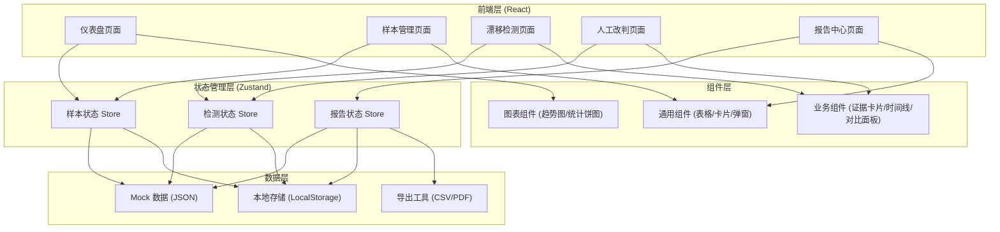
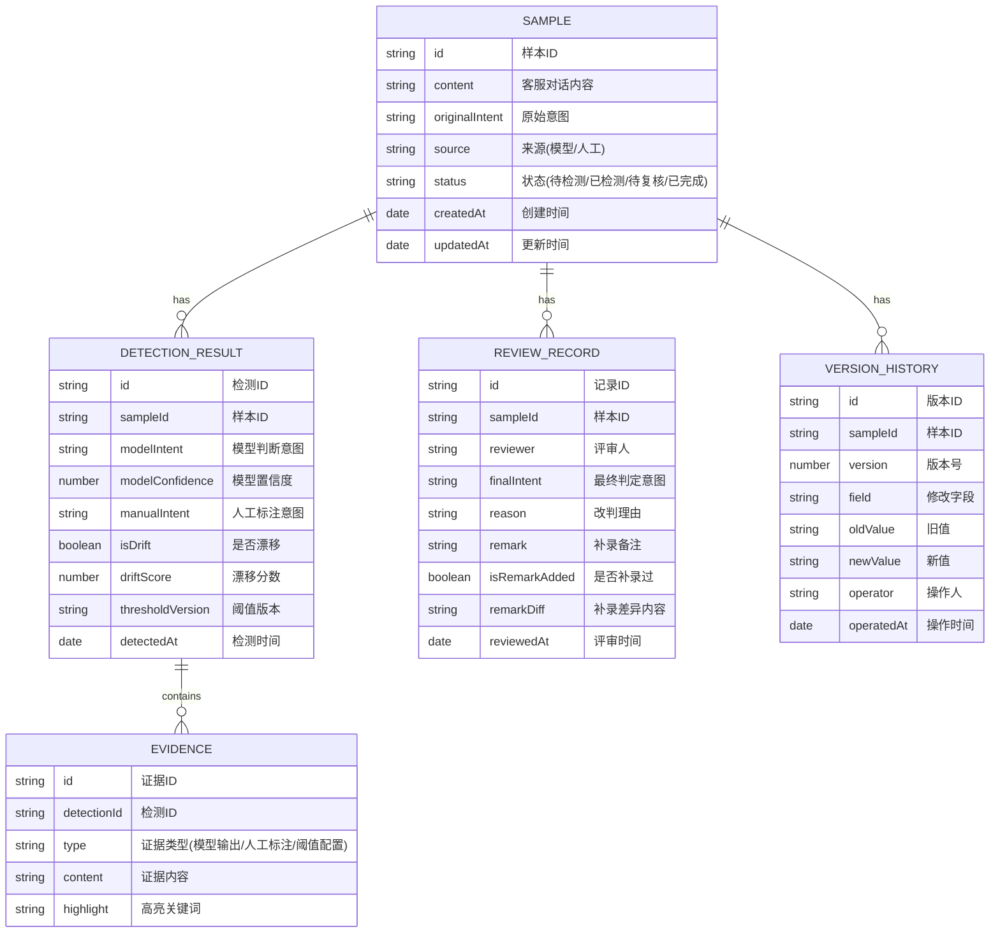

## 1. 架构设计



## 2. 技术描述

- **前端框架**: React@18 + TypeScript
- **构建工具**: Vite@5
- **样式方案**: TailwindCSS@3 + PostCSS
- **状态管理**: Zustand@4 (轻量级状态管理)
- **路由方案**: React Router@6
- **图表库**: Recharts@2 (趋势图表)
- **UI 组件库**: Headless UI (无样式组件) + Heroicons (图标)
- **数据持久化**: LocalStorage (保存改判记录和备注)
- **导出功能**: 原生 JS 实现 CSV/PDF 导出

## 3. 路由定义

| 路由 | 页面名称 | 主要功能 |
|------|----------|----------|
| / | 检测仪表盘 | 概览统计、趋势图表、快捷入口 |
| /samples | 样本管理 | 材料上传、样本列表、版本切换 |
| /detection | 漂移检测 | 自动检测、证据溯源、冲突展示 |
| /review | 人工改判 | 样本评审、改判操作、补录备注 |
| /reports | 报告中心 | 分类报告、导出功能、交接文档 |

## 4. 数据模型

### 4.1 数据模型定义



### 4.2 TypeScript 类型定义

```typescript
// 样本类型
interface Sample {
  id: string;
  content: string;
  originalIntent: string;
  source: 'model' | 'manual' | 'online';
  status: 'pending' | 'detected' | 'reviewing' | 'completed';
  createdAt: string;
  updatedAt: string;
}

// 检测结果类型
interface DetectionResult {
  id: string;
  sampleId: string;
  modelIntent: string;
  modelConfidence: number;
  manualIntent?: string;
  isDrift: boolean;
  driftScore: number;
  thresholdVersion: string;
  detectedAt: string;
  evidences: Evidence[];
}

// 证据类型
interface Evidence {
  id: string;
  type: 'model_output' | 'manual_label' | 'threshold_config';
  content: string;
  highlight?: string[];
}

// 评审记录类型
interface ReviewRecord {
  id: string;
  sampleId: string;
  reviewer: string;
  finalIntent: string;
  reason: string;
  remark?: string;
  isRemarkAdded: boolean;
  remarkDiff?: {
    before: string;
    after: string;
  };
  reviewedAt: string;
}

// 版本历史类型
interface VersionHistory {
  id: string;
  sampleId: string;
  version: number;
  field: string;
  oldValue: string;
  newValue: string;
  operator: string;
  operatedAt: string;
}

// 报告类型
interface Report {
  id: string;
  name: string;
  generatedAt: string;
  statistics: {
    totalSamples: number;
    modelDecision: number;
    manualCorrection: number;
    needReview: number;
    driftRate: number;
  };
  samples: {
    modelDecision: string[];
    manualCorrection: string[];
    needReview: string[];
  };
}
```

## 5. 前端组件架构

```
src/
├── assets/              # 静态资源
├── components/
│   ├── common/         # 通用组件
│   │   ├── Button.tsx
│   │   ├── Card.tsx
│   │   ├── Modal.tsx
│   │   ├── Table.tsx
│   │   ├── Tabs.tsx
│   │   └── Badge.tsx
│   ├── business/       # 业务组件
│   │   ├── EvidenceCard.tsx
│   │   ├── ConflictPanel.tsx
│   │   ├── Timeline.tsx
│   │   ├── SampleRow.tsx
│   │   ├── RemarkDiff.tsx
│   │   └── UploadArea.tsx
│   └── charts/         # 图表组件
│       ├── TrendChart.tsx
│       └── StatChart.tsx
├── pages/              # 页面组件
│   ├── Dashboard.tsx
│   ├── Samples.tsx
│   ├── Detection.tsx
│   ├── Review.tsx
│   └── Reports.tsx
├── store/              # 状态管理
│   ├── sampleStore.ts
│   ├── detectionStore.ts
│   └── reportStore.ts
├── types/              # 类型定义
│   └── index.ts
├── data/               # Mock 数据
│   ├── samples.ts
│   ├── detections.ts
│   └── reviews.ts
├── utils/              # 工具函数
│   ├── export.ts
│   ├── storage.ts
│   └── drift.ts
├── App.tsx
├── main.tsx
└── index.css
```

## 6. 核心功能实现方案

### 6.1 证据溯源
- 每条检测结果关联多个证据卡片
- 点击证据卡片展开详细内容，高亮关键差异点
- 支持证据链接跳转，在样本详情中定位具体位置

### 6.2 冲突处理
- 左右分栏布局，左侧展示模型证据，右侧展示人工标注
- 中间"VS"分隔，清晰对比
- 底部展示建议动作，不自动决策，由人工判断

### 6.3 补录备注
- 检测完成后允许添加备注
- 使用 diff 算法对比补录前后内容
- 高亮显示新增或修改的文字

### 6.4 版本回溯
- 每个样本维护版本历史记录
- 时间线组件展示修改历程
- 支持点击查看任意版本的完整内容
