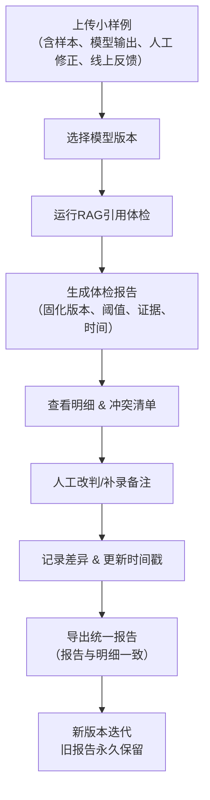

## 1. 产品概述

RAG知识库引用体检系统，专为算法工程师设计的版本化体检工具。解决"指标涨了但样本是不是变了"的信任问题，让每一条判断都有迹可循，每一次版本迭代都清晰可追溯。

- 核心价值：将RAG引用体检的判断过程完整固化，避免人工标注与导出结果脱节
- 目标用户：算法工程师、模型交接人员、质量审核人员
- 市场价值：建立可审计的模型评估链路，让交接不再反复核对

## 2. 核心功能

### 2.1 用户角色
| 角色 | 注册方式 | 核心权限 |
|------|---------|---------|
| 算法工程师 | 本地配置 | 上传样本、运行体检、补录备注、切换模型版本 |
| 交接人员 | 本地配置 | 查看历史报告、对比版本差异、导出明细 |
| 审核人员 | 本地配置 | 查看冲突清单、人工改判记录、证据溯源 |

### 2.2 功能模块
1. **体检总览页**：版本时间线、核心指标趋势、快速操作入口
2. **样本管理页**：样本上传、原始数据查看、标注状态
3. **体检详情页**：单条样本完整判断链路、证据链、人工改判记录
4. **版本对比页**：多模型版本结果对比、指标变化、差异明细
5. **冲突清单页**：模型输出与人工改判不一致的条目集中展示

### 2.3 页面详情
| 页面名称 | 模块名称 | 功能描述 |
|---------|---------|----------|
| 体检总览页 | 版本时间线 | 按时间倒序展示所有体检版本，标注模型版本号、处理时间、操作人员 |
| 体检总览页 | 指标卡片 | 准确率、召回率、F1、人工改判率等核心指标，支持版本间对比 |
| 体检总览页 | 快速操作 | 上传新样本、切换模型版本、导出报告、补录备注 |
| 样本管理页 | 样本列表 | 展示所有样本，包含原始问题、知识库来源、处理时间 |
| 样本管理页 | 上传区域 | 拖拽上传JSONL格式样本包，支持小样例批量导入 |
| 样本管理页 | 样本详情 | 查看单条样本的完整原始数据、引用片段、标注信息 |
| 体检详情页 | 判断链路 | 模型版本、阈值设置、引用证据、置信度、完整推理过程 |
| 体检详情页 | 人工改判 | 改判前后对比、改判原因、改判时间、改判人 |
| 体检详情页 | 备注补录 | 支持后续追加备注，记录补录时间与内容差异 |
| 版本对比页 | 版本选择器 | 选择2-3个模型版本进行横向对比 |
| 版本对比页 | 指标对比表 | 各版本核心指标并列展示，标记涨跌幅度 |
| 版本对比页 | 差异明细 | 列出结果不一致的样本，逐条展示差异原因 |
| 冲突清单页 | 冲突列表 | 集中展示模型输出与人工改判不一致的条目 |
| 冲突清单页 | 冲突详情 | 展示冲突点、证据链、最终判定结果 |

## 3. 核心流程

**流程说明：**
1. 算法工程师先上传小样例数据包，包含问题、知识库引用、模型输出、人工修正和线上反馈
2. 选择或切换模型版本，系统自动记录版本号和切换时间
3. 运行体检，系统固化所有判断要素：模型版本、阈值配置、引用证据、置信度分数
4. 查看体检结果和冲突清单，可进行人工改判或后续补录备注
5. 每次修改都记录时间戳和操作人，补录内容与原始内容明确区分
6. 导出报告时确保总报告与明细数据完全一致
7. 模型版本变更后，旧版本报告永久保留，可随时回溯对比

## 4. 用户界面设计

### 4.1 设计风格
- **主色调**：深靛蓝 #1E3A5F（专业、可靠）
- **辅助色**：琥珀橙 #F59E0B（标记重点、差异）、翡翠绿 #10B981（通过）、玫瑰红 #F43F5E（冲突）
- **中性色**：冷灰阶 #F8FAFC / #E2E8F0 / #64748B / #1E293B
- **按钮风格**：微圆角（6px）、轻微阴影、hover时细微上浮动画
- **字体**：标题用思源宋体（正式、学术感），正文用Inter（清晰、易读）
- **布局风格**：卡片式布局，左侧固定导航，右侧内容区支持标签页切换
- **图标风格**：线性简约图标，统一16px/20px/24px三种尺寸

### 4.2 页面设计概述
| 页面名称 | 模块名称 | UI元素 |
|---------|---------|--------|
| 体检总览页 | 版本时间线 | 竖向时间轴，节点用不同颜色标记状态，hover显示摘要，点击展开详情 |
| 体检总览页 | 指标卡片 | 大号数字展示，下方小字标注环比变化，趋势箭头用颜色区分涨跌 |
| 样本管理页 | 上传区域 | 虚线边框区域，拖拽时边框变色，支持点击选择文件 |
| 样本管理页 | 样本表格 | 斑马纹行，hover高亮，支持按来源、时间、状态筛选 |
| 体检详情页 | 判断链路 | 横向流程图，节点可点击展开，证据片段用引用块样式展示 |
| 体检详情页 | 差异对比 | 左右分栏对比，差异部分用背景色高亮，连接线标示对应关系 |
| 冲突清单页 | 冲突卡片 | 红边警示样式，顶部显示冲突类型，底部展示证据链摘要 |

### 4.3 响应式
- 桌面优先设计，最小支持1280px宽度
- 平板端折叠左侧导航为图标模式
- 移动端调整为单列布局，表格转为卡片列表
- 所有交互元素最小触摸尺寸44px

## 5. 数据持久化与回溯设计

### 5.1 不可变记录原则
- 每次体检生成独立的版本记录，一旦生成永不修改
- 人工改判和备注补录作为追加记录，与原记录关联但不覆盖
- 所有操作记录完整的时间戳和操作人信息

### 5.2 来源追溯
- 每条样本记录原始来源（文件名、行号、导入时间）
- 每条引用记录知识库文档ID、片段位置、原文内容
- 每次模型输出记录模型版本、推理时间、完整参数配置

### 5.3 报告一致性
- 导出报告时从同一数据源生成摘要和明细
- 报告包含数据校验哈希，确保未被篡改
- 明细数据支持导出为JSON/CSV，与报告可交叉验证
