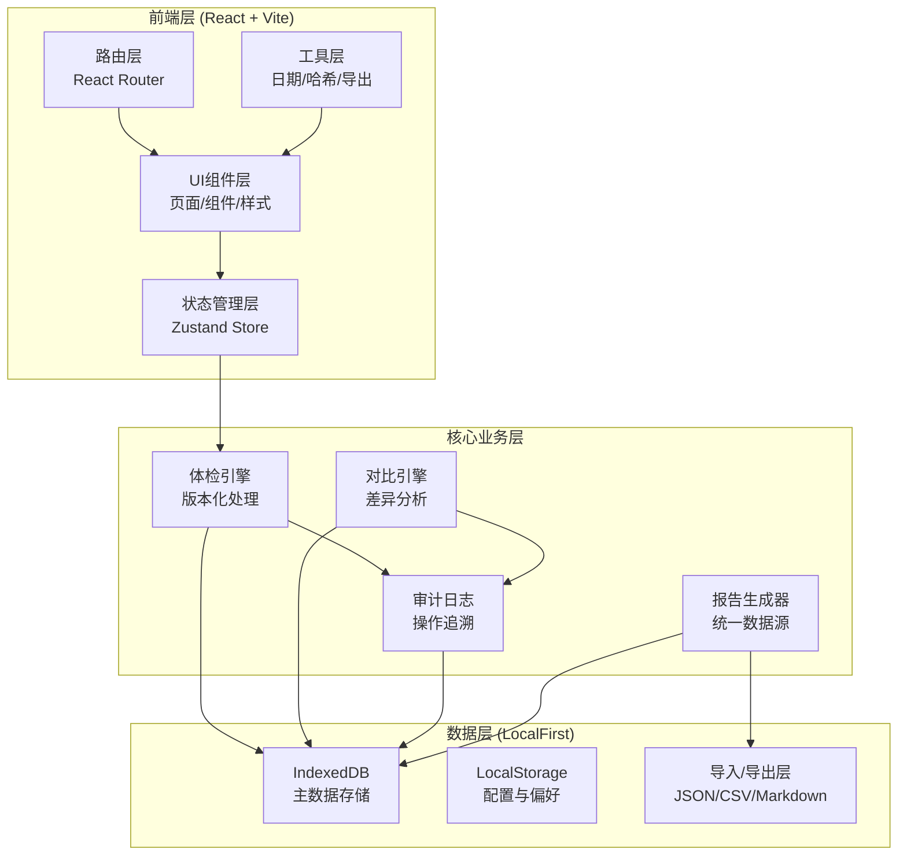
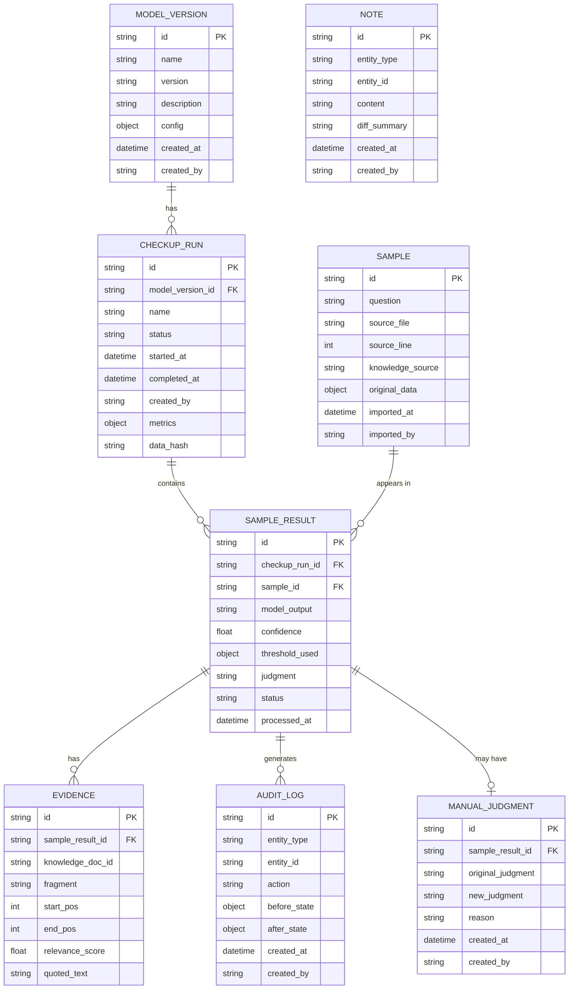

## 1. 架构设计



## 2. 技术描述

- **前端框架**: React@18 + TypeScript + Vite@5
- **状态管理**: Zustand@4（轻量级，支持时间旅行调试）
- **路由**: React Router@6
- **样式方案**: TailwindCSS@3 + CSS变量主题系统
- **UI组件**: 自定义组件库 + Lucide React图标
- **本地存储**: IndexedDB（通过idb库封装）+ LocalStorage
- **数据导入**: 原生File API + 流式JSON解析
- **数据导出**: 原生Blob API + 前端生成文件
- **数据校验**: 简单SHA-256哈希（通过Web Crypto API）
- **图表可视化**: Recharts@2
- **动画**: Framer Motion

## 3. 路由定义

| 路由路径 | 页面名称 | 主要功能 |
|---------|---------|---------|
| `/` | 体检总览页 | 版本时间线、指标概览、快速操作 |
| `/samples` | 样本管理页 | 样本上传、列表查看、原始数据详情 |
| `/checkup/:versionId` | 体检详情页 | 单版本完整结果、证据链、人工改判 |
| `/checkup/:versionId/sample/:sampleId` | 样本体检详情 | 单条样本完整判断链路 |
| `/compare` | 版本对比页 | 多版本选择、指标对比、差异明细 |
| `/conflicts` | 冲突清单页 | 冲突列表、冲突详情、证据对比 |
| `/settings` | 系统设置页 | 模型版本配置、阈值设置、操作人员配置 |

## 4. 数据模型

### 4.1 数据模型定义



### 4.2 核心数据结构定义

```typescript
// 模型版本
interface ModelVersion {
  id: string;
  name: string;
  version: string;
  description: string;
  config: {
    threshold: number;
    topK: number;
    modelType: string;
    [key: string]: any;
  };
  createdAt: string;
  createdBy: string;
}

// 体检运行记录
interface CheckupRun {
  id: string;
  modelVersionId: string;
  name: string;
  status: 'pending' | 'running' | 'completed' | 'failed';
  startedAt: string;
  completedAt?: string;
  createdBy: string;
  metrics: {
    accuracy: number;
    precision: number;
    recall: number;
    f1: number;
    manualOverrideRate: number;
    totalSamples: number;
    conflictCount: number;
  };
  dataHash: string;
}

// 样本
interface Sample {
  id: string;
  question: string;
  sourceFile: string;
  sourceLine: number;
  knowledgeSource: string;
  referenceAnswer?: string;
  onlineFeedback?: string;
  originalData: Record<string, any>;
  importedAt: string;
  importedBy: string;
}

// 样本体检结果
interface SampleResult {
  id: string;
  checkupRunId: string;
  sampleId: string;
  modelOutput: string;
  confidence: number;
  thresholdUsed: number;
  judgment: 'correct' | 'incorrect' | 'partial' | 'unverified';
  status: 'pending' | 'processed' | 'manually_adjusted';
  evidences: Evidence[];
  manualJudgment?: ManualJudgment;
  notes: Note[];
  processedAt: string;
}

// 引用证据
interface Evidence {
  id: string;
  knowledgeDocId: string;
  fragment: string;
  startPos: number;
  endPos: number;
  relevanceScore: number;
  quotedText: string;
}

// 人工改判
interface ManualJudgment {
  id: string;
  originalJudgment: string;
  newJudgment: string;
  reason: string;
  createdAt: string;
  createdBy: string;
}

// 备注补录
interface Note {
  id: string;
  content: string;
  diffSummary?: string;
  createdAt: string;
  createdBy: string;
}

// 审计日志
interface AuditLog {
  id: string;
  entityType: 'checkup_run' | 'sample_result' | 'manual_judgment' | 'note';
  entityId: string;
  action: 'create' | 'update' | 'delete' | 'override';
  beforeState?: Record<string, any>;
  afterState?: Record<string, any>;
  createdAt: string;
  createdBy: string;
}
```

### 4.3 数据库设计原则

**主键设计**:
- 所有ID使用UUID v7（带时间戳，便于排序）
- 复合索引：(checkup_run_id, sample_id) 确保唯一

**不可变设计**:
- `CheckupRun` 和 `SampleResult` 一旦标记为 completed，核心字段永不更新
- 人工改判和备注采用追加模式，通过外键关联
- 所有修改操作写入 `AuditLog`，保留完整历史

**数据完整性**:
- 每次体检运行完成后计算 `data_hash`（SHA-256 of all sample results）
- 导出报告时包含 `data_hash`，可用于校验
- 跨版本对比时校验样本ID一致性

## 5. 核心模块设计

### 5.1 体检引擎模块

```typescript
interface CheckupEngine {
  // 创建新的体检运行
  createRun(modelVersionId: string, sampleIds: string[], options: CheckupOptions): Promise<CheckupRun>;
  
  // 处理单条样本
  processSample(runId: string, sample: Sample, modelVersion: ModelVersion): Promise<SampleResult>;
  
  // 完成体检运行，计算指标和哈希
  completeRun(runId: string): Promise<CheckupRun>;
  
  // 生成数据哈希
  generateDataHash(results: SampleResult[]): string;
}
```

### 5.2 对比引擎模块

```typescript
interface ComparisonEngine {
  // 对比两个版本的指标
  compareMetrics(runIds: string[]): Promise<MetricComparison>;
  
  // 找出版本间结果不一致的样本
  findDifferences(runIds: string[]): Promise<SampleDifference[]>;
  
  // 生成冲突清单
  generateConflictList(runId: string): Promise<ConflictItem[]>;
}
```

### 5.3 审计模块

```typescript
interface AuditService {
  // 记录操作
  logAction(
    entityType: AuditLog['entityType'],
    entityId: string,
    action: AuditLog['action'],
    beforeState?: any,
    afterState?: any,
    operator?: string
  ): Promise<void>;
  
  // 获取实体的操作历史
  getHistory(entityType: string, entityId: string): Promise<AuditLog[]>;
}
```

### 5.4 报告生成模块

```typescript
interface ReportGenerator {
  // 生成Markdown格式报告
  generateMarkdown(runId: string, includeDetails: boolean): Promise<string>;
  
  // 导出JSON明细
  exportJSON(runId: string): Promise<string>;
  
  // 导出CSV明细
  exportCSV(runId: string): Promise<string>;
  
  // 校验报告完整性
  validateReport(runId: string, reportHash: string): boolean;
}
```

## 6. 前端状态管理设计

### 6.1 Store 划分

```typescript
// 全局配置Store
interface AppStore {
  currentUser: string;
  theme: 'light' | 'dark';
  activeView: string;
  setCurrentUser: (user: string) => void;
}

// 模型版本Store
interface ModelVersionStore {
  versions: ModelVersion[];
  activeVersionId: string | null;
  loading: boolean;
  fetchVersions: () => Promise<void>;
  createVersion: (data: Omit<ModelVersion, 'id' | 'createdAt'>) => Promise<ModelVersion>;
  setActiveVersion: (id: string) => void;
}

// 体检运行Store
interface CheckupStore {
  runs: CheckupRun[];
  currentRun: CheckupRun | null;
  currentResults: SampleResult[];
  loading: boolean;
  fetchRuns: () => Promise<void>;
  createRun: (modelVersionId: string, sampleIds: string[]) => Promise<CheckupRun>;
  loadRun: (runId: string) => Promise<void>;
}

// 样本Store
interface SampleStore {
  samples: Sample[];
  loading: boolean;
  fetchSamples: () => Promise<void>;
  importSamples: (file: File) => Promise<Sample[]>;
  getSample: (id: string) => Sample | undefined;
}
```

## 7. 导入导出格式规范

### 7.1 样本导入格式 (JSONL)

```jsonl
{"question": "如何配置RAG阈值？", "reference_answer": "在config.yaml中设置threshold参数", "knowledge_source": "docs/rag-config.md", "online_feedback": "用户反馈回答准确", "original_data": {"conversation_id": "conv_123"}}
{"question": "支持哪些向量数据库？", "reference_answer": "支持Milvus、FAISS、Pinecone", "knowledge_source": "docs/vector-db.md", "online_feedback": "", "original_data": {"conversation_id": "conv_124"}}
```

### 7.2 报告导出格式

Markdown报告包含：
1. 版本头部信息（模型版本、时间、操作人、数据哈希）
2. 核心指标汇总表
3. 指标趋势图（如果有历史版本）
4. 冲突清单摘要
5. 可选：明细数据表格
6. 数据校验信息

## 8. 性能与数据安全

- **本地优先架构**: 所有数据存储在浏览器本地，无需后端服务
- **数据导出加密**: 支持导出时设置密码保护（AES-GCM）
- **IndexedDB 索引优化**: 为常用查询字段建立索引
- **懒加载**: 大列表使用虚拟滚动，按需加载
- **内存管理**: 及时清理不再需要的大数据对象
- **自动备份**: 支持定时导出备份到本地文件
