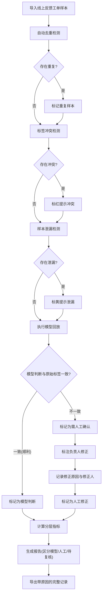

## 1. 产品概述

"聊天机器人安全回放"是面向标注负责人（周姐）的 AI/ML 小工具，用于将线上反馈工单中的安全事件样例进行系统性回放、复核与归档。核心目标是让标注负责人不再每次从线上反馈工单重新找证据，实现从样例录入到报告导出的完整闭环。

- 主要用途：对聊天机器人安全事件进行模型回放、人工复核、指标对比和报告生成
- 目标用户：标注负责人（周姐），以及后续接手的产品和算法人员
- 核心价值：减少翻旧记录的重复劳动，让每条安全判定可追溯、可交接

## 2. 核心功能

### 2.1 用户角色

| 角色 | 进入方式 | 核心权限 |
|------|----------|----------|
| 标注负责人 | 直接使用 | 导入样本、模型回放、人工复核、导出报告 |
| 产品/算法人员 | 查看报告 | 查看报告、对比指标、查看样本详情 |

### 2.2 功能模块

1. **样本管理页**：样本导入、去重检测、标签冲突检测、样本泄漏检测、来源追溯
2. **回放复核页**：模型回放执行、人工确认/修正、处理状态流转（顺利→完成 / 需确认→返工→完成）
3. **指标对比页**：模型判断 vs 人工修正 vs 待复核的分层指标，标签冲突与泄漏的单独提示
4. **报告导出页**：生成带原因的完整报告，区分模型判断、人工修正和仍需复核样本

### 2.3 页面详情

| 页面名称 | 模块名称 | 功能描述 |
|----------|----------|----------|
| 样本管理 | 样本列表 | 展示所有样例，含来源、处理时间、状态标签；支持按来源/状态筛选 |
| 样本管理 | 导入与去重 | 从线上反馈工单导入样本，自动检测重复样本并标记 |
| 样本管理 | 冲突与泄漏检测 | 标签冲突单独标红提示，样本泄漏（训练集泄露）单独标黄提示 |
| 回放复核 | 模型回放 | 对样本执行模型回放，展示模型判断结果与原始标签对比 |
| 回放复核 | 人工确认 | 标注负责人确认或修正模型结果，记录修正原因和修正人 |
| 回放复核 | 状态流转 | 顺利处理→直接完成；需确认→标记返工→人工修正→完成 |
| 指标对比 | 分层指标 | 分别统计模型判断一致率、人工修正率、待复核率，不混用平均指标掩盖问题 |
| 指标对比 | 冲突与泄漏面板 | 单独展示标签冲突数和泄漏样本数的详情，不受平均指标稀释 |
| 报告导出 | 报告生成 | 生成包含回放原因、判定来源的完整报告 |
| 报告导出 | 导出文件 | 导出 CSV/JSON，每条记录携带回放原因、原始来源、处理时间 |

## 3. 核心流程

用户导入线上反馈工单样本 → 系统自动去重与冲突/泄漏检测 → 执行模型回放 → 展示模型判断与原始标签对比 → 标注负责人人工确认或修正 → 系统计算分层指标（模型判断/人工修正/待复核） → 生成报告供产品和算法查看 → 导出带原因的完整记录

## 4. 用户界面设计

### 4.1 设计风格

- 主色调：深灰（zinc-900）为底，搭配琥珀色（amber-500）作为强调色，传达"安全审计"的严谨感
- 次要色调：翡翠绿（emerald-500）表示顺利/通过，玫红（rose-500）表示冲突/告警
- 按钮风格：圆角矩形（rounded-lg），带微弱阴影，hover 时阴影加深
- 字体：使用 Noto Sans SC 作为界面字体，Source Code Pro 作为代码/ID 字段字体
- 布局风格：左侧导航栏 + 右侧内容区，卡片式内容组织
- 图标风格：使用 Lucide 线性图标，与严肃审计场景匹配

### 4.2 页面设计概览

| 页面名称 | 模块名称 | UI 元素 |
|----------|----------|---------|
| 样本管理 | 样本列表 | 表格布局，行高适中，状态列用彩色徽章，来源列用灰色小字，时间列等宽字体 |
| 样本管理 | 导入与去重 | 顶部操作栏，导入按钮 + 去重统计卡片，重复行灰色底纹 |
| 样本管理 | 冲突与泄漏 | 冲突行标红左边框，泄漏行标黄左边框，悬浮弹出详情 |
| 回放复核 | 模型回放 | 左右对比卡片：左侧原始标签，右侧模型判断，差异高亮 |
| 回放复核 | 人工确认 | 下拉选择修正标签 + 文本框填写修正原因，确认/返工按钮 |
| 指标对比 | 分层指标 | 三栏指标卡片（模型判断/人工修正/待复核），各含精确率和覆盖率 |
| 指标对比 | 冲突泄漏面板 | 单独面板展示冲突/泄漏样本列表，不受平均指标稀释 |
| 报告导出 | 报告预览 | 报告预览区，按来源分层展示，每条含判定原因 |
| 报告导出 | 导出按钮 | CSV 和 JSON 双格式导出按钮 |

### 4.3 响应式设计

- 桌面优先设计，最小宽度 1024px
- 内容区使用滚动容器处理长列表
- 表格列在窄屏时支持横向滚动

## 5. 样例数据设计

### 5.1 三条样例覆盖场景

1. **顺利记录**：模型判断与原始标签一致，直接通过，状态为"模型判断"
2. **需人工确认记录**：模型判断与原始标签不一致，需标注负责人修正，状态为"人工修正"
3. **线上反馈工单补来的旧口径**：从线上反馈工单补入的历史记录，原始来源和口径与当前不同，保留原始来源和处理时间

### 5.2 数据质量场景

- 重复样本：第 2 条和第 3 条可能存在部分重复（如同一工单号），系统需检测并标记
- 缺引用结果：某条样本模型输出中缺少引用来源，系统需标记
- 人工改过标签：第 2 条经人工修正，需记录修正前后标签、修正原因、修正人和修正时间
