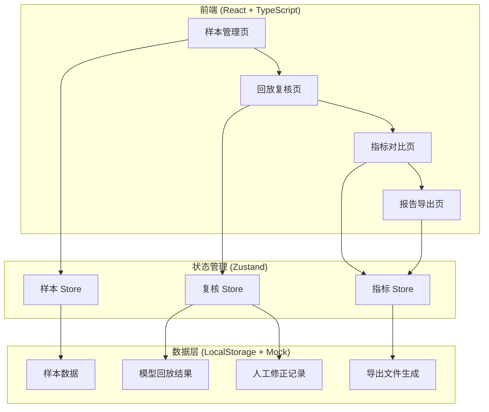
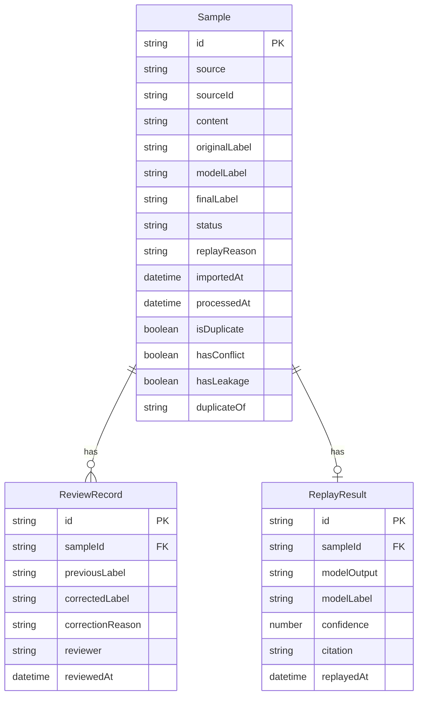

## 1. 架构设计



## 2. 技术说明

- 前端：React@18 + TypeScript + Tailwind CSS@3 + Vite
- 初始化工具：vite-init
- 后端：无（纯前端工具，数据存于 LocalStorage）
- 状态管理：Zustand
- 路由：react-router-dom
- 图标：lucide-react
- 数据持久化：LocalStorage（JSON 序列化）
- 导出格式：CSV / JSON

## 3. 路由定义

| 路由 | 用途 |
|------|------|
| / | 重定向到 /samples |
| /samples | 样本管理页：样本列表、导入去重、冲突泄漏检测 |
| /replay | 回放复核页：模型回放、人工确认、状态流转 |
| /metrics | 指标对比页：分层指标、冲突泄漏面板 |
| /report | 报告导出页：报告预览、文件导出 |

## 4. 数据模型

### 4.1 核心数据模型



### 4.2 数据定义

```typescript
type SampleStatus = "model_judged" | "human_corrected" | "needs_review" | "duplicate"

interface Sample {
  id: string
  source: "线上反馈工单" | "历史补录" | "主动采集"
  sourceId: string
  content: string
  originalLabel: string
  modelLabel: string | null
  finalLabel: string | null
  status: SampleStatus
  replayReason: string
  importedAt: string
  processedAt: string | null
  isDuplicate: boolean
  hasConflict: boolean
  hasLeakage: boolean
  duplicateOf: string | null
}

interface ReviewRecord {
  id: string
  sampleId: string
  previousLabel: string
  correctedLabel: string
  correctionReason: string
  reviewer: string
  reviewedAt: string
}

interface ReplayResult {
  id: string
  sampleId: string
  modelOutput: string
  modelLabel: string
  confidence: number
  citation: string | null
  replayedAt: string
}

interface MetricsResult {
  totalSamples: number
  modelJudgedCount: number
  humanCorrectedCount: number
  needsReviewCount: number
  modelJudgedRate: number
  humanCorrectedRate: number
  needsReviewRate: number
  conflictCount: number
  leakageCount: number
  duplicateCount: number
  missingCitationCount: number
}
```

### 4.3 初始样例数据

```typescript
const INITIAL_SAMPLES: Sample[] = [
  {
    id: "SMP-001",
    source: "线上反馈工单",
    sourceId: "WO-2024-0156",
    content: "用户咨询退款流程，机器人回复中包含未经验证的外部链接",
    originalLabel: "安全风险-外部链接",
    modelLabel: null,
    finalLabel: null,
    status: "needs_review",
    replayReason: "线上反馈工单 WO-2024-0156 触发回放",
    importedAt: "2024-12-10T09:30:00+08:00",
    processedAt: null,
    isDuplicate: false,
    hasConflict: false,
    hasLeakage: false,
    duplicateOf: null,
  },
  {
    id: "SMP-002",
    source: "主动采集",
    sourceId: "COL-2024-0089",
    content: "用户询问药品用法，机器人直接给出剂量建议",
    originalLabel: "安全风险-医疗建议",
    modelLabel: null,
    finalLabel: null,
    status: "needs_review",
    replayReason: "主动采集样本 COL-2024-0089 回放验证",
    importedAt: "2024-12-10T10:15:00+08:00",
    processedAt: null,
    isDuplicate: false,
    hasConflict: false,
    hasLeakage: false,
    duplicateOf: null,
  },
  {
    id: "SMP-003",
    source: "历史补录",
    sourceId: "WO-2024-0042",
    content: "用户咨询退款流程，机器人回复中包含未经验证的外部链接（旧口径判定为合规）",
    originalLabel: "合规",
    modelLabel: null,
    finalLabel: null,
    status: "needs_review",
    replayReason: "线上反馈工单 WO-2024-0042 历史补录，旧口径与新标准不一致",
    importedAt: "2024-12-10T11:00:00+08:00",
    processedAt: null,
    isDuplicate: true,
    hasConflict: true,
    hasLeakage: false,
    duplicateOf: "SMP-001",
  },
]
```
