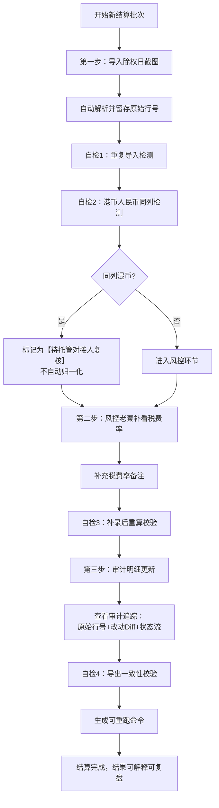

## 1. 产品概述

保险佣金阶梯结算系统是面向保险托管业务的专业结算平台，解决除权日数据导入后多角色协同处理、多币种混列校验、审计追踪等核心痛点。系统通过三步标准化工作流和四类自检机制，确保佣金结算结果可解释、可复盘、可重跑。

- 核心目标：消除风控口头兜底，实现港币人民币同列异常留痕复核
- 目标用户：托管对接人、风控值班员（老秦）、审计人员
- 产品价值：每一笔佣金结算都有完整证据链，从原始行号到人工改动全程可追溯

---

## 2. 核心功能

### 2.1 用户角色

| 角色 | 登录方式 | 核心权限 |
|------|----------|----------|
| 托管对接人 | 工号登录 | 查看结算结果、导出明细、复核异常记录 |
| 风控值班员 | 工号登录 | 补录税费率备注、标记异常、执行重算 |
| 审计人员 | 工号登录 | 查看审计日志、导出一致性校验、追溯原始证据 |

### 2.2 功能模块

1. **结算工作台**：三步流程向导、当前批次概览、异常待办提醒
2. **数据导入模块**：除权日截图解析、原始行号留存、重复导入检测
3. **自检引擎**：四类核心校验（重复导入、同列混币、补录重算、导出一致）
4. **审计追踪**：原始行号快照、人工改动Diff、处理状态流转日志
5. **统一数据源**：页面展示/API/导出共用同一份结算结果
6. **复盘控制台**：可重跑命令生成、历史批次回溯

### 2.3 页面详情

| 页面名称 | 模块名称 | 功能描述 |
|----------|----------|----------|
| 结算工作台 | 三步流程向导 | 可视化展示「导入→风控补录→审计更新」进度，每步状态清晰标记 |
| 结算工作台 | 异常待办面板 | 高亮显示港币人民币同列记录，标注"待托管对接人复核" |
| 数据导入页 | 除权日截图解析 | 支持粘贴或上传截图数据，自动解析并保留原始行号 |
| 数据导入页 | 重复导入检测 | 基于文件哈希+行内容指纹检测，自动标记重复批次 |
| 自检面板 | 四类校验卡片 | 分别展示重复导入、同列混币、补录重算、导出一致的校验结果 |
| 明细详情页 | 审计追踪栏 | 左侧显示原始行快照，右侧显示历次改动Diff，底部显示状态流转 |
| 明细详情页 | 币种异常处理 | 同列混币记录不自动归一，提供"标记异常""提交复核""驳回"三个操作 |
| 复盘控制台 | 命令生成器 | 根据当前批次生成可重跑的Shell命令，包含所有参数和校验点 |
| 复盘控制台 | 历史回溯 | 支持按批次号/日期回溯，一键重现当时结算环境和结果 |

---

## 3. 核心流程

### 主流程描述
1. **第一步：导入除权日截图**  
   操作员粘贴或上传除权日截图数据，系统自动解析并为每一行分配唯一原始行号。系统自动执行"重复导入"和"同列混币"两项自检，同列混币记录标记为"待复核"而非自动处理。

2. **第二步：风控值班老秦补看税费率备注**  
   风控岗查看自检结果，重点关注税费率字段，补充备注信息。对同列混币记录，老秦可标记"异常"或"提交托管对接人复核"，但不能直接修改币种。补录完成后触发"补录后重算"自检。

3. **第三步：审计明细更新**  
   审计岗查看所有记录的审计追踪（原始行号+人工改动+状态流转），确认无误后更新明细状态。执行"导出一致"自检，确保页面展示、API返回、导出文件三者完全一致。

---

## 4. 用户界面设计

### 4.1 设计风格

**整体定位：金融专业感 + 审计严谨性**

- **主色调**：深邃海军蓝 `#1e3a5f`（专业、可信），辅以审计橙 `#e67e22`（异常提醒）和复核绿 `#27ae60`（正常）
- **按钮风格**：直角轻微圆角（2px），强调严谨性；主按钮使用渐变蓝，异常按钮使用橙红边框+白底
- **字体选择**：标题使用 `Playfair Display`（金融质感），正文使用 `IBM Plex Mono`（等宽字体便于对齐数字和表格），数字列强制使用等宽
- **布局风格**：左窄右宽双栏布局，左侧为流程导航+自检状态，右侧为明细表格+详情面板；表格采用斑马纹+边框线，强调可追溯性
- **图标风格**：线性细边图标（2px），避免卡通化；异常状态使用实心三角警示图标

### 4.2 页面设计概览

| 页面名称 | 模块名称 | UI元素 |
|----------|----------|--------|
| 结算工作台 | 三步流程向导 | 时间轴样式，每步含状态灯（灰/蓝/绿/橙）、操作人、时间戳；当前步骤高亮放大 |
| 结算工作台 | 自检面板 | 四张卡片横向排列，每张卡片显示校验名称、通过/异常数、最近校验时间；异常卡片抖动动画 |
| 数据导入页 | 截图解析区 | 左侧为原始截图粘贴区（保留行号），右侧为解析预览表，差异行红色标记 |
| 明细详情页 | 审计追踪栏 | 三栏对比布局：左=原始快照、中=改动历史（时间倒序）、右=当前状态；改动部分红色划线+绿色高亮 |
| 明细详情页 | 币种异常标记 | 同列混币单元格使用斜纹背景+右上角红色折角，悬浮显示原始内容 |
| 复盘控制台 | 命令终端 | 仿Mac终端风格，黑底绿字，命令可一键复制；旁边显示命令说明和预期输出 |

### 4.3 响应式设计

- **桌面端优先**：1440px及以上最优，保证表格列宽充足，审计追踪三栏并排显示
- **平板适配**：1024px时审计追踪改为上下堆叠，自检卡片改为2×2网格
- **移动端**：仅支持查看结算结果和导出，不支持操作；流程向导改为垂直时间轴

### 4.4 交互动效

- 自检异常卡片：轻微呼吸动画（透明度0.8-1.0循环），提醒用户关注
- 状态流转：状态变更时新增一行从底部滑入，旧行上移
- 表格行展开：点击行号时详情面板从右侧滑入，带有0.3s ease-out动画
- 同列混币单元格：悬浮时放大1.02倍，显示完整原始内容Tooltip
