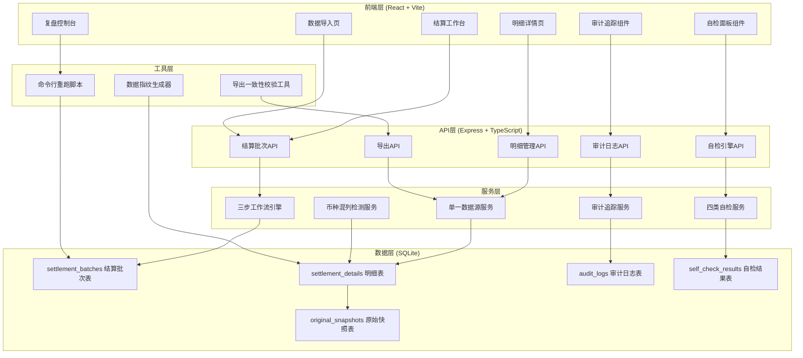
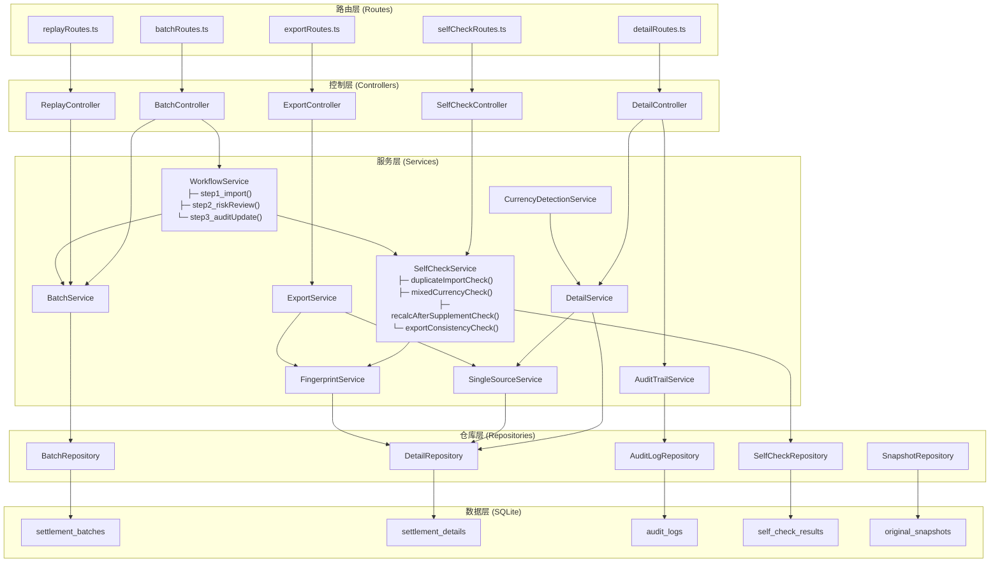
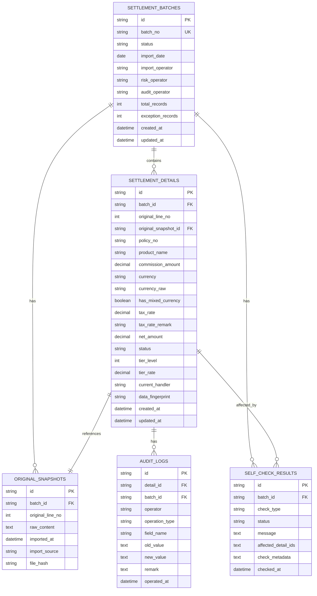

## 1. 架构设计



---

## 2. 技术选型

### 2.1 技术栈说明

| 层级 | 技术选型 | 版本 | 选型理由 |
|------|----------|------|----------|
| 前端 | React | 18.2 | 组件化开发，状态管理清晰 |
| 前端 | Vite | 5.0 | 构建速度快，开发体验好 |
| 前端 | TailwindCSS | 3.4 | 原子化CSS，快速构建专业界面 |
| 前端 | TypeScript | 5.3 | 类型安全，减少金融计算错误 |
| 后端 | Express | 4.18 | 轻量级HTTP框架，API开发高效 |
| 数据库 | SQLite | 3.45 | 单文件部署，无需额外服务，适合审计追踪 |
| 状态管理 | Zustand | 4.5 | 轻量状态管理，支持时间旅行便于复盘 |
| 表格组件 | TanStack Table | 8.11 | 高性能表格，支持虚拟滚动和列宽调整 |
| 导出工具 | SheetJS | 0.18 | Excel/CSV导出，支持多Sheet |

### 2.2 关键技术决策

1. **单一数据源架构**：所有展示层（页面/API/导出）都从 `settlement_details` 表读取，不做中间转换，确保三者完全一致
2. **不可变原始快照**：导入数据时先写入 `original_snapshots` 表，永不修改，后续所有改动都记录在 `audit_logs`
3. **币种混列检测**：基于正则匹配 `HKD/HK$/港币/¥/￥/RMB/人民币` 等关键词，检测同一单元格内是否出现多种币种标识
4. **数据指纹机制**：每行内容生成SHA256指纹，用于重复导入检测和导出一致性校验

---

## 3. 路由定义

| 路由路径 | 页面名称 | 权限要求 | 核心功能 |
|----------|----------|----------|----------|
| `/` | 结算工作台 | 所有角色 | 三步流程导航、批次概览、异常待办 |
| `/import` | 数据导入页 | 托管对接人/风控 | 除权日截图导入、解析预览、重复检测 |
| `/batch/:batchId` | 批次详情页 | 所有角色 | 明细列表、自检结果、状态流转 |
| `/detail/:detailId` | 明细详情页 | 所有角色 | 审计追踪、币种异常处理、改动历史 |
| `/risk-control` | 风控工作台 | 风控岗 | 税费率补录、异常标记、重算触发 |
| `/audit` | 审计工作台 | 审计岗 | 审计追踪查看、一致性校验、状态更新 |
| `/replay` | 复盘控制台 | 所有角色 | 可重跑命令生成、历史批次回溯 |

---

## 4. API 定义

### 4.1 核心数据类型

```typescript
// 结算批次
interface SettlementBatch {
  id: string;
  batchNo: string;
  status: 'DRAFT' | 'IMPORTED' | 'RISK_REVIEWED' | 'AUDITED' | 'COMPLETED';
  importDate: string;
  importOperator: string;
  riskOperator?: string;
  auditOperator?: string;
  totalRecords: number;
  exceptionRecords: number;
  createdAt: string;
  updatedAt: string;
}

// 结算明细
interface SettlementDetail {
  id: string;
  batchId: string;
  originalLineNo: number;        // 原始行号，永不修改
  originalSnapshotId: string;    // 关联原始快照
  policyNo: string;
  productName: string;
  commissionAmount: number;
  currency: string;              // 'HKD' | 'CNY' | 'MIXED'
  currencyRaw: string;           // 原始币种字段内容（用于留痕）
  hasMixedCurrency: boolean;     // 港币人民币同列标记
  taxRate?: number;
  taxRateRemark?: string;
  netAmount: number;
  status: 'PENDING' | 'EXCEPTION' | 'PENDING_REVIEW' | 'REVIEWED' | 'APPROVED';
  tierLevel: number;             // 佣金阶梯等级
  tierRate: number;              // 阶梯费率
  currentHandler?: string;
  dataFingerprint: string;       // 行内容指纹
}

// 原始快照
interface OriginalSnapshot {
  id: string;
  batchId: string;
  originalLineNo: number;
  rawContent: string;            // 原始行完整内容（JSON字符串）
  importedAt: string;
  importSource: 'PASTE' | 'FILE_UPLOAD';
  fileHash?: string;             // 上传文件哈希
}

// 审计日志
interface AuditLog {
  id: string;
  detailId: string;
  batchId: string;
  operator: string;
  operationType: 'CREATE' | 'UPDATE' | 'STATUS_CHANGE' | 'CURRENCY_REVIEW' | 'TAX_RATE_UPDATE';
  fieldName?: string;
  oldValue?: string;
  newValue?: string;
  remark?: string;
  operatedAt: string;
}

// 自检结果
interface SelfCheckResult {
  id: string;
  batchId: string;
  checkType: 'DUPLICATE_IMPORT' | 'MIXED_CURRENCY' | 'RECALC_AFTER_SUPPLEMENT' | 'EXPORT_CONSISTENCY';
  status: 'PASS' | 'FAIL' | 'WARNING';
  message: string;
  affectedDetailIds: string[];
  checkedAt: string;
  checkMetadata: Record<string, any>;
}
```

### 4.2 API 端点

| 方法 | 路径 | 描述 | 请求体 | 响应体 |
|------|------|------|--------|--------|
| POST | `/api/batches` | 创建新结算批次 | `{ importSource, rawData }` | `SettlementBatch` |
| GET | `/api/batches` | 获取批次列表 | Query: `status, page, pageSize` | `{ items: SettlementBatch[], total }` |
| GET | `/api/batches/:id` | 获取批次详情 | - | `SettlementBatch & { details: SettlementDetail[] }` |
| POST | `/api/batches/:id/self-check` | 执行自检 | `{ checkTypes? }` | `SelfCheckResult[]` |
| GET | `/api/batches/:id/self-check` | 获取自检结果 | - | `SelfCheckResult[]` |
| POST | `/api/batches/:id/recalculate` | 补录后重算 | - | `{ recalculatedCount, results }` |
| GET | `/api/details/:id` | 获取明细详情 | - | `SettlementDetail & { snapshot: OriginalSnapshot, auditLogs: AuditLog[] }` |
| PATCH | `/api/details/:id` | 更新明细（风控/审计） | `{ fieldName, value, remark }` | `SettlementDetail` |
| POST | `/api/details/:id/currency-review` | 币种复核 | `{ decision: 'MARK_EXCEPTION' | 'SUBMIT_REVIEW' | 'REJECT', remark }` | `SettlementDetail` |
| GET | `/api/batches/:id/export` | 导出明细 | Query: `format: 'xlsx' | 'csv'` | 文件流 + 指纹头 `X-Data-Fingerprint` |
| GET | `/api/batches/:id/replay-command` | 生成重跑命令 | - | `{ command, description, expectedOutput }` |
| GET | `/api/batches/:id/consistency-check` | 导出一致性校验 | - | `{ consistent: boolean, pageFingerprint, apiFingerprint, exportFingerprint }` |

---

## 5. 服务端架构图



---

## 6. 数据模型

### 6.1 ER 图



### 6.2 DDL 语句

```sql
-- 结算批次表
CREATE TABLE settlement_batches (
  id TEXT PRIMARY KEY,
  batch_no TEXT UNIQUE NOT NULL,
  status TEXT NOT NULL DEFAULT 'DRAFT',
  import_date TEXT NOT NULL,
  import_operator TEXT NOT NULL,
  risk_operator TEXT,
  audit_operator TEXT,
  total_records INTEGER NOT NULL DEFAULT 0,
  exception_records INTEGER NOT NULL DEFAULT 0,
  created_at TEXT NOT NULL,
  updated_at TEXT NOT NULL
);

CREATE INDEX idx_batches_status ON settlement_batches(status);
CREATE INDEX idx_batches_import_date ON settlement_batches(import_date);

-- 明细表
CREATE TABLE settlement_details (
  id TEXT PRIMARY KEY,
  batch_id TEXT NOT NULL REFERENCES settlement_batches(id),
  original_line_no INTEGER NOT NULL,
  original_snapshot_id TEXT NOT NULL REFERENCES original_snapshots(id),
  policy_no TEXT NOT NULL,
  product_name TEXT,
  commission_amount REAL NOT NULL,
  currency TEXT NOT NULL,
  currency_raw TEXT NOT NULL,
  has_mixed_currency INTEGER NOT NULL DEFAULT 0,
  tax_rate REAL,
  tax_rate_remark TEXT,
  net_amount REAL NOT NULL,
  status TEXT NOT NULL DEFAULT 'PENDING',
  tier_level INTEGER NOT NULL DEFAULT 1,
  tier_rate REAL NOT NULL DEFAULT 0,
  current_handler TEXT,
  data_fingerprint TEXT NOT NULL,
  created_at TEXT NOT NULL,
  updated_at TEXT NOT NULL
);

CREATE INDEX idx_details_batch_id ON settlement_details(batch_id);
CREATE INDEX idx_details_status ON settlement_details(status);
CREATE INDEX idx_details_mixed_currency ON settlement_details(has_mixed_currency);
CREATE INDEX idx_details_fingerprint ON settlement_details(data_fingerprint);

-- 原始快照表
CREATE TABLE original_snapshots (
  id TEXT PRIMARY KEY,
  batch_id TEXT NOT NULL REFERENCES settlement_batches(id),
  original_line_no INTEGER NOT NULL,
  raw_content TEXT NOT NULL,
  imported_at TEXT NOT NULL,
  import_source TEXT NOT NULL,
  file_hash TEXT
);

CREATE INDEX idx_snapshots_batch_id ON original_snapshots(batch_id);
CREATE INDEX idx_snapshots_file_hash ON original_snapshots(file_hash);

-- 审计日志表
CREATE TABLE audit_logs (
  id TEXT PRIMARY KEY,
  detail_id TEXT NOT NULL REFERENCES settlement_details(id),
  batch_id TEXT NOT NULL REFERENCES settlement_batches(id),
  operator TEXT NOT NULL,
  operation_type TEXT NOT NULL,
  field_name TEXT,
  old_value TEXT,
  new_value TEXT,
  remark TEXT,
  operated_at TEXT NOT NULL
);

CREATE INDEX idx_audit_detail_id ON audit_logs(detail_id);
CREATE INDEX idx_audit_batch_id ON audit_logs(batch_id);
CREATE INDEX idx_audit_operated_at ON audit_logs(operated_at);

-- 自检结果表
CREATE TABLE self_check_results (
  id TEXT PRIMARY KEY,
  batch_id TEXT NOT NULL REFERENCES settlement_batches(id),
  check_type TEXT NOT NULL,
  status TEXT NOT NULL,
  message TEXT NOT NULL,
  affected_detail_ids TEXT,
  check_metadata TEXT,
  checked_at TEXT NOT NULL
);

CREATE INDEX idx_self_check_batch_id ON self_check_results(batch_id);
CREATE INDEX idx_self_check_type ON self_check_results(check_type);
```

---

## 7. 关键业务规则实现

### 7.1 港币人民币同列检测算法

```typescript
function detectMixedCurrency(rawCurrency: string): { 
  hasMixed: boolean; 
  detectedCurrencies: string[];
  normalized: string | null;
} {
  const hkdPatterns = /HKD|HK\$|港币|港幣|HK/i;
  const cnyPatterns = /CNY|RMB|¥|￥|人民币|人民幣|元/i;
  
  const hasHKD = hkdPatterns.test(rawCurrency);
  const hasCNY = cnyPatterns.test(rawCurrency);
  
  const detected: string[] = [];
  if (hasHKD) detected.push('HKD');
  if (hasCNY) detected.push('CNY');
  
  if (detected.length > 1) {
    return {
      hasMixed: true,
      detectedCurrencies: detected,
      normalized: 'MIXED'  // 不自动归一，留给人工复核
    };
  }
  
  return {
    hasMixed: false,
    detectedCurrencies: detected,
    normalized: detected[0] || 'UNKNOWN'
  };
}
```

### 7.2 重复导入检测算法

```typescript
async function checkDuplicateImport(
  fileHash: string, 
  rawContents: string[]
): Promise<{ isDuplicate: boolean; duplicates: Array<{batchNo, lineNo}> }> {
  // 1. 检查文件级重复（完整文件哈希匹配）
  const fileDuplicate = await db.query(
    'SELECT batch_no FROM original_snapshots WHERE file_hash = ? LIMIT 1',
    [fileHash]
  );
  
  if (fileDuplicate.length > 0) {
    return { isDuplicate: true, duplicates: [{ batchNo: fileDuplicate[0].batch_no, lineNo: -1 }] };
  }
  
  // 2. 检查行级重复（基于内容指纹）
  const fingerprints = rawContents.map(c => crypto.createHash('sha256').update(c).digest('hex'));
  const lineDuplicates = await db.query(
    `SELECT b.batch_no, s.original_line_no 
     FROM settlement_details d
     JOIN settlement_batches b ON d.batch_id = b.id
     WHERE d.data_fingerprint IN (${fingerprints.map(() => '?').join(',')})`,
    fingerprints
  );
  
  return {
    isDuplicate: lineDuplicates.length > 0,
    duplicates: lineDuplicates
  };
}
```

### 7.3 可重跑命令生成

```typescript
function generateReplayCommand(batchId: string): string {
  const timestamp = new Date().toISOString();
  return `# ============================================
# 保险佣金阶梯结算 - 可重跑命令
# 批次号: ${batchId}
# 生成时间: ${timestamp}
# 说明: 执行以下命令可完整重现本次结算过程
# ============================================

# 1. 重置到导入前状态
npm run settlement:reset -- --batch=${batchId}

# 2. 重新导入除权日截图数据
npm run settlement:import -- --batch=${batchId} --source=./data/${batchId}_raw.json

# 3. 执行自检1: 重复导入检测
npm run settlement:self-check -- --batch=${batchId} --type=DUPLICATE_IMPORT

# 4. 执行自检2: 港币人民币同列检测
npm run settlement:self-check -- --batch=${batchId} --type=MIXED_CURRENCY

# 5. 重放风控补录操作
npm run settlement:replay-actions -- --batch=${batchId} --step=risk_control

# 6. 执行自检3: 补录后重算校验
npm run settlement:self-check -- --batch=${batchId} --type=RECALC_AFTER_SUPPLEMENT

# 7. 重放审计更新操作
npm run settlement:replay-actions -- --batch=${batchId} --step=audit

# 8. 执行自检4: 导出一致性校验
npm run settlement:self-check -- --batch=${batchId} --type=EXPORT_CONSISTENCY

# 9. 生成最终结果并比对
npm run settlement:finalize -- --batch=${batchId} --verify

# 10. 导出复盘报告
npm run settlement:export-report -- --batch=${batchId} --format=pdf
`;
}
```
