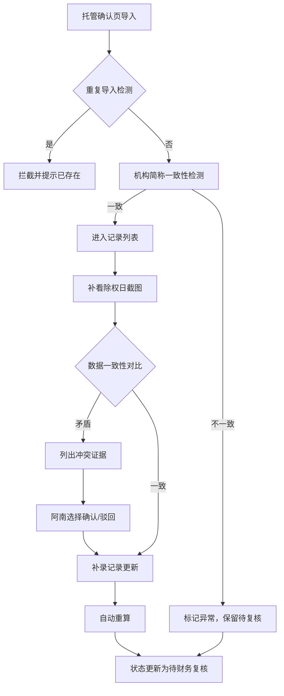

## 1. 产品概述

授信额度占用看板是面向财务复核场景的专业业务工具，解决托管确认页与除权日截图数据核对效率低、机构简称口径不一致、补录返工频繁等痛点。核心目标是让财务复核人在10分钟内完成关键数据核对，通过可视化自检和冲突证据展示，减少业务同事间的反复沟通。

- 主要解决：机构简称前后不一致识别、数据冲突可视化、自检自动化、数据来源统一
- 目标用户：财务复核人、支付平台产品经理（阿南）
- 核心价值：将核对时间从小时级压缩到分钟级，消除人工判断误差，保留复核决策留痕

## 2. 核心功能

### 2.1 用户角色

| 角色 | 登录方式 | 核心权限 |
|------|----------|----------|
| 财务复核人 | 企业账号登录 | 查看异常、执行最终复核、导出数据 |
| 支付平台产品（阿南） | 企业账号登录 | 导入托管确认页、上传除权日截图、补录记录、确认/驳回冲突 |

### 2.2 功能模块

1. **授信额度占用看板主页**：数据总览、异常统计、自检结果、记录列表
2. **托管确认页导入模块**：文件上传、数据解析、重复导入检测
3. **除权日截图补看模块**：截图上传、OCR识别、证据对比
4. **冲突处理模块**：矛盾证据列示、确认/驳回操作、决策留痕
5. **补录记录模块**：字段补录、重算触发、状态流转
6. **数据导出模块**：明细导出、一致性校验

### 2.3 页面详情

| 页面名称 | 模块名称 | 功能描述 |
|----------|----------|----------|
| 授信额度占用看板 | 异常总览卡片 | 实时展示机构简称不一致数量、冲突待处理数、重复导入预警、自检通过率 |
| 授信额度占用看板 | 记录列表 | 分页展示所有授信记录，异常行高亮标注，机构简称不一致直接在列表中显示前后对比 |
| 授信额度占用看板 | 自检面板 | 一键运行四项自检（重复导入、机构简称不一致、补录后重算、导出一致），逐项展示结果 |
| 托管确认导入 | 文件上传 | 支持Excel导入，解析后预览数据，重复导入自动拦截并提示 |
| 冲突详情抽屉 | 证据对比 | 左右并列展示托管确认页数据与除权日截图数据，矛盾字段红色标注，提供确认/驳回按钮 |
| 补录记录弹窗 | 字段编辑 | 支持补录缺失字段，保存后自动触发重算，状态标记为"待复核" |

## 3. 核心流程

### 三步核心业务流程：
1. 支付平台产品阿南导入托管确认页 → 系统自动检测重复导入和机构简称前后不一致
2. 阿南补看除权日截图 → 系统自动对比，如存在矛盾则列出冲突证据
3. 阿南补录记录更新 → 系统自动重算，机构简称不一致标记为"待财务复核"，不自动归正常

### 冲突处理流程：
当托管确认页与除权日截图数据矛盾时，系统不自动拍板，而是：
- 高亮展示冲突字段的两处来源数据
- 标注字段名称、两处数值、证据来源
- 提供"确认托管数据"和"驳回（以截图为准）"两个按钮
- 操作后自动记录决策人、时间、决策理由

## 4. 用户界面设计

### 4.1 设计风格
- **主色调**：深空灰 `#1a1f2e` 作为背景，营造专业金融科技氛围
- **强调色**：警示红 `#ef4444` 标注异常，确认绿 `#10b981` 标记正常，待处理橙 `#f59e0b` 标记待复核
- **数据蓝**：`#3b82f6` 用于图表和可交互元素
- **按钮风格**：直角矩形，2px边框，hover时有明显的状态变化和轻微上浮动效
- **字体**：标题使用 `JetBrains Mono` 等宽字体体现数据严谨性，正文使用 `Inter` 保证可读性
- **布局风格**：卡片式网格化布局，左侧异常面板 + 右侧数据表格的经典B端布局
- **图标风格**：使用Lucide线性图标，异常状态配对应警示图标

### 4.2 页面设计概览

| 页面名称 | 模块名称 | UI元素 |
|----------|----------|----------|
| 看板主页 | 异常总览卡片 | 4张统计卡片横向排列，每张含图标、数值、环比变化、趋势微图表，异常卡片有呼吸灯效果 |
| 看板主页 | 自检面板 | 可折叠区域，4项自检进度条，每项含状态图标、检查项名称、通过/异常数量、详情展开按钮 |
| 看板主页 | 数据表格 | 固定表头，斑马纹，异常行背景浅红，机构简称列显示"原简称 → 新简称"的对比格式 |
| 冲突详情抽屉 | 证据对比区 | 左右双栏布局，左侧托管数据，右侧截图数据，中间VS标识，冲突字段红色背景闪烁提示 |
| 冲突详情抽屉 | 操作区 | 底部固定操作栏，"确认托管数据"红色按钮，"驳回（以截图为准）"蓝色按钮，均需二次确认 |

### 4.3 响应式
- 桌面端优先设计，最小支持1280px宽度
- 平板端自适应调整卡片布局为2×2网格
- 数据表格支持横向滚动，关键列（机构名称、异常状态）固定
- 移动端主要用于查看数据，导入和补录操作建议在桌面端完成

### 4.4 交互动效
- 页面加载：卡片从上到下依次滑入，带0.1s交错延迟
- 异常标记：呼吸灯动画，2s一个周期，不干扰正常阅读
- 抽屉展开：从右侧滑入，带阴影变化
- 按钮点击：按下时缩放0.95，松开回弹
- 自检运行：进度条从左到右填充，完成时打钩动画
