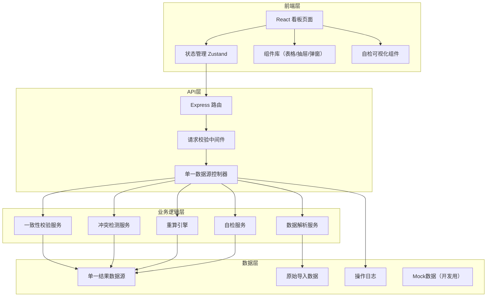
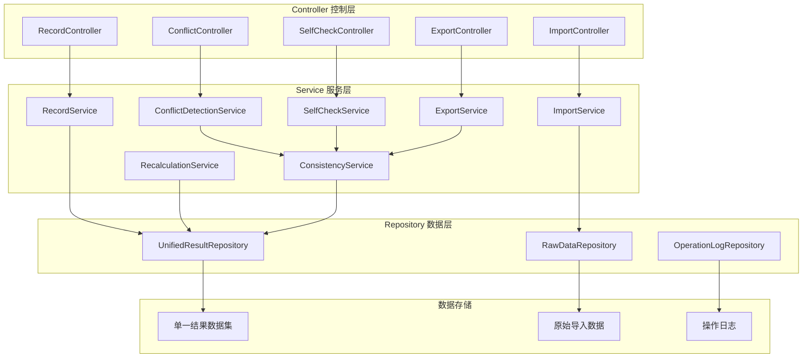
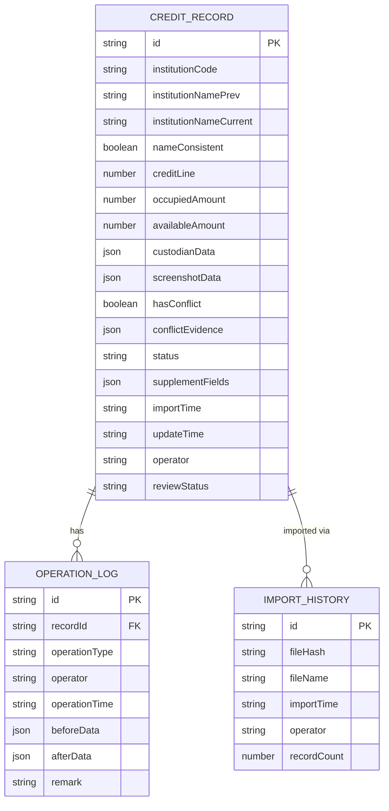

## 1. 架构设计

采用前后端分离架构，前端负责交互展示和数据可视化，后端负责业务逻辑、数据校验和持久化存储。核心设计原则是**单一数据源**：所有展示、导出、接口返回均读取同一份计算结果，确保数据一致性。



## 2. 技术描述

- **前端**：React@18 + TypeScript + tailwindcss@3 + vite + zustand + lucide-react + xlsx
- **初始化工具**：vite-init
- **后端**：Express@4 + TypeScript
- **数据存储**：内存数据库（开发阶段）+ JSON文件持久化，生产可迁移至PostgreSQL
- **Mock数据**：内置完整业务场景Mock数据，覆盖正常、异常、冲突、待复核等各种状态

## 3. 核心设计约束

### 3.1 单一数据源原则
- 所有数据展示、导出、接口返回必须调用同一个 `getUnifiedResult()` 方法
- 机构简称不一致的记录在任何视图中必须显示异常标记，禁止在一处显示异常而另一处消失
- 数据变更必须通过 `updateRecord()` 方法，自动触发重算和日志记录

### 3.2 自检服务四件套
1. **重复导入检测**：基于机构代码+日期的复合主键去重
2. **机构简称前后不一致检测**：同一机构代码历史简称与当前简称比对
3. **补录后重算**：补录字段变更后自动触发授信额度重算
4. **导出一致性**：导出前校验页面数据与接口数据哈希值一致

### 3.3 状态机设计
```
PENDING（待处理）→ CONFLICT（冲突待确认）→ RESOLVED（已处理待复核）→ REVIEWED（已复核）
          ↓                ↓
     IMPORTED        ABNORMAL（机构简称不一致）
```

## 4. 路由定义

| 路由 | 用途 |
|------|------|
| / | 授信额度占用看板主页 |
| /api/records | 获取授信记录列表（单一数据源入口） |
| /api/records/:id | 获取单条记录详情 |
| /api/records/import | 导入托管确认页 |
| /api/records/:id/screenshot | 上传除权日截图 |
| /api/records/:id/supplement | 补录记录更新 |
| /api/records/:id/resolve | 确认/驳回冲突 |
| /api/self-check | 运行自检并返回结果 |
| /api/export | 导出明细数据 |
| /api/export/verify | 导出一致性校验 |

## 5. API 定义

### 5.1 核心数据类型

```typescript
// 授信额度记录
interface CreditRecord {
  id: string;
  institutionCode: string;           // 机构代码（唯一标识）
  institutionNamePrev: string;        // 原机构简称
  institutionNameCurrent: string;     // 当前机构简称
  nameConsistent: boolean;            // 机构简称是否一致
  creditLine: number;                 // 授信额度
  occupiedAmount: number;             // 已占用金额
  availableAmount: number;            // 可用额度
  custodianData: CustodianData;       // 托管确认页数据
  screenshotData?: ScreenshotData;    // 除权日截图数据
  hasConflict: boolean;               // 是否存在数据冲突
  conflictFields?: string[];          // 冲突字段列表
  conflictEvidence?: ConflictEvidence[]; // 冲突证据
  status: RecordStatus;               // 记录状态
  supplementFields?: Record<string, any>; // 补录字段
  importTime: string;                 // 导入时间
  updateTime: string;                 // 更新时间
  operator: string;                   // 操作人
  reviewStatus: 'pending' | 'approved' | 'rejected'; // 财务复核状态
}

// 托管确认页数据
interface CustodianData {
  source: 'custodian';
  exDividendDate: string;
  shareRatio: number;
  totalShares: number;
  confirmDate: string;
  fileHash: string;                   // 文件哈希用于重复导入检测
}

// 除权日截图数据
interface ScreenshotData {
  source: 'screenshot';
  exDividendDate: string;
  shareRatio: number;
  totalShares: number;
  ocrConfidence: number;
  uploadTime: string;
}

// 冲突证据
interface ConflictEvidence {
  field: string;
  fieldLabel: string;
  custodianValue: any;
  screenshotValue: any;
  custodianSource: string;
  screenshotSource: string;
}

// 记录状态
type RecordStatus = 'pending' | 'imported' | 'abnormal' | 'conflict' | 'resolved' | 'reviewed';

// 自检结果
interface SelfCheckResult {
  checkType: 'duplicate_import' | 'name_inconsistency' | 'recalculation' | 'export_consistency';
  status: 'pass' | 'warning' | 'error';
  total: number;
  abnormal: number;
  details: SelfCheckDetail[];
  runTime: string;
}

// 统一响应结构
interface ApiResponse<T> {
  success: boolean;
  data: T;
  message?: string;
  timestamp: string;
  dataHash: string;                   // 数据哈希用于一致性校验
}
```

### 5.2 关键接口说明

**GET /api/records** - 获取授信记录列表
- 返回：`ApiResponse<CreditRecord[]>`
- 重要：这是唯一数据源入口，页面展示、导出、搜索均调用此接口

**POST /api/records/import** - 导入托管确认页
- 请求：FormData（Excel文件）
- 响应：`ApiResponse<{ imported: number; duplicates: number; nameInconsistencies: number }>`
- 自动检测重复导入和机构简称不一致

**POST /api/records/:id/screenshot** - 上传除权日截图
- 请求：FormData（图片文件 + OCR识别数据）
- 响应：`ApiResponse<{ hasConflict: boolean; conflicts: ConflictEvidence[] }>`
- 自动对比托管数据与截图数据，返回冲突证据

**POST /api/records/:id/resolve** - 处理冲突
- 请求：`{ resolution: 'confirm_custodian' | 'reject_use_screenshot'; remark: string }`
- 响应：`ApiResponse<CreditRecord>`
- 不自动决策，完全由调用方选择

**POST /api/records/:id/supplement** - 补录记录
- 请求：`{ fields: Record<string, any> }`
- 响应：`ApiResponse<CreditRecord>`
- 自动触发重算，状态标记为 `resolved` 待财务复核

**GET /api/self-check** - 运行自检
- 查询参数：`?checks=duplicate_import,name_inconsistency,recalculation,export_consistency`
- 响应：`ApiResponse<SelfCheckResult[]>`

## 6. 服务器架构



### 核心服务职责

1. **ConsistencyService**：确保所有数据读取走统一入口，计算数据哈希用于导出一致性校验
2. **ConflictDetectionService**：对比托管数据与截图数据，生成冲突证据列表
3. **SelfCheckService**：实现四项自检逻辑，每项独立可调用
4. **RecalculationService**：补录后自动重算授信额度、已占用金额、可用额度
5. **ExportService**：导出前调用 ConsistencyService 校验，确保导出数据与页面展示一致

## 7. 数据模型

### 7.1 ER图



### 7.2 索引设计
- `CREDIT_RECORD(institutionCode, importTime)` - 按机构和时间查询
- `CREDIT_RECORD(status, reviewStatus)` - 按状态筛选
- `IMPORT_HISTORY(fileHash)` - 重复导入检测
- `OPERATION_LOG(recordId, operationTime)` - 操作历史追溯

## 8. 前端状态管理

使用 Zustand 管理前端状态，核心 Store 设计：

```typescript
interface DashboardStore {
  // 单一数据源
  records: CreditRecord[];
  dataHash: string;
  loading: boolean;
  error: string | null;
  
  // 筛选条件
  filters: {
    status: string[];
    hasConflict: boolean | null;
    nameConsistent: boolean | null;
    searchText: string;
  };
  
  // 自检结果
  selfCheckResults: SelfCheckResult[];
  selfCheckRunning: boolean;
  
  // Actions
  fetchRecords: () => Promise<void>;
  setFilters: (filters: Partial<DashboardStore['filters']>) => void;
  runSelfCheck: (checks?: string[]) => Promise<void>;
  importCustodian: (file: File) => Promise<ImportResult>;
  uploadScreenshot: (id: string, file: File, ocrData: any) => Promise<void>;
  resolveConflict: (id: string, resolution: string, remark: string) => Promise<void>;
  supplementRecord: (id: string, fields: Record<string, any>) => Promise<void>;
  exportData: () => Promise<void>;
}
```

### 关键约束
- `fetchRecords()` 是唯一的数据拉取入口
- 所有修改操作成功后必须重新调用 `fetchRecords()` 确保数据一致
- 导出前校验本地 `dataHash` 与接口返回的 `dataHash` 是否一致
