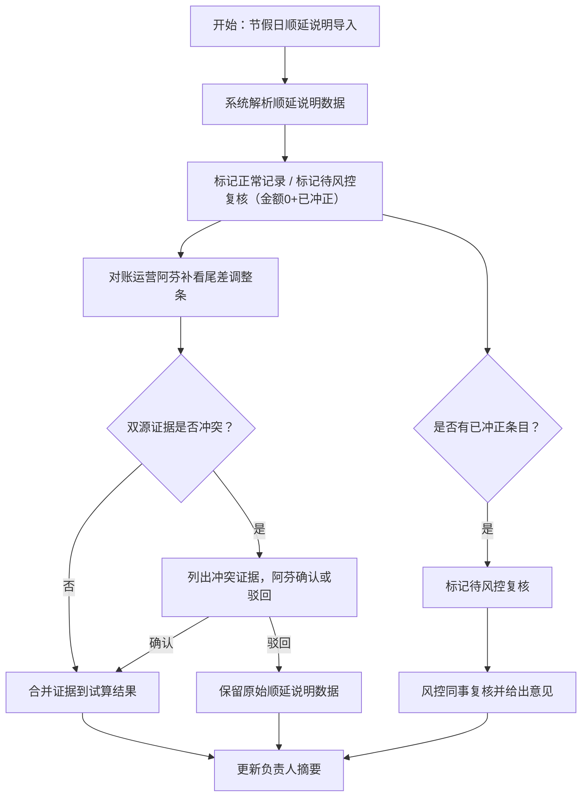

## 1. 产品概述

ABS 现金流瀑布试算系统，用于将「节假日顺延说明」主流程证据与「尾差调整条」现场说法证据合并到统一试算结果中，支持冲突检测、人工裁决、风控复核及全链路审计追踪。

- 目标用户：对账运营（阿芬）、风控复核同事、业务负责人
- 核心价值：双源证据合一、冲突不自动拍板、改动能追溯、风控风险不遗漏

## 2. 核心功能

### 2.1 用户角色

| 角色 | 进入方式 | 核心权限 |
|------|----------|----------|
| 对账运营（阿芬） | 系统登录 | 导入数据、查看冲突、确认/驳回、触发摘要更新 |
| 风控复核同事 | 系统登录 | 复核已冲正条目、标记风险、追加审核意见 |
| 业务负责人 | 系统登录 | 查看摘要、查阅历史记录、确认最终结果 |

### 2.2 功能模块

1. **试算总览页**：瀑布试算结果一览，三种记录类型分色展示，冲突标记醒目
2. **数据导入页**：节假日顺延说明导入、尾差调整条补录
3. **冲突裁决页**：双源证据冲突列表，人工确认/驳回交互
4. **审核追踪页**：谁改了什么、为什么改、影响哪些结果
5. **负责人摘要页**：给负责人看的汇总摘要及历史记录

### 2.3 页面详情

| 页面名称 | 模块名称 | 功能描述 |
|----------|----------|----------|
| 试算总览页 | 结果卡片列表 | 展示三条样例记录：正常顺利、金额0已冲正、尾差补录旧口径，分色标签区分 |
| 试算总览页 | 步骤进度条 | 三步流程：节假日顺延导入 → 尾差调整条补看 → 摘要更新 |
| 试算总览页 | 冲突横幅 | 双源矛盾时弹出冲突证据列表 |
| 数据导入页 | 顺延说明导入区 | 上传/填写节假日顺延说明数据 |
| 数据导入页 | 尾差调整补录区 | 补录尾差调整条数据，标记为旧口径 |
| 冲突裁决页 | 冲突证据对比 | 左右对比节假日顺延说明 vs 尾差调整条，列出冲突点 |
| 冲突裁决页 | 确认/驳回操作 | 对账运营阿芬选择确认或驳回，不自动拍板 |
| 审核追踪页 | 变更时间线 | 按时间倒序展示所有变更：操作人、变更内容、原因、影响结果 |
| 负责人摘要页 | 摘要卡片 | 汇总当前试算结果，突出冲突处理结论 |
| 负责人摘要页 | 历史记录表 | 试算结果历史版本，可追溯每步变更 |

## 3. 核心流程

用户打开系统后，按三步主流程操作：第一步导入节假日顺延说明数据，系统自动标记正常记录；第二步对账运营阿芬补看尾差调整条，系统将尾差调整证据与顺延说明证据合并，检测冲突；第三步冲突由阿芬裁决后，系统更新给负责人看的摘要。

对于金额为 0 且备注为「已冲正」的记录，系统不自动归入正常，而是标记为「待风控复核」，留给风控同事复核。

## 4. 用户界面设计

### 4.1 设计风格

- 主色调：深蓝（#1a365d）+ 琥珀警示（#d97706）+ 翡翠正常（#059669）
- 次要色：石板灰（#475569）、浅蓝背景（#eff6ff）
- 按钮风格：圆角微凸，确认用实心翡翠色、驳回用空心琥珀色边框
- 字体：思源宋体（Noto Serif SC）标题 + 思源黑体（Noto Sans SC）正文，层级分 5 级
- 布局：左侧固定导航 + 右侧内容区，卡片式信息组织
- 图标风格：线性图标（lucide-react），统一 20px

### 4.2 页面设计概览

| 页面名称 | 模块名称 | UI 元素 |
|----------|----------|---------|
| 试算总览页 | 结果卡片列表 | 卡片圆角阴影，翡翠/琥珀/石板三色标签，hover 浮起效果 |
| 试算总览页 | 步骤进度条 | 三步骤横向进度，当前步骤高亮动画 |
| 试算总览页 | 冲突横幅 | 顶部琥珀色横幅，展开冲突证据对比 |
| 数据导入页 | 导入表单 | 分区卡片，拖拽上传区，表格预览 |
| 冲突裁决页 | 证据对比 | 左右分栏，冲突字段高亮琥珀底色，操作按钮居下 |
| 审核追踪页 | 时间线 | 垂直时间线，变更节点带操作人头像、变更描述、影响标签 |
| 负责人摘要页 | 摘要卡片 | 大号数字摘要，下方冲突处理结论，历史记录折叠表格 |

### 4.3 响应式

桌面优先设计，导航栏在平板以下收起为汉堡菜单，卡片列表在移动端单列堆叠。

### 4.4 3D 场景

不适用。
