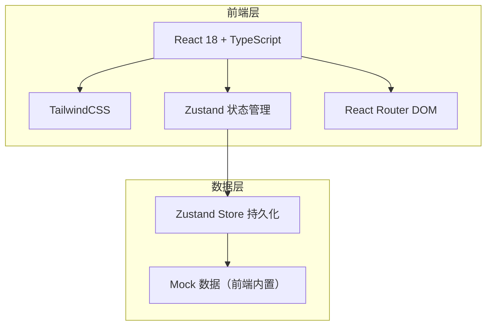
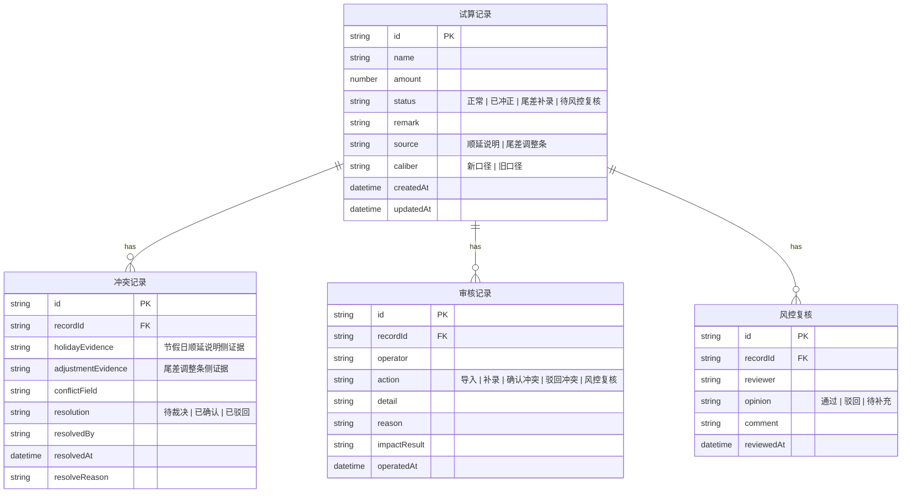

## 1. 架构设计



## 2. 技术说明

- 前端：React@18 + TailwindCSS@3 + Vite + TypeScript
- 初始化工具：vite-init
- 后端：无（纯前端，Mock 数据）
- 数据库：无（前端 Zustand 持久化 + Mock 数据）

## 3. 路由定义

| 路由 | 用途 |
|------|------|
| / | 试算总览页：三步流程进度 + 结果卡片列表 + 冲突横幅 |
| /import | 数据导入页：节假日顺延说明导入 + 尾差调整条补录 |
| /conflict | 冲突裁决页：双源证据对比 + 确认/驳回操作 |
| /audit | 审核追踪页：变更时间线 |
| /summary | 负责人摘要页：摘要卡片 + 历史记录表 |

## 4. API 定义

无后端 API，使用前端 Mock 数据和 Zustand Store 管理状态。

## 5. 服务端架构图

不适用。

## 6. 数据模型

### 6.1 数据模型定义



### 6.2 数据定义语言

前端 TypeScript 类型定义，存储于 `src/types/index.ts`：

```typescript
type RecordStatus = '正常' | '已冲正' | '尾差补录' | '待风控复核'
type RecordSource = '顺延说明' | '尾差调整条'
type CaliberType = '新口径' | '旧口径'
type ConflictResolution = '待裁决' | '已确认' | '已驳回'
type AuditAction = '导入' | '补录' | '确认冲突' | '驳回冲突' | '风控复核'
type RiskOpinion = '通过' | '驳回' | '待补充'
type WorkflowStep = 1 | 2 | 3

interface TrialRecord { id: string; name: string; amount: number; status: RecordStatus; remark: string; source: RecordSource; caliber: CaliberType; createdAt: string; updatedAt: string }
interface ConflictRecord { id: string; recordId: string; holidayEvidence: string; adjustmentEvidence: string; conflictField: string; resolution: ConflictResolution; resolvedBy: string; resolvedAt: string; resolveReason: string }
interface AuditRecord { id: string; recordId: string; operator: string; action: AuditAction; detail: string; reason: string; impactResult: string; operatedAt: string }
interface RiskReview { id: string; recordId: string; reviewer: string; opinion: RiskOpinion; comment: string; reviewedAt: string }
```

### 6.3 初始 Mock 数据

三条样例记录：
1. 顺利记录：金额 1250000，来源顺延说明，状态正常，新口径
2. 已冲正记录：金额 0，来源顺延说明，状态待风控复核，备注「已冲正」，新口径
3. 尾差补录记录：金额 3500，来源尾差调整条，状态尾差补录，旧口径
