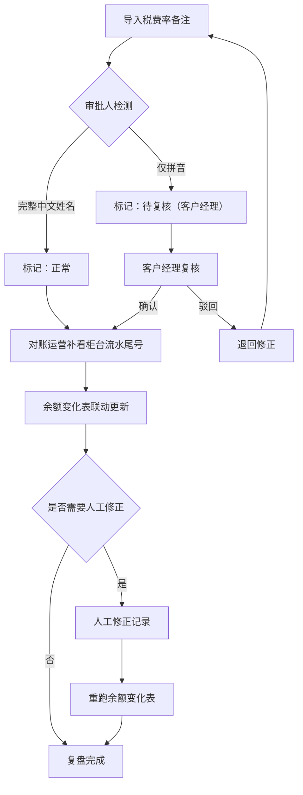

## 1. 产品概述

柜员长短款复盘是对账运营人员用来复盘柜员现金长短款差异的工具。它将税费率备注、柜台流水尾号、审批人信息等分散在临时拼接表里的字段聚合起来，通过导入→补录→余额联动三步走，让复盘结论有据可查、证据链不断裂。

- 目标用户：对账运营人员（阿芬）及新人培训场景
- 核心价值：把"临时拼接"的长短款数据变成可追溯、可复核的结构化复盘记录，避免结论看似完整但追查证据时断在半路

## 2. 核心功能

### 2.1 用户角色

| 角色 | 注册方式 | 核心权限 |
|------|----------|----------|
| 对账运营 | 分配账号 | 导入数据、补录流水尾号、标记复核、查看余额变化表 |
| 客户经理 | 分配账号 | 复核审批人拼音记录、确认或驳回 |

### 2.2 功能模块

1. **复盘看板页**：复盘记录总览，筛选与状态标记，快捷操作入口
2. **复盘详情页**：单条复盘记录的完整证据链展示，三步流程操作区

### 2.3 页面详情

| 页面名称 | 模块名称 | 功能描述 |
|----------|----------|----------|
| 复盘看板页 | 数据导入区 | 导入税费率备注数据（CSV/手动录入），解析后生成复盘记录 |
| 复盘看板页 | 记录列表区 | 展示所有复盘记录，含状态标签（正常/待补录/待复核），支持筛选排序 |
| 复盘看板页 | 余额变化总览 | 汇总所有记录的余额变化趋势 |
| 复盘详情页 | 基本信息卡 | 展示税费率备注、审批人、状态等核心字段 |
| 复盘详情页 | 柜台流水尾号补录区 | 补录柜台流水尾号后自动触发余额变化表更新 |
| 复盘详情页 | 余额变化表 | 展示调整前/调整后/差异金额，联动更新 |
| 复盘详情页 | 证据链时间线 | 记录每一步操作（导入→补录→修正→重跑），证据可追查 |

## 3. 核心流程

对账运营人员导入税费率备注数据后，系统自动识别审批人字段：若审批人为完整中文姓名，则标记为"正常"；若审批人仅留拼音，则标记为"待复核"，不急于归正常，留给客户经理复核。对账运营人员随后补看柜台流水尾号并补录，余额变化表实时联动更新。每一步操作都记录在证据链时间线中，确保结论可追溯。

## 4. 用户界面设计

### 4.1 设计风格

- 主色调：深青色 (#0F766E)，辅助色：琥珀色 (#D97706) 用于警示/待复核标记
- 按钮风格：圆角矩形，主操作用实心填充，次要操作用描边
- 字体：标题用 Noto Serif SC，正文用 Noto Sans SC
- 布局风格：卡片式布局，顶部导航
- 图标风格：线性图标，2px 描边

### 4.2 页面设计概览

| 页面名称 | 模块名称 | UI 元素 |
|----------|----------|---------|
| 复盘看板页 | 数据导入区 | 拖拽上传区，解析进度条，导入结果摘要 |
| 复盘看板页 | 记录列表区 | 表格组件，状态标签（绿色正常/黄色待复核/蓝色待补录），行操作按钮 |
| 复盘看板页 | 余额变化总览 | 折线图，关键指标卡片 |
| 复盘详情页 | 基本信息卡 | 字段标签+值，状态徽章 |
| 复盘详情页 | 流水尾号补录区 | 输入框+确认按钮，补录后自动刷新余额表 |
| 复盘详情页 | 余额变化表 | 前后对比表格，差异高亮，修正/重跑按钮 |
| 复盘详情页 | 证据链时间线 | 垂直时间线，每步含操作人、时间、变更内容 |

### 4.3 响应式

桌面优先设计，平板与手机端保证核心操作可用，图表自适应缩放。

### 4.4 演示数据

系统内置小而真的演示数据，包含至少三条记录：
1. **顺利记录**：审批人完整，税费率备注齐全，余额无差异 → 状态"正常"
2. **审批人拼音记录**：审批人仅留拼音"ZhangSan" → 状态"待复核"，需客户经理确认
3. **旧口径补录记录**：初期缺少柜台流水尾号，后从旧系统补入 → 补录后余额变化表更新，体现人工修正和重跑

每条记录包含完整的证据链（导入→补录→修正/重跑），方便对账运营阿芬给新人讲流程。
