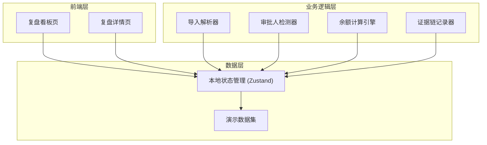
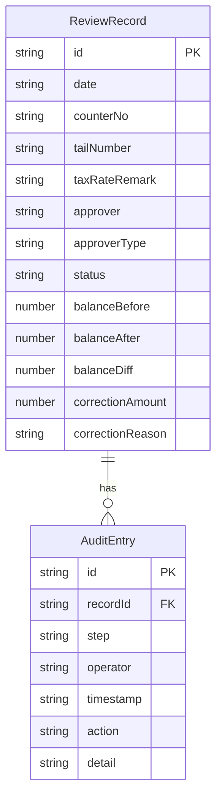

## 1. 架构设计



## 2. 技术说明

- 前端：React@18 + Tailwind CSS@3 + Vite
- 初始化工具：Vite
- 后端：无（纯前端，数据存储在本地状态和 localStorage）
- 数据库：无（使用内置 Mock 数据 + localStorage 持久化）

## 3. 路由定义

| 路由 | 用途 |
|------|------|
| / | 复盘看板页：记录总览、数据导入、筛选排序 |
| /review/:id | 复盘详情页：单条记录的完整操作和证据链 |

## 4. API 定义

无后端 API。所有数据操作通过 Zustand Store 完成：

```typescript
interface ReviewRecord {
  id: string
  date: string
  counterNo: string
  tailNumber: string
  taxRateRemark: string
  approver: string
  approverType: "full" | "pinyin"
  status: "normal" | "pending_review" | "pending_supplement"
  balanceBefore: number
  balanceAfter: number | null
  balanceDiff: number | null
  correctionAmount: number | null
  correctionReason: string | null
  auditTrail: AuditEntry[]
}

interface AuditEntry {
  step: string
  operator: string
  timestamp: string
  action: "import" | "supplement" | "correct" | "rerun" | "review"
  detail: string
  beforeValue?: string | number
  afterValue?: string | number
}
```

## 5. 服务器架构图

无后端服务器。

## 6. 数据模型

### 6.1 数据模型定义



### 6.2 演示数据

内置三条演示数据：
1. 顺利记录：审批人"张明"（完整中文），余额无差异，状态正常
2. 拼音记录：审批人"ZhangSan"（拼音），状态待复核，需客户经理确认
3. 旧口径补录记录：初期无流水尾号，后补录并触发余额更新，含人工修正和重跑

所有演示数据包含完整的证据链时间线条目。
