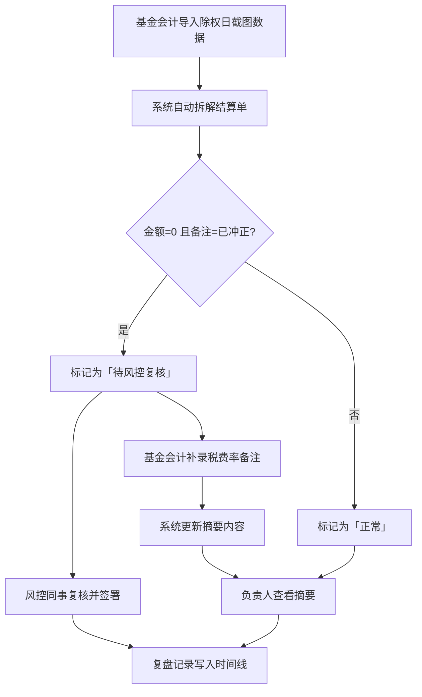

## 1. 产品概述

交易所结算单拆解——面向基金会计与风控团队的结算单审查与复盘工具。解决的核心痛点：结算单导入后金额为 0 但备注写"已冲正"的条目容易被误归为正常；税费率备注往往滞后补入，导致给负责人的摘要与实际状态脱节。本工具通过三步工作流（导入 → 补录税费率 → 摘要更新）确保每条异常都有归属、有原因、有下一步，最终产出的是一份可复盘的记录和可重跑的命令，而非冷冰冰的功能清单。

- 目标用户：基金会计（如林姐）、风控同事、负责人
- 核心价值：让结算单审查过程可追溯、可重跑、可交接

## 2. 核心功能

### 2.1 用户角色

| 角色 | 进入方式 | 核心权限 |
|------|----------|----------|
| 基金会计 | 小看板 / CLI | 导入结算单、补录税费率备注、标记人工修正、触发重跑 |
| 风控同事 | 小看板 / API | 复核"金额为0+已冲正"条目、签署复核意见 |
| 负责人 | 小看板 | 查看摘要、审阅复盘记录 |

### 2.2 功能模块

1. **结算单拆解看板**：导入结算单数据，逐条展示并标记异常（金额为0+备注已冲正），展示三步工作流进度
2. **税费率备注补录**：基金会计补充税费率备注后，自动更新关联条目的摘要内容
3. **负责人摘要**：为负责人生成人性化摘要，说明每条留痕原因、缺少材料、下一步动作
4. **复盘记录与重跑**：保留完整操作时间线，支持一键重跑历史导入操作，输出可复现的命令行

### 2.3 页面详情

| 页面名称 | 模块名称 | 功能描述 |
|----------|----------|----------|
| 结算单拆解看板 | 结算单导入区 | 上传/粘贴结算单数据，自动拆解为逐条记录，标记除权日截图条目 |
| 结算单拆解看板 | 条目列表 | 展示所有拆解后的条目，金额为0+备注已冲正的条目高亮为"待风控复核"状态 |
| 结算单拆解看板 | 三步工作流进度 | 可视化展示：①已导入 ②已补录税费率 ③摘要已更新 |
| 税费率备注补录 | 备注编辑区 | 为指定条目补录税费率备注，保存后自动触发摘要更新 |
| 税费率备注补录 | 变更影响预览 | 补录前预览哪些条目的摘要会因此改变 |
| 负责人摘要 | 摘要卡片 | 每条记录一张卡片，说明：为什么被留下、缺什么材料、下一步找谁 |
| 负责人摘要 | 待办清单 | 按角色分组：需要风控同事复核的 / 需要基金会计补录的 |
| 复盘记录 | 操作时间线 | 按时间展示所有操作：导入、补录、修正、重跑 |
| 复盘记录 | 可重跑命令 | 为每次导入生成CLI命令，支持一键复制重跑 |

## 3. 核心流程

基金会计林姐导入除权日截图数据 → 系统自动拆解并标记"金额为0+已冲正"为待风控复核 → 林姐发现税费率备注缺失，补录税费率 → 系统更新受影响条目的摘要 → 负责人查看摘要，看到每条异常的原因、缺料、下一步 → 风控同事复核"已冲正"条目并签署意见 → 所有操作记录在复盘时间线中，支持重跑

## 4. 用户界面设计

### 4.1 设计风格

- 主色调：深青灰（#2D3A3A）搭配暖琥珀色（#D4913B）作为警示/强调色
- 辅助色：纸白（#FAF8F5）作为背景，暗红（#C0504D）标记冲正异常
- 按钮风格：圆角微凸（subtle 3D），主操作用琥珀色填充，次操作用描边
- 字体：数字使用等宽字体（JetBrains Mono），正文使用可读衬线体（Noto Serif SC），标题使用无衬线（Noto Sans SC）
- 布局：左侧窄导航 + 右侧宽内容区，卡片式内容块，网格背景暗示"账本"意象
- 图标风格：线性图标（lucide-react），线条纤细，配合圆点装饰

### 4.2 页面设计概览

| 页面名称 | 模块名称 | UI元素 |
|----------|----------|--------|
| 结算单拆解看板 | 结算单导入区 | 拖拽上传区域，带虚线边框和图标；导入后展示条目数量统计 |
| 结算单拆解看板 | 条目列表 | 表格式展示，"待风控复核"行用暗红左边框+淡红背景；三步进度条在顶部 |
| 税费率备注补录 | 备注编辑区 | 侧滑面板，包含下拉选择税费率+自由文本备注，保存后带绿色勾动画 |
| 负责人摘要 | 摘要卡片 | 每卡片三段式：原因/缺料/下一步，用图标区分，底部标签标注负责角色 |
| 复盘记录 | 操作时间线 | 左侧竖线+圆点时间线，每节点展示操作摘要和可复制的CLI命令块 |

### 4.3 响应式设计

桌面优先设计，看板在小屏幕下切换为单列卡片堆叠，导航折叠为汉堡菜单。

### 4.4 3D 场景

不适用
