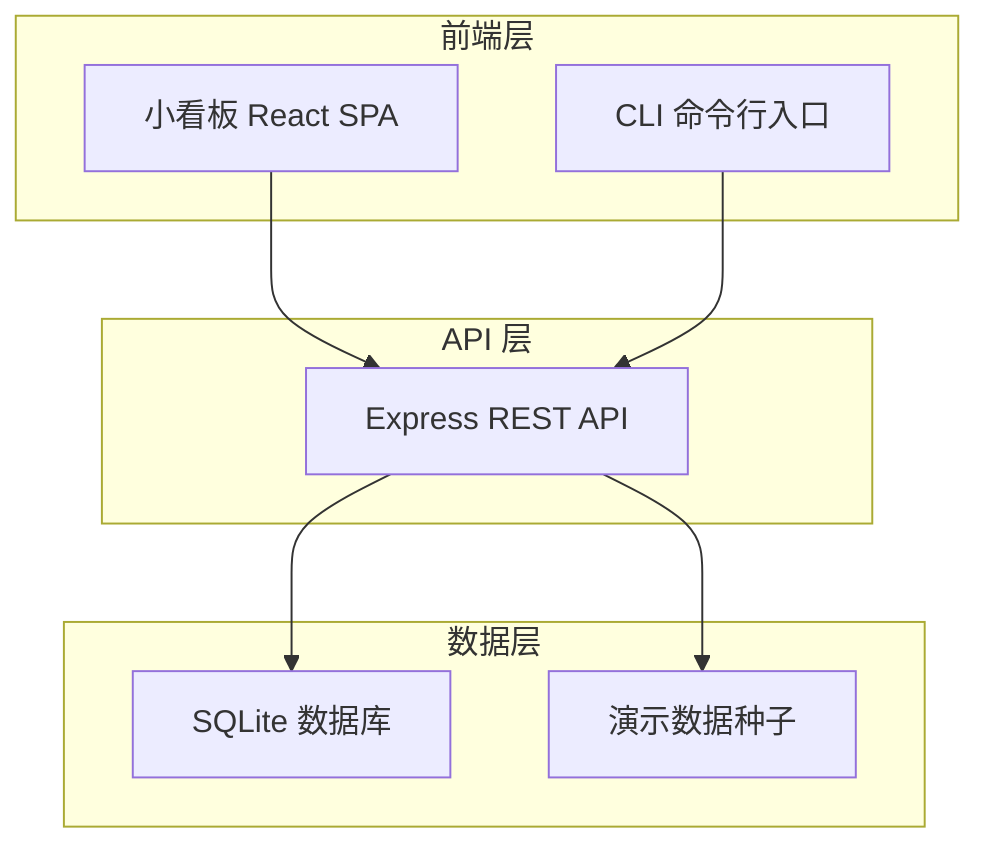
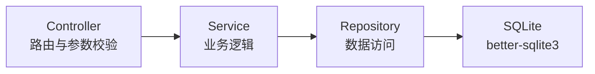
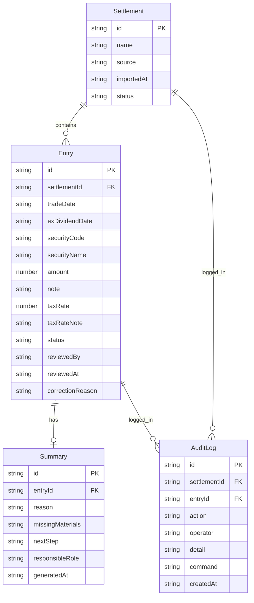

## 1. 架构设计



## 2. 技术说明

- 前端：React@18 + Tailwind CSS@3 + Vite + Zustand（状态管理）
- 初始化工具：vite-init（react-express-ts 模板）
- 后端：Express@4 + TypeScript（ESM）
- 数据库：SQLite（better-sqlite3），内置演示数据种子
- 路由：react-router-dom

## 3. 路由定义

| 路由 | 用途 |
|------|------|
| / | 结算单拆解看板主页：导入区 + 条目列表 + 三步进度 |
| /notes | 税费率备注补录页 |
| /summary | 负责人摘要页 |
| /audit-log | 复盘记录与重跑页 |

## 4. API 定义

### 4.1 结算单相关

```
POST   /api/settlements          导入结算单数据
GET    /api/settlements           获取结算单列表
GET    /api/settlements/:id       获取单条结算单详情（含拆解条目）
DELETE /api/settlements/:id       删除结算单
POST   /api/settlements/:id/rerun 重跑某次导入
```

### 4.2 条目相关

```
GET    /api/entries               获取所有拆解条目（支持按状态筛选）
PATCH  /api/entries/:id           更新条目（人工修正）
POST   /api/entries/:id/notes     补录税费率备注
PATCH  /api/entries/:id/review    风控复核签署
```

### 4.3 摘要相关

```
GET    /api/summaries             获取负责人摘要列表
POST   /api/summaries/refresh     刷新所有摘要（补录税费率后触发）
```

### 4.4 复盘记录相关

```
GET    /api/audit-logs            获取操作时间线
GET    /api/audit-logs/:id/command 获取可重跑的CLI命令
```

### 4.5 TypeScript 类型定义

```typescript
interface Settlement {
  id: string
  name: string
  source: "upload" | "cli" | "api"
  importedAt: string
  status: "imported" | "notes_supplemented" | "summary_updated"
  entries: Entry[]
}

interface Entry {
  id: string
  settlementId: string
  tradeDate: string
  exDividendDate: string | null
  securityCode: string
  securityName: string
  amount: number
  note: string
  taxRate: number | null
  taxRateNote: string | null
  status: "normal" | "pending_review" | "reviewed" | "corrected"
  reviewedBy: string | null
  reviewedAt: string | null
  correctionReason: string | null
}

interface Summary {
  id: string
  entryId: string
  reason: string
  missingMaterials: string[]
  nextStep: string
  responsibleRole: "fund_accountant" | "risk_control"
  generatedAt: string
}

interface AuditLog {
  id: string
  settlementId: string
  action: "import" | "supplement_note" | "manual_correction" | "rerun" | "review"
  operator: string
  detail: string
  command: string | null
  createdAt: string
}
```

## 5. 服务器架构图



## 6. 数据模型

### 6.1 数据模型定义



### 6.2 数据定义语言

```sql
CREATE TABLE settlements (
  id TEXT PRIMARY KEY,
  name TEXT NOT NULL,
  source TEXT NOT NULL CHECK(source IN ('upload', 'cli', 'api')),
  imported_at TEXT NOT NULL DEFAULT (datetime('now')),
  status TEXT NOT NULL DEFAULT 'imported' CHECK(status IN ('imported', 'notes_supplemented', 'summary_updated'))
);

CREATE TABLE entries (
  id TEXT PRIMARY KEY,
  settlement_id TEXT NOT NULL REFERENCES settlements(id),
  trade_date TEXT NOT NULL,
  ex_dividend_date TEXT,
  security_code TEXT NOT NULL,
  security_name TEXT NOT NULL,
  amount REAL NOT NULL DEFAULT 0,
  note TEXT NOT NULL DEFAULT '',
  tax_rate REAL,
  tax_rate_note TEXT,
  status TEXT NOT NULL DEFAULT 'normal' CHECK(status IN ('normal', 'pending_review', 'reviewed', 'corrected')),
  reviewed_by TEXT,
  reviewed_at TEXT,
  correction_reason TEXT
);

CREATE TABLE summaries (
  id TEXT PRIMARY KEY,
  entry_id TEXT NOT NULL REFERENCES entries(id),
  reason TEXT NOT NULL,
  missing_materials TEXT NOT NULL DEFAULT '[]',
  next_step TEXT NOT NULL,
  responsible_role TEXT NOT NULL CHECK(responsible_role IN ('fund_accountant', 'risk_control')),
  generated_at TEXT NOT NULL DEFAULT (datetime('now'))
);

CREATE TABLE audit_logs (
  id TEXT PRIMARY KEY,
  settlement_id TEXT NOT NULL REFERENCES settlements(id),
  entry_id TEXT REFERENCES entries(id),
  action TEXT NOT NULL CHECK(action IN ('import', 'supplement_note', 'manual_correction', 'rerun', 'review')),
  operator TEXT NOT NULL,
  detail TEXT NOT NULL,
  command TEXT,
  created_at TEXT NOT NULL DEFAULT (datetime('now'))
);

CREATE INDEX idx_entries_settlement ON entries(settlement_id);
CREATE INDEX idx_entries_status ON entries(status);
CREATE INDEX idx_summaries_entry ON summaries(entry_id);
CREATE INDEX idx_audit_logs_settlement ON audit_logs(settlement_id);
CREATE INDEX idx_audit_logs_created ON audit_logs(created_at);
```
