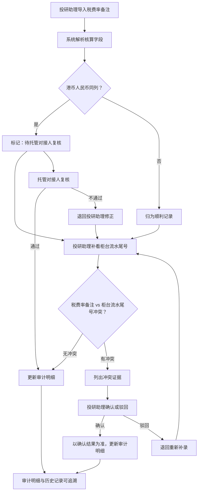

## 1. 产品概述

信托分配水位线核算系统，用于解决信托产品分配时水位线核算数据口径不一致的问题。当前港币与人民币混写在同一列时，托管对接人需反复追问核算差异，投研助理只能手工解释；补录旧口径数据缺少审计痕迹。本系统将三种典型记录（顺利记录、港币人民币同列记录、柜台流水尾号补录记录）的核算流程标准化，确保审计明细与历史记录可追溯、冲突不自动拍板。

- 目标用户：投研助理（如小周）、托管对接人、审计人员
- 核心价值：消除手工解释负担，保证核算结论的证据链完整

## 2. 核心功能

### 2.1 用户角色

| 角色 | 进入方式 | 核心权限 |
|------|----------|----------|
| 投研助理 | 账号登录 | 导入税费率备注、补看柜台流水尾号、确认/驳回冲突 |
| 托管对接人 | 账号登录 | 复核港币人民币同列记录、查看审计明细 |
| 审计人员 | 账号登录 | 查看审计明细、历史记录追溯 |

### 2.2 功能模块

1. **核算总览页**：水位线核算状态总览、三种记录类型统计、待处理冲突提示
2. **核算明细页**：税费率备注导入、柜台流水尾号补录、冲突证据展示与确认/驳回操作、港币人民币同列标记与托管对接人复核流程
3. **审计追溯页**：操作历史时间线、每步证据链、审计明细与历史记录对照

### 2.3 页面详情

| 页面名称 | 模块名称 | 功能描述 |
|----------|----------|----------|
| 核算总览页 | 状态统计卡片 | 显示顺利记录数、港币人民币同列待复核数、补录记录数、冲突待确认数 |
| 核算总览页 | 记录列表 | 展示所有核算记录，按类型标签（顺利/同列/补录）筛选，点击进入明细 |
| 核算总览页 | 待处理提醒 | 冲突待确认、同列待复核的快捷入口 |
| 核算明细页 | 税费率备注导入区 | 第一次导入税费率备注，自动解析并填入核算字段 |
| 核算明细页 | 柜台流水尾号补录区 | 投研助理补看柜台流水尾号，补充旧口径数据 |
| 核算明细页 | 冲突证据面板 | 税费率备注与柜台流水尾号矛盾时，列出冲突证据，提供确认/驳回按钮 |
| 核算明细页 | 港币人民币同列处理 | 检测到同列混合货币时，标记为"待托管对接人复核"，不自动归为正常 |
| 核算明细页 | 审计明细更新 | 三步流程完成后审计明细自动更新，记录操作人、时间、证据来源 |
| 审计追溯页 | 操作时间线 | 按时间展示每步操作：导入→补录→冲突处理→复核→审计更新 |
| 审计追溯页 | 证据链查看 | 每步操作的证据来源、原始数据、处理结果，支持展开查看详情 |
| 审计追溯页 | 历史对照 | 核算结果与历史记录对照，差异高亮 |

## 3. 核心流程

### 3.1 水位线核算主流程

投研助理导入税费率备注 → 系统自动解析核算字段 → 检测港币人民币是否同列 → 若同列，标记为"待托管对接人复核"，不归正常 → 投研助理补看柜台流水尾号 → 系统比对税费率备注与柜台流水尾号 → 若无冲突，更新审计明细 → 若有冲突，列出冲突证据 → 投研助理确认或驳回 → 托管对接人复核同列记录 → 审计明细最终更新

### 3.2 流程图

## 4. 用户界面设计

### 4.1 设计风格

- 主色调：深蓝 #1B2A4A（专业、信任感），辅助色：琥珀 #D4A843（警示与高亮），成功色：青绿 #2D9B83
- 按钮：圆角矩形，主操作深蓝底白字，危险操作琥珀底白字
- 字体：思源宋体（标题）+ 思源黑体（正文），数字使用等宽字体 JetBrains Mono
- 布局：左侧窄导航 + 右侧主内容区，卡片式模块
- 图标：线性图标，2px描边

### 4.2 页面设计概览

| 页面名称 | 模块名称 | UI 元素 |
|----------|----------|---------|
| 核算总览页 | 状态统计卡片 | 四列卡片，分别用蓝/琥珀/灰/红色边框区分类型，数字用等宽大字 |
| 核算总览页 | 记录列表 | 表格，行首类型标签色块，可筛选，行点击进入明细 |
| 核算总览页 | 待处理提醒 | 右上角浮动提醒条，琥珀色，点击跳转对应明细 |
| 核算明细页 | 税费率备注导入区 | 文件上传区 + 解析预览表格，导入按钮深蓝底 |
| 核算明细页 | 柜台流水尾号补录区 | 补录表单，尾号输入框 + 原始数据对照区 |
| 核算明细页 | 冲突证据面板 | 红色边框卡片，左右分栏展示矛盾数据，底部确认/驳回按钮 |
| 核算明细页 | 港币人民币同列处理 | 琥珀色标签"待复核"，操作栏灰显，仅托管对接人可操作 |
| 核算明细页 | 审计明细更新 | 步骤条（三步：导入→补录→更新），当前步骤高亮 |
| 审计追溯页 | 操作时间线 | 左侧竖线时间轴，每节点展示操作类型、操作人、时间戳 |
| 审计追溯页 | 证据链查看 | 可展开卡片，展示原始数据截图区 + 处理结果 |
| 审计追溯页 | 历史对照 | 双栏对照表，差异行高亮琥珀色 |

### 4.3 响应式设计

- 桌面优先设计，最小适配 1280px 宽度
- 平板端侧边栏折叠为顶部导航
- 手机端卡片单列堆叠，表格转为卡片列表

### 4.4 3D 场景

不适用
