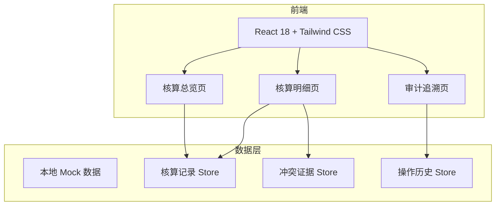
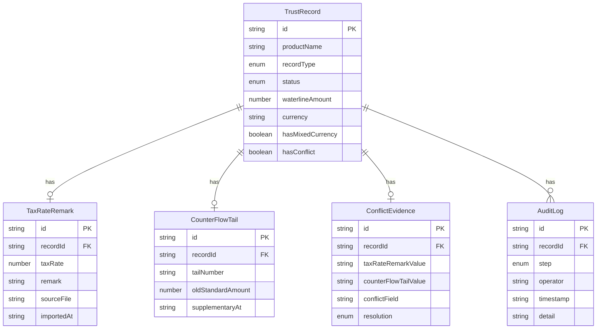

## 1. 架构设计



## 2. 技术说明

- 前端：React@18 + Tailwind CSS@3 + Vite
- 初始化工具：Vite
- 后端：无（纯前端，使用 Mock 数据）
- 数据库：无（使用 Zustand 状态管理 + localStorage 持久化）
- 路由：React Router v6

## 3. 路由定义

| 路由 | 用途 |
|------|------|
| / | 核算总览页，展示状态统计与记录列表 |
| /detail/:id | 核算明细页，税费率备注导入、补录、冲突处理 |
| /audit | 审计追溯页，操作时间线与证据链 |

## 4. API 定义

无后端 API，使用前端 Zustand Store 管理数据。

### 核心数据类型

```typescript
type RecordType = "smooth" | "mixed_currency" | "supplementary"

type RecordStatus = "smooth" | "pending_review" | "pending_confirm" | "confirmed" | "rejected"

interface TrustRecord {
  id: string
  productName: string
  recordType: RecordType
  status: RecordStatus
  taxRateRemark: TaxRateRemark | null
  counterFlowTail: CounterFlowTail | null
  waterlineAmount: number
  currency: string
  rawCurrencyText: string
  hasMixedCurrency: boolean
  hasConflict: boolean
  createdAt: string
  updatedAt: string
}

interface TaxRateRemark {
  id: string
  recordId: string
  taxRate: number
  remark: string
  sourceFile: string
  importedAt: string
  importedBy: string
}

interface CounterFlowTail {
  id: string
  recordId: string
  tailNumber: string
  oldStandardAmount: number
  currency: string
  supplementaryAt: string
  supplementaryBy: string
}

interface ConflictEvidence {
  id: string
  recordId: string
  taxRateRemarkValue: string
  counterFlowTailValue: string
  conflictField: string
  conflictDescription: string
  resolution: "pending" | "confirmed" | "rejected"
  resolvedBy: string | null
  resolvedAt: string | null
}

interface AuditLog {
  id: string
  recordId: string
  step: "import_tax_rate" | "supplementary_counter_flow" | "audit_update"
  operator: string
  role: string
  timestamp: string
  detail: string
  evidenceRef: string
}
```

## 5. 服务端架构

不适用（纯前端项目）

## 6. 数据模型

### 6.1 数据模型定义



### 6.2 初始样例数据

三条典型记录：
1. **顺利记录**：产品"信泰-稳健1号"，税费率备注与柜台流水尾号一致，无混合货币，状态 smooth
2. **港币人民币同列记录**：产品"中融-海外优选"，rawCurrencyText 含"港币/人民币"，hasMixedCurrency=true，状态 pending_review
3. **补录旧口径记录**：产品"华宝-经典系列"，柜台流水尾号为后补数据，与税费率备注冲突（税费率 15% vs 柜台流水尾号对应 12%），hasConflict=true，状态 pending_confirm
