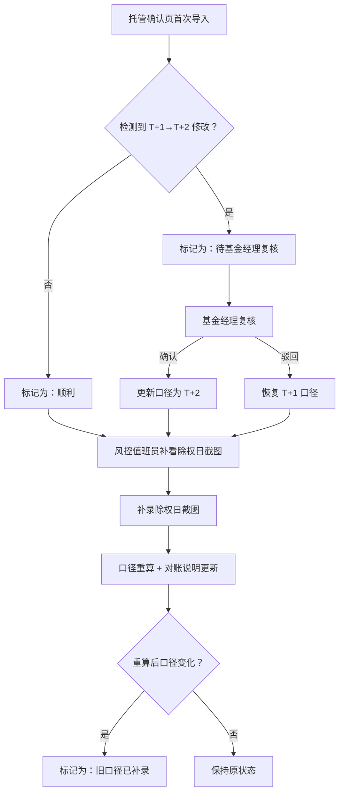

## 1. 产品概述

资产减值迁徙矩阵是一款面向风控值班人员的小型对账工具，用于从托管确认页和除权日截图中提取、校验并追踪资产减值口径变化。系统自动识别 T+1 到账被手工改为 T+2 的异常，补录除权日截图后联动更新对账说明，确保减值迁徙口径始终可追溯。

- 目标用户：风控值班员（老秦）、新入职风控培训人员、基金经理（复核角色）
- 核心价值：消除临时拼接带来的口径错漏，让减值迁徙矩阵从"人肉核对"变为"系统留痕"

## 2. 核心功能

### 2.1 用户角色

| 角色 | 进入方式 | 核心权限 |
|------|----------|----------|
| 风控值班员 | 命令行 / API / 小看板 | 导入数据、补录截图、触发重跑、查看结果 |
| 基金经理 | 小看板 | 复核 T+1→T+2 异常标记 |
| 培训新人 | 小看板（演示模式） | 查看演示数据、理解流程 |

### 2.2 功能模块

1. **矩阵看板页**：迁徙矩阵总览、记录状态筛选、三种处理结果色块区分
2. **导入与补录页**：托管确认页首次导入、除权日截图补录、对账说明联动更新
3. **记录详情页**：单条记录全生命周期、口径变更时间线、复核状态流转

### 2.3 页面详情

| 页面名称 | 模块名称 | 功能描述 |
|----------|----------|----------|
| 矩阵看板页 | 矩阵总览表 | 展示所有记录的迁徙状态，用色块区分"顺利"、"T+1→T+2 待复核"、"旧口径补录"三种结果 |
| 矩阵看板页 | 状态筛选栏 | 按处理结果筛选记录，支持"全部/顺利/待复核/已补录" |
| 矩阵看板页 | 统计卡片 | 显示总记录数、顺利数、待复核数、已补录数 |
| 导入与补录页 | 托管确认页导入 | 上传/粘贴托管确认页数据，解析为结构化记录 |
| 导入与补录页 | 除权日截图补录 | 对已有记录补录除权日截图，触发口径重算与对账说明更新 |
| 导入与补录页 | 对账说明联动 | 补录后自动更新对账说明文本，展示变更前后对比 |
| 记录详情页 | 全生命周期时间线 | 从首次导入→补录截图→口径变更→复核确认的完整链路 |
| 记录详情页 | 口径变更标记 | T+1→T+2 变更时标注"待基金经理复核"，不自动归为正常 |
| 记录详情页 | 重跑按钮 | 触发重新计算，展示重跑前后差异 |

## 3. 核心流程

风控值班员导入托管确认页数据后，系统解析并生成初始矩阵记录。若检测到 T+1 到账被手工改为 T+2，系统将该记录标记为"待基金经理复核"，不自动归入正常。后续风控值班员补看除权日截图时，补录截图数据触发口径重算，对账说明联动更新。基金经理在复核环节确认或驳回 T+1→T+2 变更。

## 4. 用户界面设计

### 4.1 设计风格

- **主色调**：深墨蓝（#0F1923）为底，配合冷灰蓝（#1A2B3C）卡片
- **强调色**：翠绿（#00D68F）顺利、琥珀（#FFAA00）待复核、珊瑚红（#FF6B6B）异常/旧口径
- **字体**：JetBrains Mono（数据/表格）+ Noto Sans SC（中文正文）
- **布局**：左侧窄导航 + 右侧宽内容区，卡片式信息密度
- **图标**：线性图标，2px 描边，与金融终端工具视觉一致

### 4.2 页面设计概览

| 页面名称 | 模块名称 | UI 元素 |
|----------|----------|---------|
| 矩阵看板页 | 矩阵总览表 | 深色表格，行悬停高亮，状态列色块标签，等宽字体数字 |
| 矩阵看板页 | 状态筛选栏 | 胶囊式 Tab 切换，选中态带底色，过渡动画 |
| 矩阵看板页 | 统计卡片 | 四宫格卡片，大数字 + 小标签，卡片底部带渐变线 |
| 导入与补录页 | 托管确认页导入 | 拖拽上传区域 + 文本粘贴框，解析后预览表格 |
| 导入与补录页 | 除权日截图补录 | 记录选择器 + 上传区域，补录后弹出变更对比弹窗 |
| 导入与补录页 | 对账说明联动 | 双栏对比（变更前/变更后），变更字段高亮 |
| 记录详情页 | 全生命周期时间线 | 纵向时间线，节点带图标和状态色，点击展开详情 |
| 记录详情页 | 口径变更标记 | 红色警告横幅 + "待复核"徽章，复核按钮 |
| 记录详情页 | 重跑按钮 | 主操作按钮，点击后 loading 动画 → 结果对比面板 |

### 4.3 响应式

- 桌面优先设计，最小支持 1280px 宽度
- 平板端：导航折叠为汉堡菜单，表格支持横向滚动
- 移动端：看板页切换为卡片列表视图

### 4.4 3D 场景

不适用
