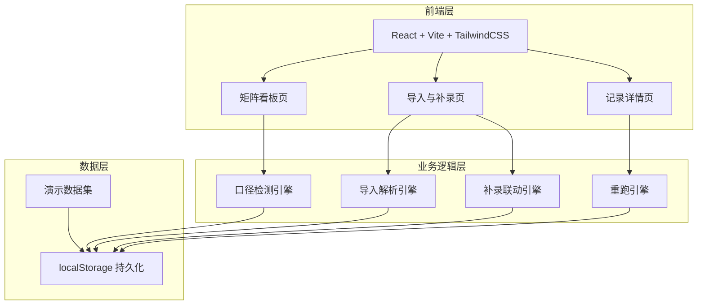
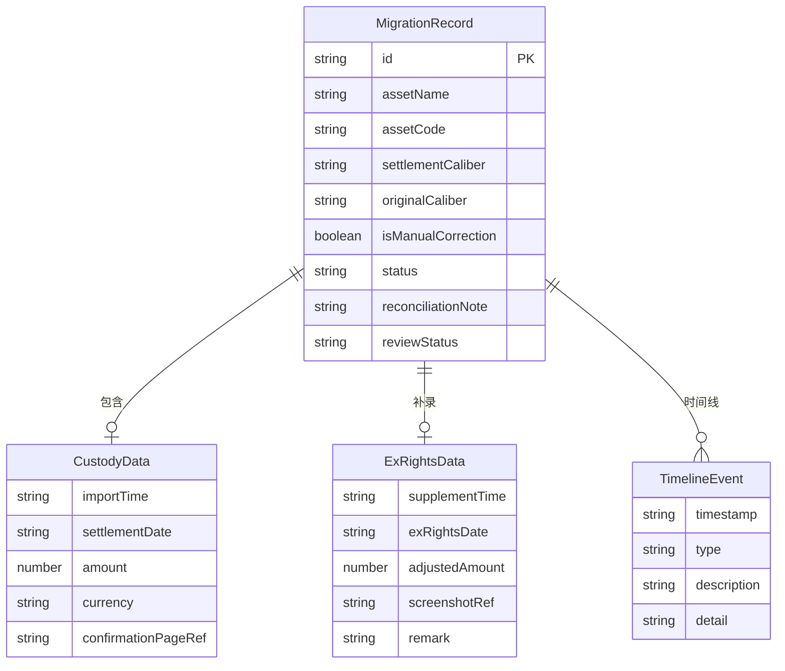

## 1. 架构设计



## 2. 技术说明

- **前端**：React@18 + TailwindCSS@3 + Vite
- **初始化工具**：Vite
- **后端**：无（纯前端，数据持久化使用 localStorage）
- **数据库**：无（使用内存状态 + localStorage，内嵌演示数据集）
- **状态管理**：React Context + useReducer
- **路由**：React Router v6

## 3. 路由定义

| 路由 | 用途 |
|------|------|
| / | 矩阵看板页，展示迁徙矩阵总览与筛选 |
| /import | 导入与补录页，托管确认页导入和除权日截图补录 |
| /record/:id | 记录详情页，单条记录全生命周期 |

## 4. API 定义

无后端 API，所有数据操作通过前端状态管理完成。核心操作函数：

```typescript
interface MigrationRecord {
  id: string
  assetName: string
  assetCode: string
  custodyData: CustodyData
  exRightsData: ExRightsData | null
  settlementCaliber: "T+1" | "T+2"
  originalCaliber: "T+1" | "T+2"
  isManualCorrection: boolean
  status: "smooth" | "pending_review" | "old_caliber_supplemented"
  reconciliationNote: string
  timeline: TimelineEvent[]
  reviewStatus: "none" | "confirmed" | "rejected"
}

interface CustodyData {
  source: "custody_confirmation"
  importTime: string
  settlementDate: string
  amount: number
  currency: string
  confirmationPageRef: string
}

interface ExRightsData {
  source: "ex_rights_screenshot"
  supplementTime: string
  exRightsDate: string
  adjustedAmount: number
  screenshotRef: string
  remark: string
}

interface TimelineEvent {
  timestamp: string
  type: "import" | "caliber_change" | "supplement" | "review" | "rerun"
  description: string
  detail?: string
}
```

## 5. 服务端架构

不适用（纯前端应用）

## 6. 数据模型

### 6.1 数据模型定义



### 6.2 演示数据

内嵌三条核心演示记录：

1. **顺利记录**：华夏沪深300ETF，T+1 到账无修改，直接标记为"顺利"
2. **T+1→T+2 待复核记录**：南方中证500ETF，T+1 被手工改为 T+2，标记为"待基金经理复核"
3. **旧口径补录记录**：嘉实创业板ETF，首次导入 T+1，后补录除权日截图发现口径应为 T+2，对账说明联动更新，标记为"旧口径已补录"

此外包含一次人工修正事件和一次重跑事件，用于演示完整流程。
