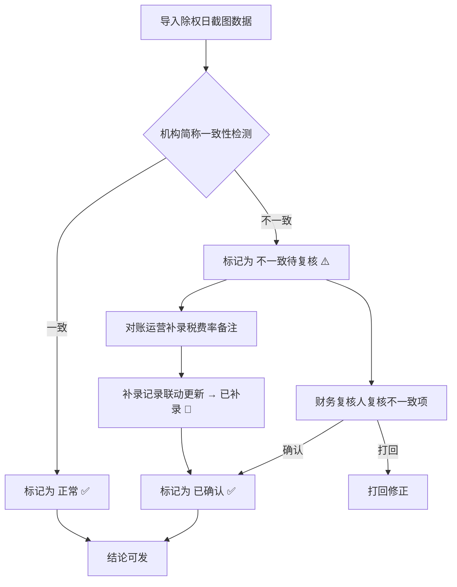
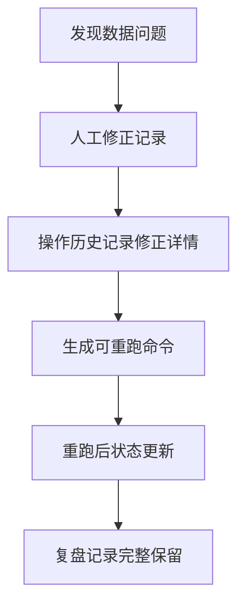

## 1. 产品概述

回购协议展期台账是一套面向对账运营与财务复核场景的轻量台账工具。核心解决的问题是：财务复核人晚上催结果时，对账运营只能翻除权日截图，却因机构简称前后不一致而不敢直接发结论。本台账让导入即标出不一致、补录税费率备注后联动更新，并留下一份可复盘的记录和可重新跑的命令。

- 目标用户：对账运营（如阿芬）、财务复核人、新人培训
- 核心价值：将"翻截图 + 凭记忆"的手工对账流程，变成有痕迹、可复核、可重跑的结构化台账

## 2. 核心功能

### 2.1 用户角色

| 角色 | 进入方式 | 核心权限 |
|------|----------|----------|
| 对账运营 | CLI / API / 小看板 | 导入数据、补录税费率备注、标记机构简称不一致、修正记录 |
| 财务复核人 | 小看板 / API | 复核机构简称不一致项、确认结论、查看复盘记录 |
| 新人 | 小看板 | 查看演示数据、学习流程 |

### 2.2 功能模块

1. **台账主页（小看板）**：展示所有展期记录，按状态分组（正常 / 不一致待复核 / 已补录），支持筛选与排序
2. **数据导入页**：导入除权日截图数据，自动检测机构简称不一致并标红
3. **记录详情页**：查看单条记录完整信息、除权日截图、税费率备注、操作历史
4. **复核页**：财务复核人专用的不一致项清单，逐条确认或打回
5. **复盘记录页**：展示操作流水与可重跑的命令

### 2.3 页面详情

| 页面名称 | 模块名称 | 功能描述 |
|----------|----------|----------|
| 台账主页 | 记录列表 | 三态标签（正常✅ / 不一致⚠️ / 已补录📝），点击跳转详情 |
| 台账主页 | 状态统计卡片 | 统计三种状态数量，点击可筛选 |
| 台账主页 | 快速导入按钮 | 触发导入流程 |
| 数据导入页 | 导入表单 | 输入/粘贴除权日截图数据，系统自动解析 |
| 数据导入页 | 一致性检测结果 | 实时标出机构简称不一致，黄色警告条 |
| 记录详情页 | 基本信息 | 交易编号、机构简称（来源1 vs 来源2）、除权日、展期日期 |
| 记录详情页 | 除权日截图 | 截图缩略图 + 点击放大 |
| 记录详情页 | 税费率备注 | 显示当前税费率、备注来源、补录按钮 |
| 记录详情页 | 操作历史 | 时间线展示所有变更（导入、补录、修正、重跑） |
| 复核页 | 不一致清单 | 逐条展示机构简称不一致项，支持确认/打回 |
| 复核页 | 批量操作 | 批量确认或打回 |
| 复盘记录页 | 操作流水 | 按时间排列所有操作 |
| 复盘记录页 | 可重跑命令 | 每次操作生成对应的 CLI 命令，一键复制 |

## 3. 核心流程

### 三步主流程

1. **第一次导入**：对账运营导入除权日截图数据，系统自动检测机构简称一致性
   - 顺利记录 → 标记为"正常"
   - 机构简称前后不一致 → 标记为"不一致待复核"，不自动归正常，留给财务复核人
2. **补录税费率备注**：对账运营查看税费率备注，补录到台账中
   - 补录后，相关记录状态更新（如旧口径记录更新为"已补录"）
3. **复核与结论**：财务复核人逐条确认不一致项，结论可发

### 人工修正与重跑流程

## 4. 用户界面设计

### 4.1 设计风格

- **风格**：工业实用主义（Industrial Utilitarian）—— 信息密度高、状态一目了然、操作极简
- **主色**：深灰底 (#1A1A2E) + 白字，强调专业与沉稳
- **辅色**：状态色 —— 正常绿 (#00C853)、不一致橙 (#FF9100)、已补录蓝 (#448AFF)
- **强调色**：红色警告 (#FF1744) 用于不一致标记
- **字体**：JetBrains Mono（数据表格）+ Noto Sans SC（中文正文）
- **布局**：顶部状态卡片 → 中间记录列表 → 右侧详情面板
- **按钮风格**：紧凑方形、微圆角、状态色填充

### 4.2 页面设计概览

| 页面名称 | 模块名称 | UI 元素 |
|----------|----------|---------|
| 台账主页 | 状态统计卡片 | 3张卡片横排，数字大号 + 状态色底 |
| 台账主页 | 记录列表 | 表格，行高紧凑，不一致行橙底高亮 |
| 台账主页 | 快速导入 | 浮动按钮，右下角，主色填充 |
| 数据导入页 | 导入表单 | 居中卡片式表单，上方进度条 |
| 数据导入页 | 检测结果 | 黄色警告条 + 不一致字段标红 |
| 记录详情页 | 基本信息 | 两栏对比布局（来源1 vs 来源2） |
| 记录详情页 | 除权日截图 | 缩略图 + 点击弹窗放大 |
| 记录详情页 | 操作历史 | 左侧时间线，节点颜色对应操作类型 |
| 复核页 | 不一致清单 | 卡片列表，每张卡片一条不一致 |
| 复盘记录页 | 操作流水 | 表格 + 右侧命令面板 |
| 复盘记录页 | 可重跑命令 | 代码块样式，一键复制按钮 |

### 4.3 响应式设计

- 桌面优先设计，信息密度高
- 平板：详情面板改为底部抽屉
- 手机：仅保留列表与状态卡片，详情页全屏

### 4.4 演示数据

台账内置演示数据，包含三种典型记录：

| 记录 | 机构简称 | 除权日 | 税费率 | 状态 | 说明 |
|------|----------|--------|--------|------|------|
| TX-2024-001 | 国泰君安证券 vs 国泰君安证券 | 2024-12-15 | 3.00% | 正常 ✅ | 顺利记录，简称一致 |
| TX-2024-002 | 中信建投证券 vs 中信建投 | 2024-12-16 | 2.80% | 不一致 ⚠️ | 来源1"中信建投证券"vs 来源2"中信建投"，需复核 |
| TX-2024-003 | 华泰证券 vs 华泰证券 | 2024-12-17 | 2.50% (旧口径) | 已补录 📝 | 税费率从备注补录，原记录2.80%，补录后更新为旧口径2.50% |

演示数据操作历史：
1. 第一次导入（3条记录）
2. 机构简称不一致检测（TX-2024-002 标记）
3. 对账运营补录税费率备注（TX-2024-003）
4. 人工修正（修正 TX-2024-002 的机构简称为"中信建投证券"）
5. 重跑一致性检测（TX-2024-002 变为正常）
