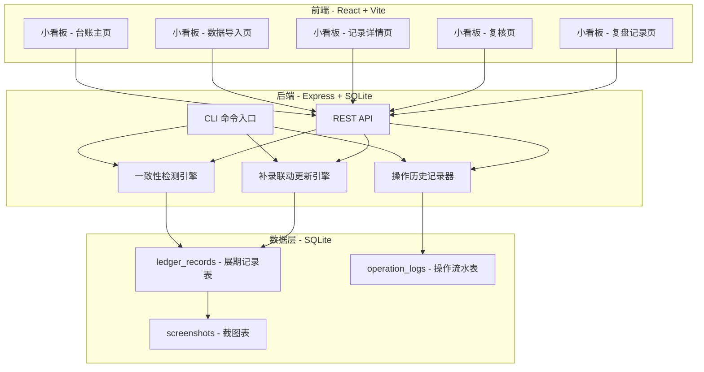
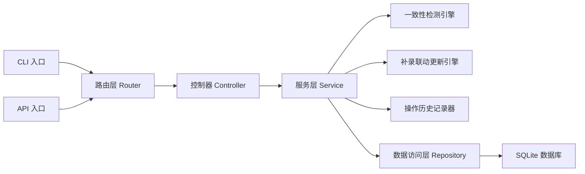
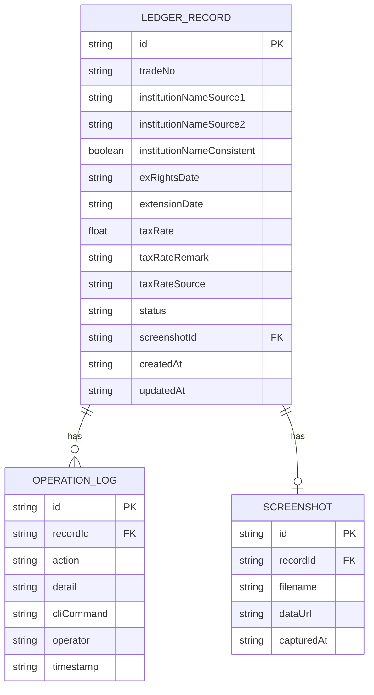

## 1. 架构设计



## 2. 技术说明

- **前端**：React@18 + TailwindCSS@3 + Vite
- **初始化工具**：Vite (create-vite)
- **后端**：Express@4 + better-sqlite3
- **数据库**：SQLite（单文件，随项目携带）
- **CLI**：Node.js 脚本，通过 yargs 解析命令行参数
- **演示数据**：内置 SQL seed，首次启动自动加载

## 3. 路由定义

| 路由 | 用途 |
|------|------|
| `/` | 台账主页 - 记录列表 + 状态统计 |
| `/import` | 数据导入页 - 除权日截图导入 |
| `/record/:id` | 记录详情页 - 单条记录完整信息 |
| `/review` | 复核页 - 不一致项清单 |
| `/audit-log` | 复盘记录页 - 操作流水 + 可重跑命令 |

## 4. API 定义

### 4.1 数据类型

```typescript
interface LedgerRecord {
  id: string
  tradeNo: string
  institutionNameSource1: string
  institutionNameSource2: string
  institutionNameConsistent: boolean
  exRightsDate: string
  extensionDate: string
  taxRate: number | null
  taxRateRemark: string
  taxRateSource: "original" | "supplemented"
  status: "normal" | "inconsistent" | "supplemented" | "confirmed"
  screenshotId: string | null
  createdAt: string
  updatedAt: string
}

interface OperationLog {
  id: string
  recordId: string | null
  action: "import" | "detect" | "supplement" | "correct" | "rerun" | "confirm" | "reject"
  detail: string
  cliCommand: string
  operator: string
  timestamp: string
}

interface Screenshot {
  id: string
  recordId: string
  filename: string
  dataUrl: string
  capturedAt: string
}
```

### 4.2 接口定义

| 方法 | 路径 | 用途 |
|------|------|------|
| GET | `/api/records` | 获取所有记录，支持 `?status=` 筛选 |
| GET | `/api/records/:id` | 获取单条记录详情 |
| POST | `/api/records/import` | 批量导入记录 |
| PUT | `/api/records/:id/supplement` | 补录税费率备注 |
| PUT | `/api/records/:id/correct` | 人工修正机构简称 |
| POST | `/api/records/rerun` | 重跑一致性检测 |
| PUT | `/api/records/:id/confirm` | 财务复核确认 |
| PUT | `/api/records/:id/reject` | 财务复核打回 |
| GET | `/api/records/stats` | 获取状态统计 |
| GET | `/api/audit-logs` | 获取操作流水 |
| GET | `/api/screenshots/:id` | 获取截图 |
| POST | `/api/demo/seed` | 加载演示数据 |

## 5. 服务端架构图



## 6. 数据模型

### 6.1 数据模型定义



### 6.2 数据定义语言

```sql
CREATE TABLE IF NOT EXISTS ledger_records (
  id TEXT PRIMARY KEY,
  trade_no TEXT NOT NULL,
  institution_name_source1 TEXT NOT NULL,
  institution_name_source2 TEXT NOT NULL,
  institution_name_consistent INTEGER NOT NULL DEFAULT 1,
  ex_rights_date TEXT NOT NULL,
  extension_date TEXT NOT NULL,
  tax_rate REAL,
  tax_rate_remark TEXT DEFAULT '',
  tax_rate_source TEXT DEFAULT 'original',
  status TEXT NOT NULL DEFAULT 'normal',
  screenshot_id TEXT,
  created_at TEXT NOT NULL,
  updated_at TEXT NOT NULL
);

CREATE TABLE IF NOT EXISTS operation_logs (
  id TEXT PRIMARY KEY,
  record_id TEXT,
  action TEXT NOT NULL,
  detail TEXT NOT NULL,
  cli_command TEXT NOT NULL,
  operator TEXT NOT NULL DEFAULT 'system',
  timestamp TEXT NOT NULL,
  FOREIGN KEY (record_id) REFERENCES ledger_records(id)
);

CREATE TABLE IF NOT EXISTS screenshots (
  id TEXT PRIMARY KEY,
  record_id TEXT NOT NULL,
  filename TEXT NOT NULL,
  data_url TEXT NOT NULL,
  captured_at TEXT NOT NULL,
  FOREIGN KEY (record_id) REFERENCES ledger_records(id)
);

CREATE INDEX IF NOT EXISTS idx_records_status ON ledger_records(status);
CREATE INDEX IF NOT EXISTS idx_logs_record_id ON operation_logs(record_id);
CREATE INDEX IF NOT EXISTS idx_logs_timestamp ON operation_logs(timestamp);
```

## 7. CLI 命令设计

```bash
# 导入除权日截图数据
node cli.js import --file ./data/import.json

# 重跑一致性检测
node cli.js detect --all
node cli.js detect --record TX-2024-002

# 补录税费率备注
node cli.js supplement --record TX-2024-003 --rate 2.50 --remark "旧口径，来自税费率备注"

# 人工修正机构简称
node cli.js correct --record TX-2024-002 --field institutionNameSource2 --value "中信建投证券"

# 财务复核确认
node cli.js confirm --record TX-2024-002

# 财务复核打回
node cli.js reject --record TX-2024-002

# 查看复盘记录
node cli.js audit-log [--record TX-2024-002]

# 加载演示数据
node cli.js demo --seed

# 查看统计
node cli.js stats
```
