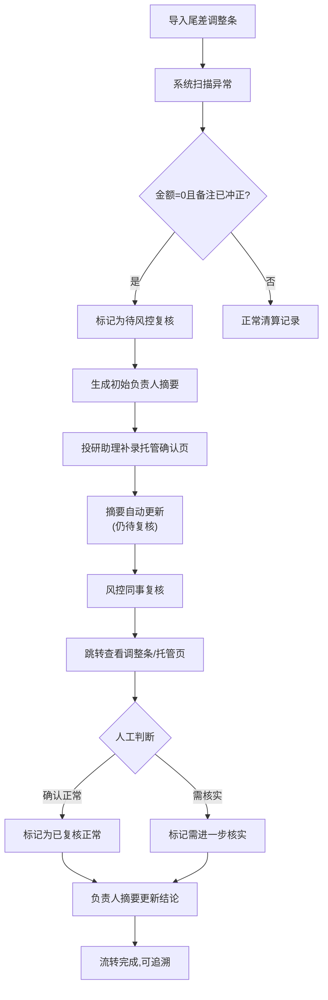

## 1. 产品概述

碳配额交易清算是服务于碳交易市场的业务复核系统，解决尾差调整中"金额为0但备注已冲正"这类特殊记录的人工复核流程，让风控同事、投研助理和负责人三方协作有凭有据。

- 核心问题：尾差调整条中金额为0但备注"已冲正"的记录，无法自动判断是否正常，需要人工兜底
- 目标用户：投研助理小周（操作补录）、风控同事（复核判断）、负责人（决策审批）
- 市场价值：把口头交接变成可追溯的系统流程，让清算结果可解释、可复核、可问责

## 2. 核心功能

### 2.1 用户角色

| 角色 | 注册方式 | 核心权限 |
|------|----------|----------|
| 投研助理 | 系统账号 | 导入尾差调整条、补录托管确认页、查看待办 |
| 风控同事 | 系统账号 | 复核异常记录、标记冲正状态、填写复核意见 |
| 负责人 | 系统账号 | 查看摘要报告、跟踪处理进度、决策审批 |

### 2.2 功能模块

1. **数据导入看板**：尾差调整条导入、托管确认页补录、数据校验与异常标记
2. **交易清算总览**：3D/图表展示清算结果、金额分布、异常记录高亮
3. **尾差调整明细**：调整条列表、金额为0但已冲正记录标红、一键跳转托管确认页
4. **托管确认页**：托管凭证查看、补录信息、状态跟踪
5. **负责人摘要**：异常记录原因说明、缺件清单、下一步行动建议、人员对接指引
6. **复核工作台**：风控复核面板、冲正记录处理、意见留存

### 2.3 页面详情

| 页面名称 | 模块名称 | 功能描述 |
|---------|----------|----------|
| 数据导入看板 | 尾差调整条导入 | 支持Excel/CSV导入，自动校验字段完整性，标记金额为0且备注含"已冲正"的记录 |
| 数据导入看板 | 托管确认页补录 | 上传/录入托管凭证，关联对应调整条，更新清算摘要 |
| 交易清算总览 | 3D图表展示 | 碳配额交易量、金额、异常笔数的可视化展示，支持钻取 |
| 交易清算总览 | 异常记录导航 | 点击图表中的异常点，直接跳转至尾差调整明细或托管确认页 |
| 尾差调整明细 | 异常记录列表 | 金额为0但备注"已冲正"的记录高亮显示，状态为"待风控复核" |
| 尾差调整明细 | 记录详情 | 展示完整调整信息、冲正备注、关联托管凭证、复核历史 |
| 托管确认页 | 凭证展示 | 展示托管确认信息、金额、日期、经办人 |
| 托管确认页 | 补录操作 | 补充缺失字段、上传凭证附件、关联调整条 |
| 负责人摘要 | 异常说明卡片 | 每条待处理记录说明：为什么被留下、缺什么材料、下一步找谁 |
| 负责人摘要 | 进度概览 | 已处理/待复核/待补录的统计、流转时间、责任到人 |
| 复核工作台 | 风控处理面板 | 标记"确认正常"或"需要进一步核实"、填写复核意见 |
| 复核工作台 | 冲正记录处理 | 金额为0但已冲正的记录不能自动归正常，必须人工确认 |

## 3. 核心流程

### 三步核心流程

1. **第一步：尾差调整条第一次导入**
   - 投研助理小周导入尾差调整条数据
   - 系统自动扫描，标记出"金额为0且备注含'已冲正'"的记录
   - 这些记录状态设为"待风控复核"，**不自动归为正常**
   - 生成初始负责人摘要，标注异常

2. **第二步：投研助理小周补看托管确认页**
   - 小周针对异常记录查找对应的托管确认凭证
   - 在系统中补录托管确认页信息，关联到对应调整条
   - 托管确认页补录后，负责人摘要自动更新
   - 状态仍为"待风控复核"，等待风控同事确认

3. **第三步：风控同事复核 + 负责人摘要更新**
   - 风控同事在复核工作台查看异常记录
   - 可点击跳转查看尾差调整条和托管确认页
   - 人工判断后标记状态：确认正常 / 需要进一步核实
   - 复核完成后，负责人摘要更新最终结论和行动建议

### 流转流程图

## 4. 用户界面设计

### 4.1 设计风格

- **整体风格**：专业金融风控系统 + 温暖的协作感，拒绝冷冰冰的系统日志
- **主色调**：深邃碳灰 `#1a1f2e`（代表碳交易），配合金融绿 `#10b981`（正常）、警示橙 `#f59e0b`（待处理）、风控红 `#ef4444`（异常）
- **辅助色**：托管蓝 `#3b82f6`（凭证）、摘要金 `#eab308`（负责人视图）
- **按钮风格**：微圆角（4px）、轻微投影、悬停上浮2px，强调专业稳重
- **字体选择**：
  - 标题/数字：`JetBrains Mono` 等宽字体，金额数字对齐专业
  - 正文/说明：`Noto Sans SC` 中文易读，注释和交接说明清晰
- **布局风格**：左右分栏 + 卡片式布局，左侧导航 + 右侧内容区，异常卡片带边框强调
- **图标风格**：Lucide 线性图标，配合状态色点，专业不花哨

### 4.2 页面设计概述

| 页面名称 | 模块名称 | UI元素 |
|---------|----------|--------|
| 数据导入看板 | 导入区域 | 拖拽上传区 + 进度条 + 异常计数徽章，橙色数字跳动提示 |
| 数据导入看板 | 数据预览 | 表格展示前10行，异常行红底白字高亮，鼠标悬停显示异常原因 |
| 交易清算总览 | 3D柱状图 | 按交易日的清算金额柱形，异常日用红色柱顶标记，点击柱形钻取 |
| 交易清算总览 | 饼图分布 | 正常/待复核/异常三类占比，点击扇区跳转对应列表 |
| 交易清算总览 | 趋势折线 | 近30天清算趋势，异常点用红点标注，悬停显示详情 |
| 尾差调整明细 | 异常卡片 | 金额为0的记录卡片左侧红边，"已冲正"标签右上角，点击跳转按钮 |
| 尾差调整明细 | 状态流转条 | 导入→待补录→待复核→已完成，当前步骤高亮 |
| 托管确认页 | 凭证卡片 | 类纸质凭证设计，印章式状态标记，补录字段下划线提示 |
| 托管确认页 | 关联调整条 | 底部关联列表，点击切换查看 |
| 负责人摘要 | 说明卡片 | 每条记录配"为什么留下"、"缺什么"、"找谁"三段式说明，语气像小周和风控交接 |
| 负责人摘要 | 时间线 | 处理进度时间线，每个节点标注操作人和时间 |
| 复核工作台 | 左右对比 | 左侧尾差调整条，右侧托管确认页，中间人工判断选项 |
| 复核工作台 | 意见框 | 富文本意见输入，预设常用话术模板 |

### 4.3 响应式

- 桌面端优先（1440px+），适配1080p和2K屏
- 平板端折叠左侧导航为图标栏
- 移动端重点展示负责人摘要和待办列表，图表简化为卡片
- 表格支持横向滚动，异常列固定在左侧

### 4.4 3D图表场景

- **环境**：深色背景配合轻微网格地面，营造数据空间感
- **光照**：顶部主光 + 侧面补光，柱形有清晰光影和投影
- **相机**：45度俯视角，可拖拽旋转查看数据分布
- **交互**：柱形hover放大并显示tooltip，点击触发页面跳转
- **动画**：页面加载时柱形从0升起，异常柱形红色脉动
- **后处理**：轻微泛光效果，红色异常点有辉光强调
- **性能**：单页最多30根柱形，超过自动合并为周/月视图

### 4.5 文案风格

- **摘要说明要像小周和风控交接说话**，不说"该记录状态异常"，要说
  - 「这条金额是0但备注写了已冲正，我先留着等你看」
  - 「缺托管确认页的凭证号，小周正在找」
  - 「下一步找风控同事复核，还是找小周补材料？」
- **负责人摘要模板**：
  > 📌 为什么留下：这条尾差调整金额为0，但系统备注"已冲正"，无法自动判断是否真的平账，按规则留给风控复核。
  > 
  > 📋 还缺什么：托管确认页的凭证扫描件还没上传，经办人签字栏为空。
  > 
  > 👤 下一步找谁：先找投研助理小周补托管确认凭证，再找风控同事李工复核。
