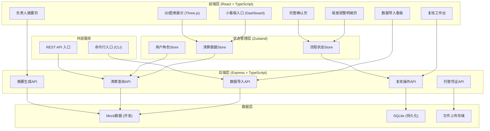
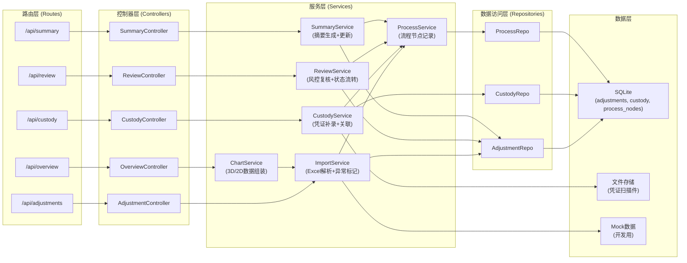
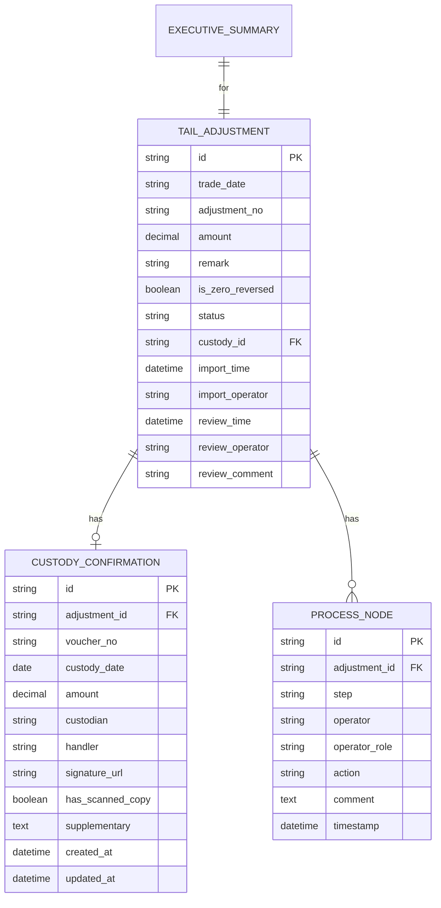

## 1. 架构设计



## 2. 技术描述

- **前端框架**：React@18 + TypeScript@5 + Vite@5
- **状态管理**：Zustand@4（轻量，适合业务流程状态追踪）
- **路由**：React Router DOM@6
- **样式**：TailwindCSS@3 + CSS变量主题系统
- **3D图表**：three@0.160 + @react-three/fiber@8 + @react-three/drei@9 + @react-three/postprocessing@2
- **2D图表**：Recharts@2（饼图、折线图、趋势图）
- **UI组件**：Lucide React（图标）+ 自研业务组件
- **后端**：Express@4 + TypeScript@5（ESM格式）
- **数据库**：SQLite3 + better-sqlite3（轻量，单文件部署）
- **文件处理**：xlsx（Excel导入）、papaparse（CSV导入）、multer（文件上传）
- **数据校验**：zod@3（运行时类型校验）
- **初始化工具**：vite-init
- **包管理器**：pnpm（优先），回退 npm

## 3. 路由定义

| 路由路径 | 页面组件 | 用途 | 角色权限 |
|----------|----------|------|----------|
| `/` | Dashboard | 小看板入口，快捷操作+待办概览 | 所有角色 |
| `/import` | ImportBoard | 数据导入看板，尾差调整条+托管确认页导入 | 投研助理 |
| `/overview` | ClearingOverview | 交易清算总览，3D+2D图表展示 | 所有角色 |
| `/adjustments` | AdjustmentList | 尾差调整明细列表 | 所有角色 |
| `/adjustments/:id` | AdjustmentDetail | 单条调整记录详情 | 所有角色 |
| `/custody/:id` | CustodyConfirm | 托管确认页详情/补录 | 投研助理+风控 |
| `/summary` | ExecutiveSummary | 负责人摘要页 | 负责人+所有 |
| `/review` | ReviewDesk | 风控复核工作台 | 风控同事 |

## 4. API 定义

### 4.1 类型定义

```typescript
// 尾差调整条
interface TailAdjustment {
  id: string;
  tradeDate: string;
  adjustmentNo: string;
  amount: number;
  remark: string;
  hasZeroAmountButReversed: boolean;
  status: 'imported' | 'pending_custody' | 'pending_review' | 'reviewed_normal' | 'needs_verification';
  custodyConfirmId?: string;
  importTime: string;
  importOperator: string;
  reviewTime?: string;
  reviewOperator?: string;
  reviewComment?: string;
}

// 托管确认页
interface CustodyConfirmation {
  id: string;
  adjustmentId: string;
  voucherNo: string;
  custodyDate: string;
  amount: number;
  custodian: string;
  handler: string;
  signatureUrl?: string;
  hasScannedCopy: boolean;
  supplementaryFields: Record<string, string>;
  createTime: string;
  updateTime: string;
}

// 负责人摘要
interface ExecutiveSummaryItem {
  adjustmentId: string;
  whyKept: string;
  missingMaterials: string[];
  nextStep: string;
  contactPerson: string;
  contactRole: 'assistant' | 'risk' | 'both';
  updatedAt: string;
}

// 流程节点
interface ProcessNode {
  id: string;
  adjustmentId: string;
  step: 'import' | 'custody' | 'review' | 'complete';
  operator: string;
  operatorRole: string;
  action: string;
  comment?: string;
  timestamp: string;
}
```

### 4.2 接口清单

| 方法 | 路径 | 描述 | 请求体 | 响应 |
|------|------|------|--------|------|
| POST | `/api/adjustments/import` | 导入尾差调整条（Excel/CSV） | `FormData(file, operator)` | `{ total: number, flagged: number, items: TailAdjustment[] }` |
| GET | `/api/adjustments` | 查询调整条列表 | `?status=&tradeDate=&keyword=` | `TailAdjustment[]` |
| GET | `/api/adjustments/:id` | 获取单条调整详情 | - | `TailAdjustment & { custody?: CustodyConfirmation }` |
| POST | `/api/custody` | 补录托管确认页 | `CustodyConfirmation` | `CustodyConfirmation` |
| PUT | `/api/custody/:id` | 更新托管确认页 | `Partial<CustodyConfirmation>` | `CustodyConfirmation` |
| POST | `/api/review/:id` | 风控复核 | `{ result: 'normal' | 'verify', comment: string, operator: string }` | `TailAdjustment` |
| GET | `/api/summary` | 负责人摘要列表 | - | `ExecutiveSummaryItem[]` |
| GET | `/api/overview/stats` | 总览统计数据 | - | `{ total, pendingCustody, pendingReview, completed, flagged }` |
| GET | `/api/overview/chart` | 图表数据 | `?type=3d&period=30d` | 3D柱状图数据或饼图数据 |
| GET | `/api/process/:adjustmentId` | 流程历史 | - | `ProcessNode[]` |

## 5. 服务器架构图



## 6. 数据模型

### 6.1 ER 图



### 6.2 DDL 语句

```sql
-- 尾差调整条表
CREATE TABLE tail_adjustment (
  id TEXT PRIMARY KEY,
  trade_date TEXT NOT NULL,
  adjustment_no TEXT NOT NULL UNIQUE,
  amount REAL NOT NULL DEFAULT 0,
  remark TEXT,
  is_zero_reversed INTEGER NOT NULL DEFAULT 0,
  status TEXT NOT NULL DEFAULT 'imported',
  custody_id TEXT,
  import_time TEXT NOT NULL,
  import_operator TEXT NOT NULL,
  review_time TEXT,
  review_operator TEXT,
  review_comment TEXT,
  FOREIGN KEY (custody_id) REFERENCES custody_confirmation(id)
);

CREATE INDEX idx_adjustment_status ON tail_adjustment(status);
CREATE INDEX idx_adjustment_date ON tail_adjustment(trade_date);
CREATE INDEX idx_adjustment_zero_reversed ON tail_adjustment(is_zero_reversed);

-- 托管确认页表
CREATE TABLE custody_confirmation (
  id TEXT PRIMARY KEY,
  adjustment_id TEXT NOT NULL,
  voucher_no TEXT,
  custody_date TEXT,
  amount REAL,
  custodian TEXT,
  handler TEXT,
  signature_url TEXT,
  has_scanned_copy INTEGER DEFAULT 0,
  supplementary TEXT,
  created_at TEXT NOT NULL,
  updated_at TEXT NOT NULL,
  FOREIGN KEY (adjustment_id) REFERENCES tail_adjustment(id)
);

CREATE INDEX idx_custody_adjustment ON custody_confirmation(adjustment_id);

-- 流程节点表
CREATE TABLE process_node (
  id TEXT PRIMARY KEY,
  adjustment_id TEXT NOT NULL,
  step TEXT NOT NULL,
  operator TEXT NOT NULL,
  operator_role TEXT NOT NULL,
  action TEXT NOT NULL,
  comment TEXT,
  timestamp TEXT NOT NULL,
  FOREIGN KEY (adjustment_id) REFERENCES tail_adjustment(id)
);

CREATE INDEX idx_process_adjustment ON process_node(adjustment_id);
CREATE INDEX idx_process_timestamp ON process_node(timestamp);

-- 初始化Mock数据（演示三步流程）
INSERT INTO tail_adjustment (id, trade_date, adjustment_no, amount, remark, is_zero_reversed, status, import_time, import_operator) VALUES
('adj_001', '2026-06-01', 'ADJ-2026-0601-001', 0, '已冲正-季度尾差调整', 1, 'pending_review', '2026-06-03 09:00:00', '小周'),
('adj_002', '2026-06-01', 'ADJ-2026-0601-002', 12500.50, '正常手续费调整', 0, 'imported', '2026-06-03 09:00:00', '小周'),
('adj_003', '2026-06-02', 'ADJ-2026-0602-001', 0, '已冲正-月度轧差', 1, 'pending_custody', '2026-06-03 09:05:00', '小周'),
('adj_004', '2026-06-02', 'ADJ-2026-0602-002', 8750.00, '交易手续费', 0, 'imported', '2026-06-03 09:05:00', '小周');

INSERT INTO process_node (id, adjustment_id, step, operator, operator_role, action, timestamp) VALUES
('p1', 'adj_001', 'import', '小周', 'assistant', '导入尾差调整条，系统检测金额为0且备注已冲正，标记待风控复核', '2026-06-03 09:00:00'),
('p2', 'adj_002', 'import', '小周', 'assistant', '导入正常调整记录', '2026-06-03 09:00:00'),
('p3', 'adj_003', 'import', '小周', 'assistant', '导入尾差调整条，系统检测金额为0且备注已冲正，待补托管确认页', '2026-06-03 09:05:00'),
('p4', 'adj_004', 'import', '小周', 'assistant', '导入正常调整记录', '2026-06-03 09:05:00');
```

### 6.3 核心业务规则（代码层实现）

1. **异常标记规则**：`amount === 0 && remark.includes('已冲正')` → `is_zero_reversed = true`
2. **状态流转规则**：
   - 导入后 → `imported`，异常自动转 `pending_review` 或 `pending_custody`
   - 补录托管页后 → 保持 `pending_review`（**不自动完成**，需风控确认）
   - 风控标记"确认正常" → `reviewed_normal`
   - 风控标记"需核实" → `needs_verification`
3. **摘要生成规则**：
   - 未补托管页：`还缺什么 = ['托管确认页凭证', '经办人签字']`，`下一步 = '找小周补凭证'`
   - 已补托管页待复核：`还缺什么 = ['风控复核意见']`，`下一步 = '找风控同事复核'`
   - 已复核：`还缺什么 = []`，`下一步 = '已完成，可归档'`
4. **3D点击跳转规则**：
   - 点击异常柱形 → 判断是否有关联托管页 → 无则跳转调整详情，有则跳转托管页
