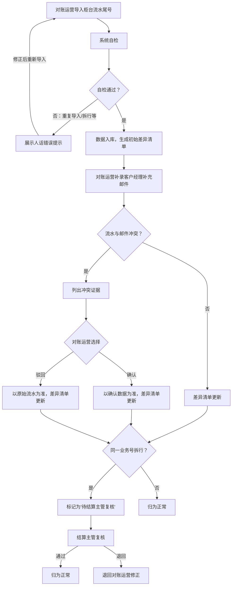

## 1. 产品概述

场外期权敲入监测系统，用于对场外期权交易中的敲入事件进行全流程监测与对账。解决同一业务号拆成手续费和本金两行时的不一致问题、柜台流水与客户经理补充邮件冲突时的判定问题，以及对账运营人员手工解释差异的低效问题。

- 目标用户：对账运营（阿芬）、结算主管
- 核心价值：自检拦截常见错误、冲突证据留痕、差异清单自动更新、结算主管复核闭环

## 2. 核心功能

### 2.1 用户角色

| 角色 | 进入方式 | 核心权限 |
|------|----------|----------|
| 对账运营 | 登录系统 | 导入流水、补录邮件、确认/驳回冲突、查看差异清单 |
| 结算主管 | 登录系统 | 复核拆行记录、查看差异清单与历史记录、导出报表 |

### 2.2 功能模块

1. **导入与自检页面**：柜台流水尾号导入、自检（重复导入、同一业务号拆行检测、补录后重算、导出一致性）
2. **补录与冲突判定页面**：客户经理补充邮件补录、冲突证据列出、确认/驳回操作
3. **差异清单与复核页面**：差异清单自动更新、拆行记录留待结算主管复核、历史记录追溯

### 2.3 页面详情

| 页面名称 | 模块名称 | 功能说明 |
|----------|----------|----------|
| 导入与自检 | 柜台流水导入区 | 上传/粘贴柜台流水尾号数据，触发自检 |
| 导入与自检 | 自检结果面板 | 展示重复导入、拆行检测、导出一致性等自检结果，人话错误提示 |
| 补录与冲突 | 补录邮件区 | 输入/粘贴客户经理补充邮件内容，关联业务号 |
| 补录与冲突 | 冲突证据面板 | 柜台流水尾号与补充邮件矛盾时列出冲突项，由对账运营选择确认或驳回 |
| 差异清单与复核 | 差异清单表格 | 自动更新差异，标记拆行待复核状态 |
| 差异清单与复核 | 复核操作区 | 结算主管对拆行记录进行复核通过/退回 |
| 差异清单与复核 | 历史记录面板 | 展示每次导入、补录、复核操作的时间线 |

## 3. 核心流程

1. 对账运营导入柜台流水尾号 → 系统自检（重复导入、拆行检测） → 自检结果展示（人话提示）
2. 对账运营补录客户经理补充邮件 → 系统比对流水与邮件 → 发现冲突则列出证据 → 对账运营选择确认或驳回
3. 差异清单自动更新 → 同一业务号拆手续费/本金两行标记为"待复核" → 结算主管复核 → 复核通过/退回

## 4. 用户界面设计

### 4.1 设计风格

- 主色调：深蓝灰（#1e293b）+ 琥珀警告色（#f59e0b）+ 翡翠成功色（#10b981）
- 按钮：圆角、微阴影、状态色区分（确认绿、驳回红、待复核琥珀）
- 字体：Noto Sans SC 中文优先，JetBrains Mono 数据展示
- 布局：左侧导航 + 右侧内容区，卡片式模块分区
- 图标风格：线性图标，统一 20px

### 4.2 页面设计概览

| 页面名称 | 模块名称 | UI要素 |
|----------|----------|--------|
| 导入与自检 | 柜台流水导入区 | 拖拽上传区、粘贴文本框、导入按钮 |
| 导入与自检 | 自检结果面板 | 错误卡片（红/琥珀/绿）、人话错误描述、重试按钮 |
| 补录与冲突 | 补录邮件区 | 业务号选择、邮件内容输入、关联按钮 |
| 补录与冲突 | 冲突证据面板 | 左右对照卡片（流水数据 vs 邮件数据）、确认/驳回按钮 |
| 差异清单与复核 | 差异清单表格 | 数据表格、状态标签、筛选器、导出按钮 |
| 差异清单与复核 | 复核操作区 | 复核通过/退回按钮、备注输入 |
| 差异清单与复核 | 历史记录面板 | 时间线组件、操作类型标签 |

### 4.3 响应式设计

桌面优先设计，最小宽度 1024px。数据表格支持横向滚动，移动端暂不作为核心适配目标。

### 4.4 3D场景

不适用
