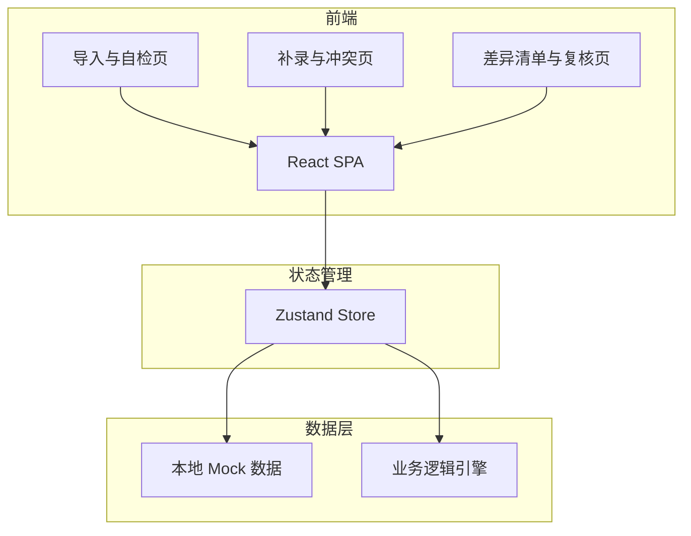
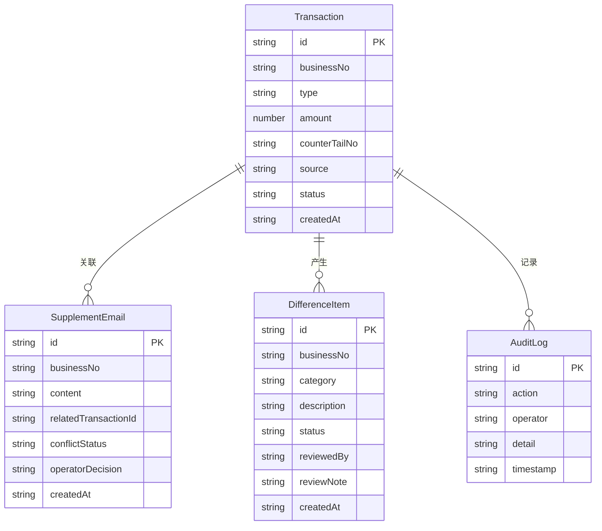

## 1. 架构设计



纯前端 SPA，数据存储在 Zustand + localStorage，业务逻辑（自检、冲突比对、差异清单更新）在前端计算引擎中实现。

## 2. 技术说明

- 前端：React@18 + TypeScript + tailwindcss@3 + vite
- 初始化工具：vite-init
- 后端：无（纯前端，数据存 localStorage）
- 数据库：无（Mock 数据 + localStorage 持久化）

## 3. 路由定义

| 路由 | 用途 |
|------|------|
| / | 重定向到 /import |
| /import | 导入与自检页面 |
| /supplement | 补录与冲突判定页面 |
| /reconciliation | 差异清单与复核页面 |

## 4. API定义

无后端 API，所有数据操作通过 Zustand Store 完成。

## 5. 服务端架构

不适用

## 6. 数据模型

### 6.1 数据模型定义



### 6.2 数据定义语言

使用 TypeScript 接口定义：

```typescript
interface Transaction {
  id: string;
  businessNo: string;
  type: 'principal' | 'fee';
  amount: number;
  counterTailNo: string;
  source: 'counter' | 'email';
  status: 'normal' | 'pending_review' | 'reviewed' | 'rejected';
  createdAt: string;
}

interface SupplementEmail {
  id: string;
  businessNo: string;
  content: string;
  relatedTransactionId: string;
  conflictStatus: 'none' | 'conflict' | 'resolved';
  operatorDecision: 'confirmed' | 'rejected' | 'pending';
  createdAt: string;
}

interface DifferenceItem {
  id: string;
  businessNo: string;
  category: 'split_row' | 'data_mismatch' | 'duplicate' | 'other';
  description: string;
  status: 'open' | 'pending_review' | 'resolved' | 'rejected';
  reviewedBy?: string;
  reviewNote?: string;
  createdAt: string;
}

interface AuditLog {
  id: string;
  action: 'import' | 'supplement' | 'conflict_resolve' | 'review' | 'export';
  operator: string;
  detail: string;
  timestamp: string;
}

interface SelfCheckResult {
  type: 'duplicate_import' | 'split_row' | 'recalc_mismatch' | 'export_inconsistency';
  severity: 'error' | 'warning';
  message: string;
  relatedBusinessNos: string[];
}
```
