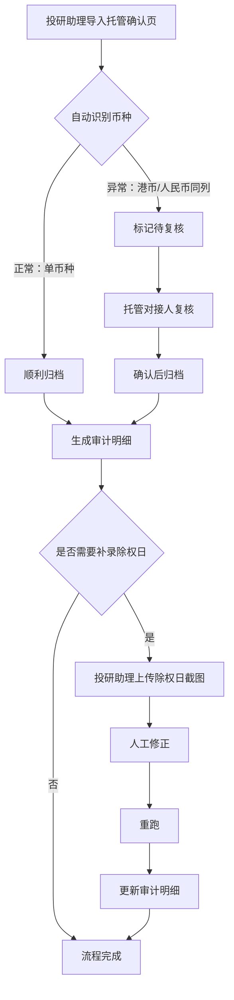

## 1. 产品概述

"支付拒付证据包整理"是面向投研助理的日常工具，用于从托管确认页导入支付拒付记录，处理港币/人民币同列等常见错口径，补充除权日截图的旧口径数据，并生成可审计的明细与历史记录。
- 目标用户：投研助理（如小周）、托管对接人
- 核心价值：将散落在托管确认页、除权日截图中的拒付证据结构化归档，确保审计明细和历史记录对得上

## 2. 核心功能

### 2.1 用户角色

| 角色 | 进入方式 | 核心权限 |
|------|----------|----------|
| 投研助理 | 默认进入 | 导入记录、补录除权日截图、查看审计明细与历史 |
| 托管对接人 | 由投研助理转交 | 复核港币/人民币同列的记录 |

### 2.2 功能模块

1. **证据包总览页**：展示所有证据记录列表，区分"顺利"、"错口径待复核"、"已补录"三种状态
2. **托管确认导入页**：首次导入托管确认页数据，自动识别港币/人民币同列情况
3. **除权日截图补录页**：对旧口径记录，从除权日截图补录正确的除权日信息
4. **审计明细页**：汇总所有处理结果，展示每条记录的完整处理链路
5. **历史记录页**：按时间线展示每次操作（导入、修正、重跑、补录）的详细日志

### 2.3 页面详情

| 页面名称 | 模块名称 | 功能描述 |
|----------|----------|----------|
| 证据包总览页 | 记录列表 | 展示三条演示记录，分别标注"顺利"、"错口径-待复核"、"已补录-旧口径" |
| 证据包总览页 | 状态筛选 | 按处理状态筛选记录 |
| 托管确认导入页 | 文件上传区 | 上传托管确认页（模拟） |
| 托管确认导入页 | 预览与识别 | 展示导入数据，高亮港币/人民币同列的异常列 |
| 托管确认导入页 | 确认提交 | 顺利记录直接归档，同列记录标记"待复核"转交托管对接人 |
| 除权日截图补录页 | 截图上传区 | 上传除权日截图（模拟） |
| 除权日截图补录页 | 补录表单 | 填写正确的除权日、金额等信息 |
| 除权日截图补录页 | 人工修正标记 | 标记此条为"人工修正" |
| 审计明细页 | 明细表格 | 展示每条记录的完整字段：原始金额、币种、除权日、处理结果、修正人 |
| 审计明细页 | 差异对比 | 对比原始数据与修正后数据的差异 |
| 历史记录页 | 操作时间线 | 按时间展示所有操作记录 |
| 历史记录页 | 操作详情 | 展开查看每步操作的详细变更内容 |

## 3. 核心流程

1. 投研助理从托管确认页导入数据
2. 系统自动识别正常记录与异常记录（港币/人民币同列）
3. 正常记录直接归档，生成审计明细
4. 异常记录标记"待复核"，转交托管对接人复核
5. 投研助理对旧口径记录，上传除权日截图补录
6. 补录完成后，系统执行人工修正和重跑
7. 审计明细和历史记录同步更新

## 4. 用户界面设计

### 4.1 设计风格

- 主色调：深墨绿 (#1B4332) + 金色点缀 (#D4A843)，传达金融审计的专业与沉稳
- 辅助色：浅灰底 (#F8F9FA)，红色警告 (#DC3545)，绿色通过 (#28A745)
- 按钮风格：圆角矩形 (rounded-lg)，深色底白字，hover 时轻微上浮阴影
- 字体：Noto Sans SC 作为正文，Source Serif 4 作为标题衬线体
- 布局风格：左侧固定导航 + 右侧内容区，卡片式布局
- 图标风格：线性图标 (lucide-react)

### 4.2 页面设计概览

| 页面名称 | 模块名称 | UI 元素 |
|----------|----------|---------|
| 证据包总览页 | 记录列表 | 卡片列表，每张卡片含状态标签（绿/红/金）、金额、币种、日期 |
| 证据包总览页 | 状态筛选 | 顶部标签栏：全部/顺利/待复核/已补录 |
| 托管确认导入页 | 上传区 | 虚线拖拽区，上传后展示预览表格 |
| 托管确认导入页 | 异常高亮 | 异常行背景变浅红，币种列显示"港币+人民币"标签 |
| 除权日截图补录页 | 补录表单 | 表单含日期选择器、金额输入、修正说明文本框 |
| 审计明细页 | 明细表格 | 宽表格，列头固定，支持横向滚动 |
| 审计明细页 | 差异对比 | 左右对照，删除线标旧值，绿色标新值 |
| 历史记录页 | 时间线 | 左侧竖线 + 节点圆点，右侧操作卡片 |

### 4.3 响应式设计

- 桌面优先设计，最小宽度 1280px
- 表格在窄屏时支持横向滚动
- 卡片在中等屏幕下从双列变单列

### 4.4 演示数据设计

三条核心演示记录：

| 记录 | 证券代码 | 原始金额 | 币种情况 | 除权日 | 处理状态 | 说明 |
|------|----------|----------|----------|--------|----------|------|
| 1 | 00001.HK | 150,000 | 单一港币 | 2026-05-20 | 顺利 | 正常流程，直接归档 |
| 2 | 00002.HK | 200,000/180,000 | 港币+人民币同列 | 2026-05-22 | 待复核 | 币种异常，需托管对接人复核 |
| 3 | 00003.HK | 120,000 | 旧口径港币 | 2026-05-15→2026-05-18 | 已补录 | 除权日从截图补录，含一次人工修正和一次重跑 |

操作历史记录：

| 时间 | 操作 | 记录 | 操作人 | 变更内容 |
|------|------|------|--------|----------|
| 2026-05-20 09:30 | 导入托管确认页 | 记录1 | 投研助理小周 | 首次导入 |
| 2026-05-20 09:31 | 自动归档 | 记录1 | 系统 | 顺利归档 |
| 2026-05-22 10:15 | 导入托管确认页 | 记录2 | 投研助理小周 | 首次导入，检测到港币/人民币同列 |
| 2026-05-22 10:16 | 标记待复核 | 记录2 | 系统 | 币种异常，转交托管对接人 |
| 2026-05-22 14:00 | 复核通过 | 记录2 | 托管对接人李姐 | 确认港币金额200,000，人民币金额180,000 |
| 2026-05-23 11:00 | 上传除权日截图 | 记录3 | 投研助理小周 | 发现除权日为2026-05-18，非2026-05-15 |
| 2026-05-23 11:05 | 人工修正 | 记录3 | 投研助理小周 | 除权日从2026-05-15修正为2026-05-18 |
| 2026-05-23 11:10 | 重跑 | 记录3 | 系统 | 按修正后除权日重新计算，审计明细更新 |
