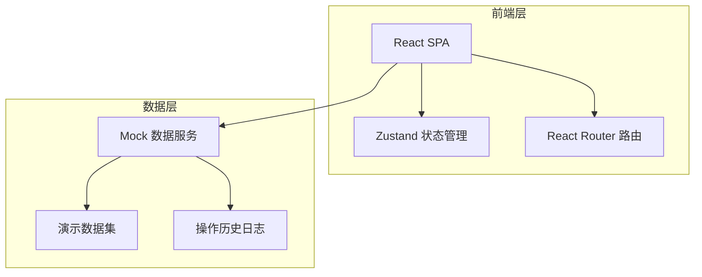
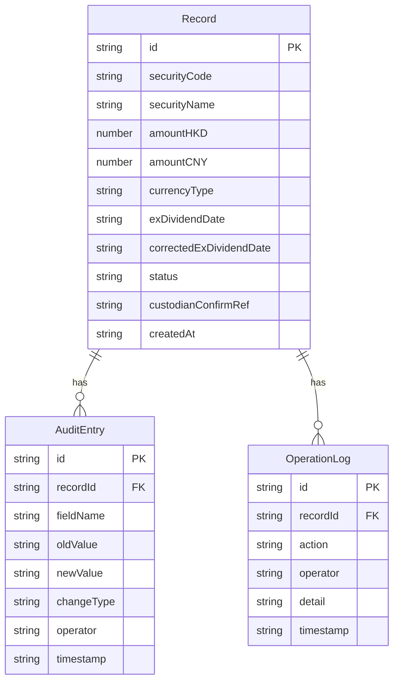

## 1. 架构设计



纯前端应用，使用 Zustand 管理状态，Mock 数据模拟托管确认页导入、除权日截图补录等操作。

## 2. 技术说明

- 前端：React@18 + Tailwind CSS@3 + Vite
- 初始化工具：vite-init
- 后端：无（纯前端，Mock 数据）
- 数据库：无（内存状态 + Mock 数据）
- 状态管理：Zustand
- 路由：React Router DOM v6
- 图标：lucide-react

## 3. 路由定义

| 路由 | 用途 |
|------|------|
| / | 证据包总览页，展示所有记录列表和状态筛选 |
| /import | 托管确认导入页，首次导入和识别 |
| /supplement | 除权日截图补录页，旧口径补录 |
| /audit | 审计明细页，汇总处理结果和差异对比 |
| /history | 历史记录页，操作时间线 |

## 4. 数据模型

### 4.1 数据模型定义



### 4.2 类型定义

```typescript
type RecordStatus = "smooth" | "pending_review" | "supplemented" | "reviewed"

interface EvidenceRecord {
  id: string
  securityCode: string
  securityName: string
  amountHKD: number | null
  amountCNY: number | null
  currencyType: "HKD" | "CNY" | "MIXED"
  exDividendDate: string
  correctedExDividendDate: string | null
  status: RecordStatus
  custodianConfirmRef: string
  createdAt: string
}

interface AuditEntry {
  id: string
  recordId: string
  fieldName: string
  oldValue: string
  newValue: string
  changeType: "import" | "auto_archive" | "flag_review" | "review_approve" | "manual_correction" | "rerun"
  operator: string
  timestamp: string
}

interface OperationLog {
  id: string
  recordId: string
  action: string
  operator: string
  detail: string
  timestamp: string
}
```

### 4.3 初始演示数据

三条预设记录：
1. `REC-001`：00001.HK 汇丰控股，150,000 港币，顺利归档
2. `REC-002`：00002.HK 汇贤产业，200,000 港币 + 180,000 人民币同列，待复核
3. `REC-003`：00003.HK 香港交易所，120,000 港币，除权日从 2026-05-15 修正为 2026-05-18，已补录

## 5. 状态管理设计

使用 Zustand 的核心 Store：

- `useEvidenceStore`：管理记录列表、审计明细、操作日志
  - `records: EvidenceRecord[]`
  - `auditEntries: AuditEntry[]`
  - `operationLogs: OperationLog[]`
  - `importRecords(data): void` - 导入托管确认页数据
  - `reviewRecord(id): void` - 托管对接人复核
  - `supplementRecord(id, data): void` - 补录除权日截图
  - `manualCorrect(id, field, value): void` - 人工修正
  - `rerun(id): void` - 重跑
