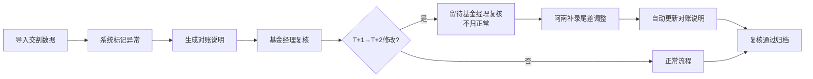

## 1. 产品概述

期货交割仓单核查系统是一套面向基金公司的对账复核工具，解决T+1到账被手工修改为T+2等异常记录的追踪、解释和复核问题。系统自动标记人工修改记录，生成人性化对账说明，并提供完整的操作审计追踪，让基金经理和支付平台产品经理能够高效协作完成交割仓单核查工作。

- 核心价值：将冷冰冰的系统日志转化为可理解的对账说明，明确每条异常记录的处理责任人、缺失材料和下一步动作
- 目标用户：基金经理（复核审批）、支付平台产品经理（补录信息、解释异常）

## 2. 核心 Features

### 2.1 用户角色

| 角色 | 注册方式 | 核心权限 |
|------|----------|----------|
| 基金经理 | 内部系统同步 | 查看对账报告、复核异常记录（T+1→T+2修改）、审批通过/驳回 |
| 支付平台产品阿南 | 内部系统同步 | 导入交割数据、补录尾差调整、编辑对账说明、标记处理状态、查看演示数据培训新人 |

### 2.2 Feature Module

1. **数据导入看板**：交割仓单数据导入、节假日顺延规则配置、导入进度与异常预览
2. **对账核查主页**：记录列表、异常标记（T+1→T+2高亮）、对账说明展示、处理状态追踪
3. **记录详情页**：完整操作历史、修改前后对比、复核追踪链、材料缺失清单、下一步责任人
4. **尾差调整管理**：尾差调整条补录、自动更新关联对账说明、调整影响分析
5. **演示模式**：内置完整演示流程，包含节假日顺延、尾差调整、人工修正、重跑四个场景

### 2.3 Page Details

| 页面名称 | 模块名称 | Feature description |
|----------|----------|---------------------|
| 数据导入看板 | 文件上传区 | 支持Excel/CSV导入，实时校验格式，预览异常记录 |
| 数据导入看板 | 节假日配置 | 可视化节假日日历，支持顺延规则测试 |
| 对账核查主页 | 异常标记卡 | T+1→T+2修改记录高亮红色边框，显示修改人、修改时间 |
| 对账核查主页 | 对账说明面板 | 每条记录显示：为什么被留下、缺什么材料、下一步找谁 |
| 记录详情页 | 操作时间线 | 谁在什么时间改了什么、为什么改、影响了哪些结果 |
| 记录详情页 | 复核追踪 | 基金经理复核状态、意见、审批历史 |
| 尾差调整管理 | 调整条录入 | 补录尾差调整原因、金额、关联原始记录 |
| 尾差调整管理 | 对账说明联动 | 尾差调整后自动更新所有关联记录的对账说明 |
| 演示模式 | 流程引导 | 三步演示：导入节假日顺延→补看尾差调整→对账说明更新 |

## 3. 核心流程

### 3.1 日常对账流程

支付平台产品阿南导入交割仓单数据 → 系统自动标记T+1→T+2等人工修改记录 → 生成对账说明（为什么留下、缺什么材料、下一步找谁） → 基金经理看到异常提醒 → 基金经理复核T+1→T+2修改（不急着归正常，留待复核） → 阿南补录尾差调整条 → 系统自动更新对账说明 → 复核通过后归档

### 3.2 演示培训流程

阿南开启演示模式 → Step1：导入包含节假日顺延的演示数据 → Step2：补看尾差调整条 → Step3：查看对账说明自动更新 → 全程包含一次人工修正和一次重跑场景

## 4. 用户界面设计

### 4.1 设计风格

- **主色调**：专业金融蓝 (#1E3A8A) 作为主色，警示红 (#DC2626) 标记T+1→T+2异常，成功绿 (#059669) 标记已复核
- **辅助色**：琥珀橙 (#D97706) 标记待补材料，靛蓝 (#4F46E5) 标记尾差调整
- **按钮风格**：轻微圆角（4px），悬停有微妙阴影，主按钮使用渐变边框增强质感
- **字体**：标题使用 "Noto Serif SC" 衬线字体体现专业感，正文使用 "Inter" 无衬线保证可读性
- **布局风格**：卡片式布局，信息分层清晰，异常记录卡片使用红框高亮，有微妙的脉冲动画提醒
- **图标风格**：线性图标，金融领域专业符号，避免过度装饰

### 4.2 页面设计概述

| 页面名称 | 模块名称 | UI Elements |
|----------|----------|-------------|
| 对账核查主页 | 异常标记卡 | 红色边框、脉冲动画、修改人标签、时间戳、状态徽章 |
| 对账核查主页 | 对账说明面板 | 三段式布局：原因分析→缺失材料→下一步动作，每段有独立图标 |
| 记录详情页 | 操作时间线 | 垂直时间轴，每个节点显示：操作人头像、操作类型、修改前后diff、原因备注 |
| 记录详情页 | 复核追踪 | 基金经理头像、复核意见、签名时间戳、状态流转 |
| 尾差调整管理 | 调整条录入 | 表单式布局，关联记录自动联想，影响范围实时预览 |
| 演示模式 | 流程引导 | 顶部进度条，每步有高亮提示框，下一步按钮呼吸动画 |

### 4.3 响应式

- Desktop-first设计，主内容区最小宽度1280px
- 看板页面支持横向滚动查看多列数据
- 平板适配：侧边栏可折叠，卡片自适应换行
- 移动端：重点展示异常标记和对账说明，操作功能简化

### 4.4 交互细节

- T+1→T+2异常卡片悬停时显示修改前后对比tooltip
- 对账说明更新时有淡入动画，标注"刚刚更新"徽章
- 操作时间线点击节点展开详细diff
- 尾差调整提交后，关联记录的对账说明区域有高亮闪烁提示更新
- 演示模式有"上一步/下一步"导航，支持随时退出
